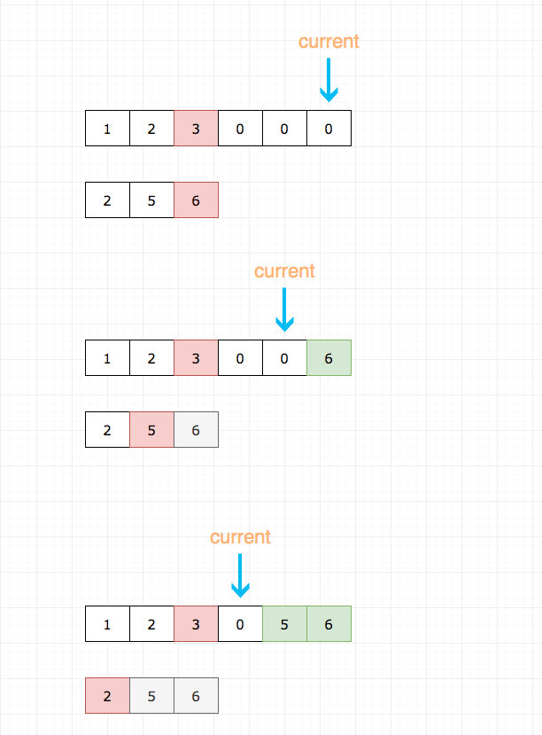
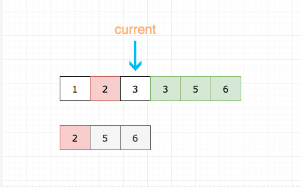
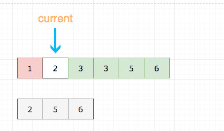

# 0088. 合并两个有序数组

## 题目地址（88. 合并两个有序数组）

<https://leetcode-cn.com/problems/merge-sorted-array/>

## 题目描述

```
<pre class="calibre18">```
给定两个有序整数数组 nums1 和 nums2，将 nums2 合并到 nums1 中，使得 num1 成为一个有序数组。

说明:

初始化 nums1 和 nums2 的元素数量分别为 m 和 n。
你可以假设 nums1 有足够的空间（空间大小大于或等于 m + n）来保存 nums2 中的元素。
示例:

输入:
nums1 = [1,2,3,0,0,0], m = 3
nums2 = [2,5,6],       n = 3

输出: [1,2,2,3,5,6]

```
```

## 公司

- 阿里
- 腾讯
- 百度
- 字节
- loomberg
- facebook
- microsoft

## 前置知识

- 归并排序

## 思路

符合直觉的做法是`将nums2插到num1的末尾, 然后排序`

具体代码：

```
<pre class="calibre18">```
<span class="hljs-title">// 这种解法连m都用不到</span>
<span class="hljs-title">// 这显然不是出题人的意思</span>
<span class="hljs-keyword">if</span> (n === <span class="hljs-params">0</span>) <span class="hljs-keyword">return</span>;
<span class="hljs-keyword">let</span> current2 = <span class="hljs-params">0</span>;
<span class="hljs-keyword">for</span> (<span class="hljs-keyword">let</span> i = nums1.length - <span class="hljs-params">1</span>; i >= nums1.length - n; i--) {
  nums1[i] = nums2[current2++];
}
nums1.sort((a, b) => a - b); <span class="hljs-title">// 当然你可以自己写排序，这里懒得写了，因为已经偏离了题目本身</span>

```
```

这道题目其实和基本排序算法中的`merge sort`非常像，但是 merge sort 很多时候，合并的时候我们通常是 新建一个数组，这样就很简单。 但是这道题目要求的是`原地修改`.

这就和 merge sort 的 merge 过程有点不同，我们先来回顾一下 merge sort 的 merge 过程。

merge 的过程`可以`是先比较两个数组的头元素，然后将较小的推到最终的数组中，并将其从原数组中出队列。 循环直到两个数组都为空。

具体代码如下：

```
<pre class="calibre18">```
<span class="hljs-title">// 将nums1 和 nums2 合并</span>
<span class="hljs-function"><span class="hljs-keyword">function</span> <span class="hljs-title">merge</span>(<span class="hljs-params">nums1, nums2</span>) </span>{
  <span class="hljs-keyword">let</span> ret = [];
  <span class="hljs-keyword">while</span> (nums1.length || nums2.length) {
    <span class="hljs-title">// 为了方便大家理解，这里代码有点赘余</span>
    <span class="hljs-keyword">if</span> (nums1.length === <span class="hljs-params">0</span>) {
      ret.push(nums2.shift());
      <span class="hljs-keyword">continue</span>;
    }

    <span class="hljs-keyword">if</span> (nums2.length === <span class="hljs-params">0</span>) {
      ret.push(nums1.shift());
      <span class="hljs-keyword">continue</span>;
    }
    <span class="hljs-keyword">const</span> a = nums1[<span class="hljs-params">0</span>];
    <span class="hljs-keyword">const</span> b = nums2[<span class="hljs-params">0</span>];
    <span class="hljs-keyword">if</span> (a > b) {
      ret.push(nums2.shift());
    } <span class="hljs-keyword">else</span> {
      ret.push(nums1.shift());
    }
  }
  <span class="hljs-keyword">return</span> ret;
}

```
```

这里要求原地修改，其实我们能只要从后往前比较，并从后往前插入即可。

我们需要三个指针：

1. current 用于记录当前填补到那个位置了
2. m 用于记录 nums1 数组处理到哪个元素了
3. n 用于记录 nums2 数组处理到哪个元素了

如图所示：

- 灰色代表 num2 数组已经处理过的元素
- 红色代表当前正在进行比较的元素
- 绿色代表已经就位的元素



## 关键点解析

- 从后往前比较，并从后往前插入

## 代码

代码支持：Python3, C++, Java, JavaScript

JavaSCript Code:

```
<pre class="calibre18">```
<span class="hljs-keyword">var</span> merge = <span class="hljs-function"><span class="hljs-keyword">function</span> (<span class="hljs-params">nums1, m, nums2, n</span>) </span>{
  <span class="hljs-title">// 设置一个指针，指针初始化指向nums1的末尾（根据#62，应该是index为 m+n-1 的位置，因为nums1的长度有可能更长）</span>
  <span class="hljs-title">// 然后不断左移指针更新元素</span>
  <span class="hljs-keyword">let</span> current = m + n - <span class="hljs-params">1</span>;

  <span class="hljs-keyword">while</span> (current >= <span class="hljs-params">0</span>) {
    <span class="hljs-title">// 没必要继续了</span>
    <span class="hljs-keyword">if</span> (n === <span class="hljs-params">0</span>) <span class="hljs-keyword">return</span>;

    <span class="hljs-title">// 为了方便大家理解，这里代码有点赘余</span>
    <span class="hljs-keyword">if</span> (m < <span class="hljs-params">1</span>) {
      nums1[current--] = nums2[--n];
      <span class="hljs-keyword">continue</span>;
    }

    <span class="hljs-keyword">if</span> (n < <span class="hljs-params">1</span>) {
      nums1[current--] = nums1[--m];
      <span class="hljs-keyword">continue</span>;
    }
    <span class="hljs-title">// 取大的填充 nums1的末尾</span>
    <span class="hljs-title">// 然后更新 m 或者 n</span>
    <span class="hljs-keyword">if</span> (nums1[m - <span class="hljs-params">1</span>] > nums2[n - <span class="hljs-params">1</span>]) {
      nums1[current--] = nums1[--m];
    } <span class="hljs-keyword">else</span> {
      nums1[current--] = nums2[--n];
    }
  }
};

```
```

C++ code:

```
<pre class="calibre18">```
class Solution {
public:
    void merge(vector<int>& nums1, int m, vector<int>& nums2, int n) {
        int current = m + n - 1;
        while (current >= 0) {
            if (n == 0) return;
            if (m < 1) {
                nums1[current--] = nums2[--n];
                continue;
            }
            if (n < 1) {
                nums1[current--] = nums1[--m];
                continue;
            }
            if (nums1[m - 1] > nums2[n - 1]) nums1[current--] = nums1[--m];
            else nums1[current--] = nums2[--n];
        }
    }
};

```
```

Java Code:

```
<pre class="calibre18">```
<span class="hljs-class"><span class="hljs-keyword">class</span> <span class="hljs-title">Solution</span> </span>{
    <span class="hljs-function"><span class="hljs-keyword">public</span> <span class="hljs-keyword">void</span> <span class="hljs-title">merge</span><span class="hljs-params">(<span class="hljs-keyword">int</span>[] nums1, <span class="hljs-keyword">int</span> m, <span class="hljs-keyword">int</span>[] nums2, <span class="hljs-keyword">int</span> n)</span> </span>{
        <span class="hljs-keyword">int</span> i=m-<span class="hljs-params">1</span>, j=n-<span class="hljs-params">1</span>, k=m+n-<span class="hljs-params">1</span>;
        <span class="hljs-title">// 合并</span>
        <span class="hljs-keyword">while</span>(i>=<span class="hljs-params">0</span> && j>=<span class="hljs-params">0</span>)
        {
            <span class="hljs-keyword">if</span>(nums1[i] > nums2[j])
            {
                nums1[k--] = nums1[i--];
            }
            <span class="hljs-keyword">else</span>
            {
                nums1[k--] = nums2[j--];
            }
        }
        <span class="hljs-title">// 合并剩余的nums2</span>
        <span class="hljs-keyword">while</span>(j>=<span class="hljs-params">0</span>)
        {
            nums1[k--] = nums2[j--];
        }
    }
}

```
```

Python Code:

```
<pre class="calibre18">```
<span class="hljs-class"><span class="hljs-keyword">class</span> <span class="hljs-title">Solution</span>:</span>
    <span class="hljs-function"><span class="hljs-keyword">def</span> <span class="hljs-title">merge</span><span class="hljs-params">(self, nums1: List[int], m: int, nums2: List[int], n: int)</span> -> <span class="hljs-keyword">None</span>:</span>
        <span class="hljs-string">"""
        Do not return anything, modify nums1 in-place instead.
        """</span>
        <span class="hljs-title"># 整体思路相似，只不过没有使用 current 指针记录当前填补位置</span>
        <span class="hljs-keyword">while</span> m > <span class="hljs-params">0</span> <span class="hljs-keyword">and</span> n > <span class="hljs-params">0</span>:
            <span class="hljs-keyword">if</span> nums1[m<span class="hljs-params">-1</span>] <= nums2[n<span class="hljs-params">-1</span>]:
                nums1[m+n<span class="hljs-params">-1</span>] = nums2[n<span class="hljs-params">-1</span>]
                n -= <span class="hljs-params">1</span>
            <span class="hljs-keyword">else</span>:
                nums1[m+n<span class="hljs-params">-1</span>] = nums1[m<span class="hljs-params">-1</span>]
                m -=<span class="hljs-params">1</span>
        <span class="hljs-string">"""
        由于没有使用 current，第一步比较结束后有两种情况:
            1. 指针 m>0，n=0，此时不需要做任何处理
            2. 指针 n>0，m=0，此时需要将 nums2 指针左侧元素全部拷贝到 nums1 的前 n 位
        """</span>
        <span class="hljs-keyword">if</span> n > <span class="hljs-params">0</span>:
            nums1[:n] = nums2[:n]

```
```

**复杂度分析**

- 时间复杂度：O(M+N)O(M + N)O(M+N)
- 空间复杂度：O(1)O(1)O(1)

欢迎关注我的公众号《脑洞前端》获取更多更新鲜的 LeetCode 题解

