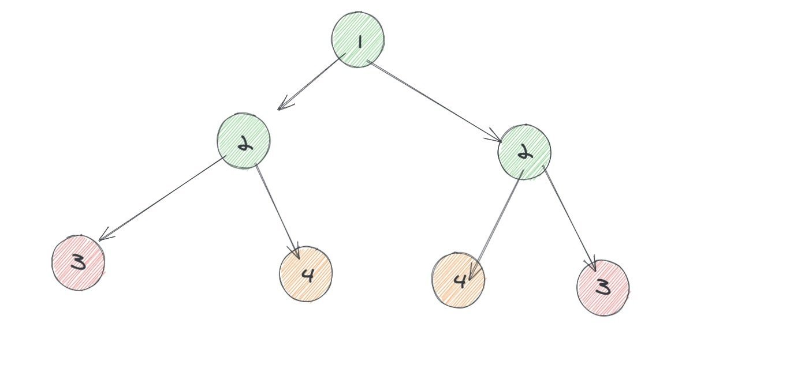
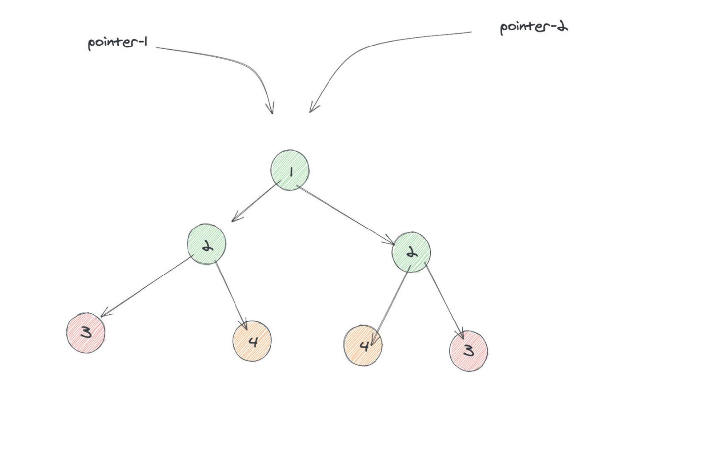

# 0101. 对称二叉树

## 题目地址(101. 对称二叉树)

<https://leetcode-cn.com/problems/symmetric-tree/>

## 题目描述

```
<pre class="calibre18">```
给定一个二叉树，检查它是否是镜像对称的。


例如，二叉树 [1,2,2,3,4,4,3] 是对称的。

    1
   / \
  2   2
 / \ / \
3  4 4  3


但是下面这个 [1,2,2,null,3,null,3] 则不是镜像对称的:

    1
   / \
  2   2
   \   \
   3    3


进阶：

你可以运用递归和迭代两种方法解决这个问题吗？

```
```

## 公司

- 阿里
- 腾讯
- 百度
- 字节
- bloomberg
- linkedin
- microsoft

## 前置知识

- [二叉树](https://github.com/azl397985856/leetcode/blob/master/thinkings/basic-data-structure.md)
- [递归](https://github.com/azl397985856/leetcode/blob/master/thinkings/dynamic-programming.md)

## 思路

看到这题的时候，我的第一直觉是 DFS。然后我就想:`如果左子树是镜像，并且右子树也是镜像，是不是就说明整体是镜像？`。经过几秒的思考， 这显然是不对的，不符合题意。



很明显其中左子树中的节点会和右子树中的节点进行比较，我把比较的元素进行了颜色区分，方便大家看。

这里我的想法是：`遍历每一个节点的时候，我都可以通过某种方法知道它对应的对称节点是谁。这样的话我直接比较两者是否一致就行了。`

最初我的想法是两次遍历，第一次遍历的同时将遍历结果存储到哈希表中，然后第二次遍历去哈希表取。

这种方法可行，但是需要 N 的空间（N 为节点总数）。我想到如果两者可以同时进行遍历，是不是就省去了哈希表的开销。



如果不明白的话，我举个简单例子：

```
<pre class="calibre18">```
给定一个数组，检查它是否是镜像对称的。例如，数组 [1,2,2,3,2,2,1] 是对称的。

```
```

如果用哈希表的话大概是：

```
<pre class="calibre18">```
seen = dict()
<span class="hljs-keyword">for</span> i, num <span class="hljs-keyword">in</span> enumerate(nums):
    seen[i] = num
<span class="hljs-keyword">for</span> i, num <span class="hljs-keyword">in</span> enumerate(nums):
    <span class="hljs-keyword">if</span>  seen[len(nums) - <span class="hljs-params">1</span> - i] != num:
      <span class="hljs-keyword">return</span> <span class="hljs-keyword">False</span>
<span class="hljs-keyword">return</span> <span class="hljs-keyword">True</span>

```
```

而同时遍历的话大概是这样的：

```
<pre class="calibre18">```
l = <span class="hljs-params">0</span>
r = len(nums) - <span class="hljs-params">1</span>

<span class="hljs-keyword">while</span> l < r:
   <span class="hljs-keyword">if</span> nums[l] != nums[r]: <span class="hljs-keyword">return</span> <span class="hljs-keyword">False</span>
   l += <span class="hljs-params">1</span>
   r -= <span class="hljs-params">1</span>
<span class="hljs-keyword">return</span> <span class="hljs-keyword">True</span>

```
```

> 其实更像本题一点的话应该是从中间分别向两边扩展 😂

## 代码

```
<pre class="calibre18">```

<span class="hljs-class"><span class="hljs-keyword">class</span> <span class="hljs-title">Solution</span>:</span>
    <span class="hljs-function"><span class="hljs-keyword">def</span> <span class="hljs-title">isSymmetric</span><span class="hljs-params">(self, root: TreeNode)</span> -> bool:</span>
        <span class="hljs-function"><span class="hljs-keyword">def</span> <span class="hljs-title">dfs</span><span class="hljs-params">(root1, root2)</span>:</span>
            <span class="hljs-keyword">if</span> root1 == root2: <span class="hljs-keyword">return</span> <span class="hljs-keyword">True</span>
            <span class="hljs-keyword">if</span> <span class="hljs-keyword">not</span> root1 <span class="hljs-keyword">or</span> <span class="hljs-keyword">not</span> root2: <span class="hljs-keyword">return</span> <span class="hljs-keyword">False</span>
            <span class="hljs-keyword">if</span> root1.val != root2.val: <span class="hljs-keyword">return</span> <span class="hljs-keyword">False</span>
            <span class="hljs-keyword">return</span> dfs(root1.left, root2.right) <span class="hljs-keyword">and</span> dfs(root1.right, root2.left)
        <span class="hljs-keyword">if</span> <span class="hljs-keyword">not</span> root: <span class="hljs-keyword">return</span> <span class="hljs-keyword">True</span>
        <span class="hljs-keyword">return</span> dfs(root.left, root.right)

```
```

**复杂度分析**

- 时间复杂度：O(N)O(N)O(N)，其中 N 为节点数。
- 空间复杂度：递归的深度最高为节点数，因此空间复杂度是 O(N)O(N)O(N)，其中 N 为节点数。

大家对此有何看法，欢迎给我留言，我有时间都会一一查看回答。更多算法套路可以访问我的 LeetCode 题解仓库：<https://github.com/azl397985856/leetcode> 。 目前已经 37K star 啦。 大家也可以关注我的公众号《力扣加加》带你啃下算法这块硬骨头。 

