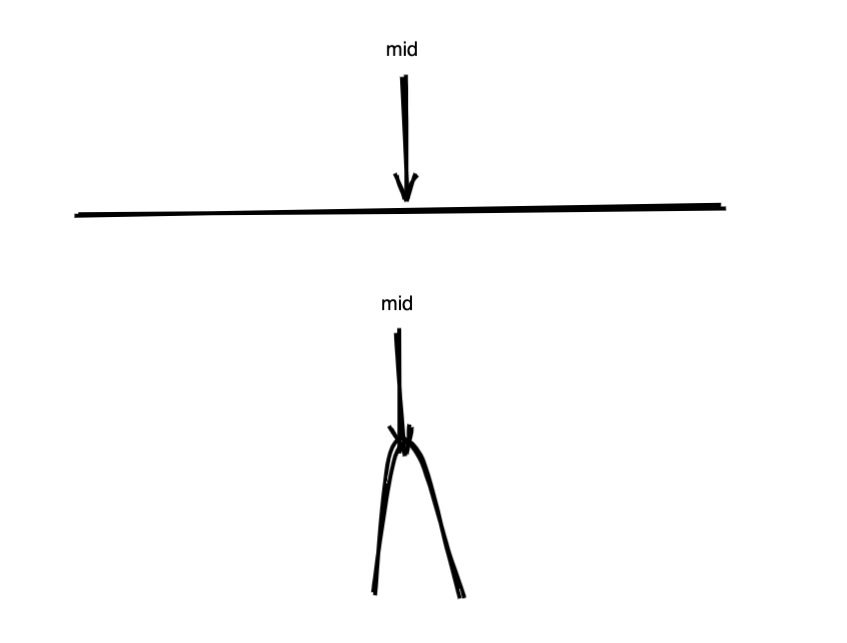

# 0108. 将有序数组转换为二叉搜索树

## 题目地址(108. 将有序数组转换为二叉搜索树)

<https://leetcode-cn.com/problems/convert-sorted-array-to-binary-search-tree/>

## 题目描述

```
<pre class="calibre18">```
将一个按照升序排列的有序数组，转换为一棵高度平衡二叉搜索树。

本题中，一个高度平衡二叉树是指一个二叉树每个节点 的左右两个子树的高度差的绝对值不超过 1。

示例:

给定有序数组: [-10,-3,0,5,9],

一个可能的答案是：[0,-3,9,-10,null,5]，它可以表示下面这个高度平衡二叉搜索树：

      0
     / \
   -3   9
   /   /
 -10  5

```
```

## 前置知识

- [二叉搜索树](https://github.com/azl397985856/leetcode/blob/master/thinkings/basic-data-structure.md)
- [平衡二叉树](https://github.com/azl397985856/leetcode/blob/master/thinkings/basic-data-structure.md)
- [递归](https://github.com/azl397985856/leetcode/blob/master/thinkings/dynamic-programming.md)

## 公司

- 阿里
- 腾讯
- 百度
- 字节
- airbnb

## 思路

由于输入是一个**升序排列的有序数组**。因此任意选择一点，将其作为根节点，其左部分左节点，其右部分右节点即可。 因此我们很容易写出递归代码。

而题目要求是**高度平衡**的二叉搜索树，因此我们必须要取中点。 不难证明：`由于是中点，因此左右两部分差不会大于 1，也就是说其形成的左右子树节点数最多相差 1，因此左右子树高度差的绝对值不超过 1`。

形象一点来看就像你提起一根绳子，从中点提的话才能使得两边绳子长度相差最小。



## 关键点

- 找中点

## 代码

代码支持：JS，C++，Java，Python

JS Code:

```
<pre class="calibre18">```
<span class="hljs-keyword">var</span> sortedArrayToBST = <span class="hljs-function"><span class="hljs-keyword">function</span> (<span class="hljs-params">nums</span>) </span>{
  <span class="hljs-title">// 由于数组是排序好的，因此一个思路就是将数组分成两半，一半是左子树，另一半是右子树</span>
  <span class="hljs-title">// 然后运用“树的递归性质”递归完成操作即可。</span>
  <span class="hljs-keyword">if</span> (nums.length === <span class="hljs-params">0</span>) <span class="hljs-keyword">return</span> <span class="hljs-params">null</span>;
  <span class="hljs-keyword">const</span> mid = nums.length >> <span class="hljs-params">1</span>;
  <span class="hljs-keyword">const</span> root = <span class="hljs-keyword">new</span> TreeNode(nums[mid]);

  root.left = sortedArrayToBST(nums.slice(<span class="hljs-params">0</span>, mid));
  root.right = sortedArrayToBST(nums.slice(mid + <span class="hljs-params">1</span>));
  <span class="hljs-keyword">return</span> root;
};

```
```

Python Code:

```
<pre class="calibre18">```
<span class="hljs-class"><span class="hljs-keyword">class</span> <span class="hljs-title">Solution</span>:</span>
    <span class="hljs-function"><span class="hljs-keyword">def</span> <span class="hljs-title">sortedArrayToBST</span><span class="hljs-params">(self, nums: List[int])</span> -> TreeNode:</span>
        <span class="hljs-keyword">if</span> <span class="hljs-keyword">not</span> nums: <span class="hljs-keyword">return</span> <span class="hljs-keyword">None</span>
        mid = (len(nums) - <span class="hljs-params">1</span>) // <span class="hljs-params">2</span>
        root = TreeNode(nums[mid])
        root.left = self.sortedArrayToBST(nums[:mid])
        root.right = self.sortedArrayToBST(nums[mid + <span class="hljs-params">1</span>:])
        <span class="hljs-keyword">return</span> root

```
```

**复杂度分析**

- 时间复杂度：O(N)O(N)O(N)
- 空间复杂度：每次递归都 copy 了 N 的 空间，因此空间复杂度为 O(N2)O(N ^ 2)O(N2)

然而，实际上没必要开辟新的空间：

C++ Code:

```
<pre class="calibre18">```
<span class="hljs-keyword">class</span> Solution {
<span class="hljs-keyword">public</span>:
    <span class="hljs-function">TreeNode* <span class="hljs-title">sortedArrayToBST</span><span class="hljs-params">(<span class="hljs-params">vector</span><<span class="hljs-keyword">int</span>>& nums)</span> </span>{
        <span class="hljs-keyword">return</span> reBuild(nums, <span class="hljs-params">0</span>, nums.size()<span class="hljs-params">-1</span>);
    }

    <span class="hljs-function">TreeNode* <span class="hljs-title">reBuild</span><span class="hljs-params">(<span class="hljs-params">vector</span><<span class="hljs-keyword">int</span>>& nums, <span class="hljs-keyword">int</span> left, <span class="hljs-keyword">int</span> right)</span> 
    </span>{
        <span class="hljs-title">// 终止条件：中序遍历为空</span>
        <span class="hljs-keyword">if</span>(left > right)
        {
            <span class="hljs-keyword">return</span> <span class="hljs-params">NULL</span>;
        }
        <span class="hljs-title">// 建立当前子树的根节点</span>
        <span class="hljs-keyword">int</span> mid = (left+right)/<span class="hljs-params">2</span>;
        TreeNode * root = <span class="hljs-keyword">new</span> TreeNode(nums[mid]);

        <span class="hljs-title">// 左子树的下层递归</span>
        root->left = reBuild(nums, left, mid<span class="hljs-params">-1</span>);
        <span class="hljs-title">// 右子树的下层递归</span>
        root->right = reBuild(nums, mid+<span class="hljs-params">1</span>, right);
        <span class="hljs-title">// 返回根节点</span>
        <span class="hljs-keyword">return</span> root;
    }
};

```
```

Java Code:

```
<pre class="calibre18">```
<span class="hljs-class"><span class="hljs-keyword">class</span> <span class="hljs-title">Solution</span> </span>{
    <span class="hljs-function"><span class="hljs-keyword">public</span> TreeNode <span class="hljs-title">sortedArrayToBST</span><span class="hljs-params">(<span class="hljs-keyword">int</span>[] nums)</span> </span>{
        <span class="hljs-keyword">return</span> dfs(nums, <span class="hljs-params">0</span>, nums.length - <span class="hljs-params">1</span>);
    }

    <span class="hljs-function"><span class="hljs-keyword">private</span> TreeNode <span class="hljs-title">dfs</span><span class="hljs-params">(<span class="hljs-keyword">int</span>[] nums, <span class="hljs-keyword">int</span> lo, <span class="hljs-keyword">int</span> hi)</span> </span>{
        <span class="hljs-keyword">if</span> (lo > hi) {
            <span class="hljs-keyword">return</span> <span class="hljs-keyword">null</span>;
        }
        <span class="hljs-keyword">int</span> mid = lo + (hi - lo) / <span class="hljs-params">2</span>;
        TreeNode root = <span class="hljs-keyword">new</span> TreeNode(nums[mid]);
        root.left = dfs(nums, lo, mid - <span class="hljs-params">1</span>);
        root.right = dfs(nums, mid + <span class="hljs-params">1</span>, hi);
        <span class="hljs-keyword">return</span> root;
    }
}

```
```

Python Code:

```
<pre class="calibre18">```
<span class="hljs-class"><span class="hljs-keyword">class</span> <span class="hljs-title">Solution</span><span class="hljs-params">(object)</span>:</span>
    <span class="hljs-function"><span class="hljs-keyword">def</span> <span class="hljs-title">sortedArrayToBST</span><span class="hljs-params">(self, nums)</span>:</span>
        <span class="hljs-string">"""
        :type nums: List[int]
        :rtype: TreeNode
        """</span>
        <span class="hljs-keyword">return</span> self.reBuild(nums, <span class="hljs-params">0</span>, len(nums)<span class="hljs-params">-1</span>)

    <span class="hljs-function"><span class="hljs-keyword">def</span> <span class="hljs-title">reBuild</span><span class="hljs-params">(self, nums, left, right)</span>:</span>
         <span class="hljs-title"># 终止条件：</span>
        <span class="hljs-keyword">if</span> left > right:
            <span class="hljs-keyword">return</span>
        <span class="hljs-title"># 建立当前子树的根节点</span>
        mid = (left + right)//<span class="hljs-params">2</span>
        root = TreeNode(nums[mid])
        <span class="hljs-title"># 左右子树的下层递归</span>
        root.left = self.reBuild(nums, left, mid<span class="hljs-params">-1</span>)
        root.right = self.reBuild(nums, mid+<span class="hljs-params">1</span>, right)

        <span class="hljs-keyword">return</span> root

```
```

**复杂度分析**

- 时间复杂度：O(N)O(N)O(N)
- 空间复杂度：隐式调用栈的开销为 O(N)O(N)O(N)

更多题解可以访问我的 LeetCode 题解仓库：<https://github.com/azl397985856/leetcode> 。 目前已经 37K star 啦。

公众号【 [力扣加加](https://tva1.sinaimg.cn/large/007S8ZIlly1gfcuzagjalj30p00dwabs.jpg)】 知乎专栏【 [Lucifer - 知乎](https://www.zhihu.com/people/lu-xiao-13-70)】

点关注，不迷路！