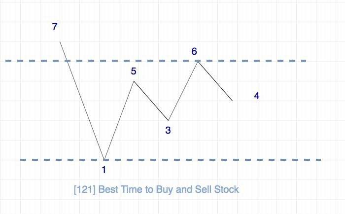

# 0121. 买卖股票的最佳时机

## 题目地址(121. 买卖股票的最佳时机)

<https://leetcode-cn.com/problems/best-time-to-buy-and-sell-stock/description/>

## 题目描述

```
<pre class="calibre18">```
给定一个数组，它的第 i 个元素是一支给定股票第 i 天的价格。

如果你最多只允许完成一笔交易（即买入和卖出一支股票一次），设计一个算法来计算你所能获取的最大利润。

注意：你不能在买入股票前卖出股票。


示例 1:

输入: [7,1,5,3,6,4]
输出: 5
解释: 在第 2 天（股票价格 = 1）的时候买入，在第 5 天（股票价格 = 6）的时候卖出，最大利润 = 6-1 = 5 。
     注意利润不能是 7-1 = 6, 因为卖出价格需要大于买入价格；同时，你不能在买入前卖出股票。
示例 2:

输入: [7,6,4,3,1]
输出: 0
解释: 在这种情况下, 没有交易完成, 所以最大利润为 0。

```
```

## 前置知识

- [数组](https://github.com/azl397985856/leetcode/blob/master/thinkings/basic-data-structure.md)

## 公司

- 阿里
- 腾讯
- 百度
- 字节
- amazon
- bloomberg
- facebook
- microsoft
- uber

## 思路

由于我们是想获取到最大的利润，我们的策略应该是低点买入，高点卖出。

由于题目对于交易次数有限制，只能交易一次，因此问题的本质其实就是求波峰浪谷的差值的最大值。

用图表示的话就是这样：



## 关键点解析

- 这类题只要你在心中（或者别的地方）画出上面这种图就很容易解决

## 代码

语言支持：JS，C++，Java，Python

JS Code:

```
<pre class="calibre18">```
<span class="hljs-title">/**
 * @param {number[]} prices
 * @return {number}
 */</span>
<span class="hljs-keyword">var</span> maxProfit = <span class="hljs-function"><span class="hljs-keyword">function</span> (<span class="hljs-params">prices</span>) </span>{
  <span class="hljs-keyword">let</span> min = prices[<span class="hljs-params">0</span>];
  <span class="hljs-keyword">let</span> profit = <span class="hljs-params">0</span>;
  <span class="hljs-title">// 7 1 5 3 6 4</span>
  <span class="hljs-keyword">for</span> (<span class="hljs-keyword">let</span> i = <span class="hljs-params">1</span>; i < prices.length; i++) {
    <span class="hljs-keyword">if</span> (prices[i] > prices[i - <span class="hljs-params">1</span>]) {
      profit = <span class="hljs-params">Math</span>.max(profit, prices[i] - min);
    } <span class="hljs-keyword">else</span> {
      min = <span class="hljs-params">Math</span>.min(min, prices[i]);
    }
  }

  <span class="hljs-keyword">return</span> profit;
};

```
```

C++ Code:

```
<pre class="calibre18">```
<span class="hljs-title">/**
 * 系统上C++的测试用例中的输入有[]，因此需要加一个判断
 */</span>
<span class="hljs-keyword">class</span> Solution {
<span class="hljs-keyword">public</span>:
    <span class="hljs-function"><span class="hljs-keyword">int</span> <span class="hljs-title">maxProfit</span><span class="hljs-params">(<span class="hljs-params">vector</span><<span class="hljs-keyword">int</span>>& prices)</span> </span>{
        <span class="hljs-keyword">if</span> (prices.empty()) <span class="hljs-keyword">return</span> <span class="hljs-params">0</span>;
        <span class="hljs-keyword">auto</span> min = prices[<span class="hljs-params">0</span>];
        <span class="hljs-keyword">auto</span> profit = <span class="hljs-params">0</span>;
        <span class="hljs-keyword">for</span> (<span class="hljs-keyword">auto</span> i = <span class="hljs-params">1</span>; i < prices.size(); ++i) {
            <span class="hljs-keyword">if</span> (prices[i] > prices[i <span class="hljs-params">-1</span>]) {
                profit = max(profit, prices[i] - min);
            } <span class="hljs-keyword">else</span> {
                min = <span class="hljs-params">std</span>::min(min, prices[i]);;
            }
        }
        <span class="hljs-keyword">return</span> profit;
    }
};

```
```

Java Code:

```
<pre class="calibre18">```
<span class="hljs-class"><span class="hljs-keyword">class</span> <span class="hljs-title">Solution</span> </span>{
    <span class="hljs-function"><span class="hljs-keyword">public</span> <span class="hljs-keyword">int</span> <span class="hljs-title">maxProfit</span><span class="hljs-params">(<span class="hljs-keyword">int</span>[] prices)</span> </span>{
        <span class="hljs-keyword">int</span> minprice = Integer.MAX_VALUE;
        <span class="hljs-keyword">int</span> maxprofit = <span class="hljs-params">0</span>;
        <span class="hljs-keyword">for</span> (<span class="hljs-keyword">int</span> price: prices) {
            maxprofit = Math.max(maxprofit, price - minprice);
             minprice = Math.min(price, minprice);
        }
        <span class="hljs-keyword">return</span> maxprofit;
    }
}

```
```

Python Code:

```
<pre class="calibre18">```
<span class="hljs-class"><span class="hljs-keyword">class</span> <span class="hljs-title">Solution</span>:</span>
    <span class="hljs-function"><span class="hljs-keyword">def</span> <span class="hljs-title">maxProfit</span><span class="hljs-params">(self, prices: <span class="hljs-string">'List[int]'</span>)</span> -> int:</span>
        <span class="hljs-keyword">if</span> <span class="hljs-keyword">not</span> prices: <span class="hljs-keyword">return</span> <span class="hljs-params">0</span>

        min_price = float(<span class="hljs-string">'inf'</span>)
        max_profit = <span class="hljs-params">0</span>

        <span class="hljs-keyword">for</span> price <span class="hljs-keyword">in</span> prices:
            <span class="hljs-keyword">if</span> price < min_price:
                min_price = price
            <span class="hljs-keyword">elif</span> max_profit < price - min_price:
                max_profit = price - min_price
        <span class="hljs-keyword">return</span> max_profit

```
```

**复杂度分析**

- 时间复杂度：O(N)O(N)O(N)
- 空间复杂度：O(1)O(1)O(1)

## 相关题目

- [122.best-time-to-buy-and-sell-stock-ii](122.best-time-to-buy-and-sell-stock-ii.html)
- [309.best-time-to-buy-and-sell-stock-with-cooldown](309.best-time-to-buy-and-sell-stock-with-cooldown.html)

大家对此有何看法，欢迎给我留言，我有时间都会一一查看回答。更多算法套路可以访问我的 LeetCode 题解仓库：<https://github.com/azl397985856/leetcode> 。 目前已经 37K star 啦。 大家也可以关注我的公众号《力扣加加》带你啃下算法这块硬骨头。

