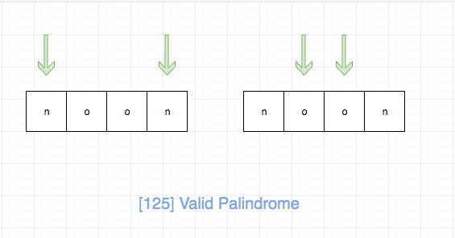
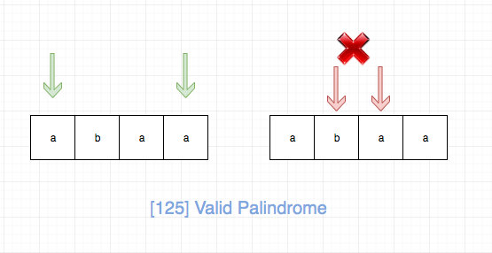

# 0125. 验证回文串

## 题目地址(125. 验证回文串)

<https://leetcode-cn.com/problems/valid-palindrome/description/>

## 题目描述

```
<pre class="calibre18">```
给定一个字符串，验证它是否是回文串，只考虑字母和数字字符，可以忽略字母的大小写。

说明：本题中，我们将空字符串定义为有效的回文串。

示例 1:

输入: "A man, a plan, a canal: Panama"
输出: true
示例 2:

输入: "race a car"
输出: false

```
```

## 前置知识

- 回文
- 双指针

## 公司

- 阿里
- 腾讯
- 百度
- 字节
- facebook
- microsoft
- uber
- zenefits

## 思路

这是一道考察回文的题目，而且是最简单的形式，即判断一个字符串是否是回文。

针对这个问题，我们可以使用头尾双指针，

- 如果两个指针的元素不相同，则直接返回 false,
- 如果两个指针的元素相同，我们同时更新头尾指针，循环。 直到头尾指针相遇。

时间复杂度为 O(n).

拿“noon”这样一个回文串来说，我们的判断过程是这样的：



拿“abaa”这样一个不是回文的字符串来说，我们的判断过程是这样的：



## 关键点解析

- 双指针

## 代码

- 语言支持：JS，C++，Python

JavaScript Code:

```
<pre class="calibre18">```
<span class="hljs-title">/*
 * @lc app=leetcode id=125 lang=javascript
 *
 * [125] Valid Palindrome
 */</span>
<span class="hljs-title">// 只处理英文字符（题目忽略大小写，我们前面全部转化成了小写， 因此这里我们只判断小写）和数字</span>
<span class="hljs-function"><span class="hljs-keyword">function</span> <span class="hljs-title">isValid</span>(<span class="hljs-params">c</span>) </span>{
  <span class="hljs-keyword">const</span> charCode = c.charCodeAt(<span class="hljs-params">0</span>);
  <span class="hljs-keyword">const</span> isDigit =
    charCode >= <span class="hljs-string">"0"</span>.charCodeAt(<span class="hljs-params">0</span>) && charCode <= <span class="hljs-string">"9"</span>.charCodeAt(<span class="hljs-params">0</span>);
  <span class="hljs-keyword">const</span> isChar = charCode >= <span class="hljs-string">"a"</span>.charCodeAt(<span class="hljs-params">0</span>) && charCode <= <span class="hljs-string">"z"</span>.charCodeAt(<span class="hljs-params">0</span>);

  <span class="hljs-keyword">return</span> isDigit || isChar;
}
<span class="hljs-title">/**
 * @param {string} s
 * @return {boolean}
 */</span>
<span class="hljs-keyword">var</span> isPalindrome = <span class="hljs-function"><span class="hljs-keyword">function</span> (<span class="hljs-params">s</span>) </span>{
  s = s.toLowerCase();
  <span class="hljs-keyword">let</span> left = <span class="hljs-params">0</span>;
  <span class="hljs-keyword">let</span> right = s.length - <span class="hljs-params">1</span>;

  <span class="hljs-keyword">while</span> (left < right) {
    <span class="hljs-keyword">if</span> (!isValid(s[left])) {
      left++;
      <span class="hljs-keyword">continue</span>;
    }
    <span class="hljs-keyword">if</span> (!isValid(s[right])) {
      right--;
      <span class="hljs-keyword">continue</span>;
    }

    <span class="hljs-keyword">if</span> (s[left] === s[right]) {
      left++;
      right--;
    } <span class="hljs-keyword">else</span> {
      <span class="hljs-keyword">break</span>;
    }
  }

  <span class="hljs-keyword">return</span> right <= left;
};

```
```

C++ Code:

```
<pre class="calibre18">```
<span class="hljs-keyword">class</span> Solution {
<span class="hljs-keyword">public</span>:
    <span class="hljs-function"><span class="hljs-keyword">bool</span> <span class="hljs-title">isPalindrome</span><span class="hljs-params">(<span class="hljs-params">string</span> s)</span> </span>{
        <span class="hljs-keyword">if</span> (s.empty())
            <span class="hljs-keyword">return</span> <span class="hljs-params">true</span>;
        <span class="hljs-keyword">const</span> <span class="hljs-keyword">char</span>* s1 = s.c_str();
        <span class="hljs-keyword">const</span> <span class="hljs-keyword">char</span>* e = s1 + s.length() - <span class="hljs-params">1</span>;
        <span class="hljs-keyword">while</span> (e > s1) {
            <span class="hljs-keyword">if</span> (!<span class="hljs-params">isalnum</span>(*s1)) {++s1; <span class="hljs-keyword">continue</span>;}
            <span class="hljs-keyword">if</span> (!<span class="hljs-params">isalnum</span>(*e)) {--e; <span class="hljs-keyword">continue</span>;}
            <span class="hljs-keyword">if</span> (<span class="hljs-params">tolower</span>(*s1) != <span class="hljs-params">tolower</span>(*e)) <span class="hljs-keyword">return</span> <span class="hljs-params">false</span>;
            <span class="hljs-keyword">else</span> {--e; ++s1;}
        }
        <span class="hljs-keyword">return</span> <span class="hljs-params">true</span>;
    }
};

```
```

Python Code:

```
<pre class="calibre18">```
<span class="hljs-class"><span class="hljs-keyword">class</span> <span class="hljs-title">Solution</span>:</span>
    <span class="hljs-function"><span class="hljs-keyword">def</span> <span class="hljs-title">isPalindrome</span><span class="hljs-params">(self, s: str)</span> -> bool:</span>
        left, right = <span class="hljs-params">0</span>, len(s) - <span class="hljs-params">1</span>
        <span class="hljs-keyword">while</span> left < right:
            <span class="hljs-keyword">if</span> <span class="hljs-keyword">not</span> s[left].isalnum():
                left += <span class="hljs-params">1</span>
                <span class="hljs-keyword">continue</span>
            <span class="hljs-keyword">if</span> <span class="hljs-keyword">not</span> s[right].isalnum():
                right -= <span class="hljs-params">1</span>
                <span class="hljs-keyword">continue</span>
            <span class="hljs-keyword">if</span> s[left].lower() == s[right].lower():
                left += <span class="hljs-params">1</span>
                right -= <span class="hljs-params">1</span>
            <span class="hljs-keyword">else</span>:
                <span class="hljs-keyword">break</span>
        <span class="hljs-keyword">return</span> right <= left

    <span class="hljs-function"><span class="hljs-keyword">def</span> <span class="hljs-title">isPalindrome2</span><span class="hljs-params">(self, s: str)</span> -> bool:</span>
        <span class="hljs-string">"""
        使用语言特性进行求解
        """</span>
        s = <span class="hljs-string">''</span>.join(i <span class="hljs-keyword">for</span> i <span class="hljs-keyword">in</span> s <span class="hljs-keyword">if</span> i.isalnum()).lower()
        <span class="hljs-keyword">return</span> s == s[::<span class="hljs-params">-1</span>]

```
```

**复杂度分析**

- 时间复杂度：O(N)O(N)O(N)
- 空间复杂度：O(1)O(1)O(1)

大家对此有何看法，欢迎给我留言，我有时间都会一一查看回答。更多算法套路可以访问我的 LeetCode 题解仓库：<https://github.com/azl397985856/leetcode> 。 目前已经 37K star 啦。 大家也可以关注我的公众号《力扣加加》带你啃下算法这块硬骨头。

