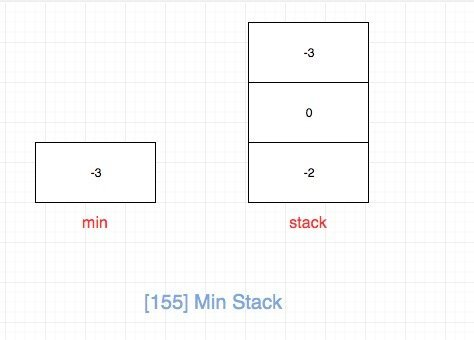
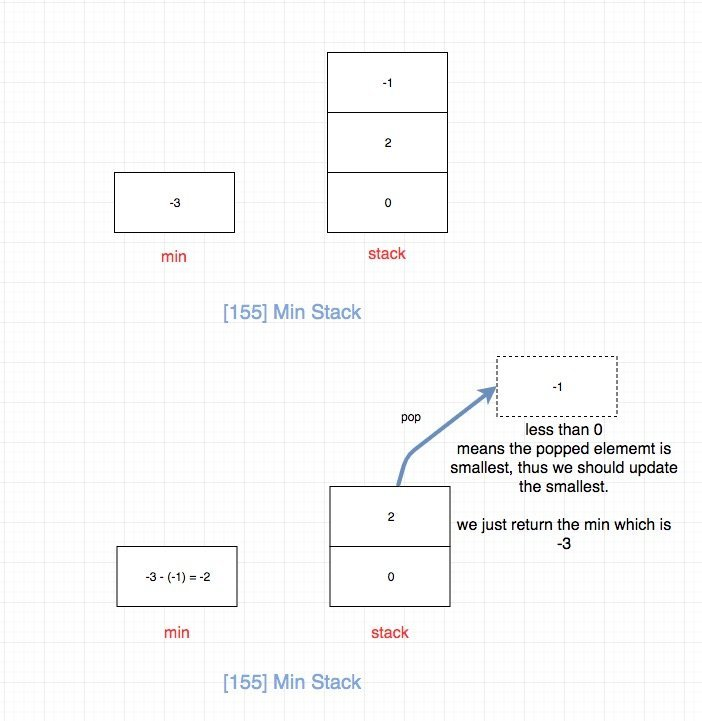
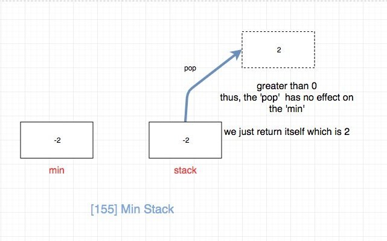

# 0155. 最小栈

# 题目地址(155. 最小栈)

<https://leetcode-cn.com/problems/min-stack/>

# 题目描述

```
<pre class="calibre18">```
设计一个支持 push ，pop ，top 操作，并能在常数时间内检索到最小元素的栈。

push(x) —— 将元素 x 推入栈中。
pop() —— 删除栈顶的元素。
top() —— 获取栈顶元素。
getMin() —— 检索栈中的最小元素。


示例:

输入：
["MinStack","push","push","push","getMin","pop","top","getMin"]
[[],[-2],[0],[-3],[],[],[],[]]

输出：
[null,null,null,null,-3,null,0,-2]

解释：
MinStack minStack = new MinStack();
minStack.push(-2);
minStack.push(0);
minStack.push(-3);
minStack.getMin();   --> 返回 -3.
minStack.pop();
minStack.top();      --> 返回 0.
minStack.getMin();   --> 返回 -2.


提示：

pop、top 和 getMin 操作总是在 非空栈 上调用。

```
```

## 前置知识

- [栈](https://github.com/azl397985856/leetcode/blob/master/thinkings/basic-data-structure.md)## 公司
- amazon
- bloomberg
- google
- snapchat
- uber
- zenefits

## 两个栈

## 公司

- 阿里
- 腾讯
- 百度
- 字节

### 思路

我们使用两个栈：

- 一个栈存放全部的元素，push，pop都是正常操作这个正常栈。
- 另一个存放最小栈。 每次push，如果比最小栈的栈顶还小，我们就push进最小栈，否则不操作
- 每次pop的时候，我们都判断其是否和最小栈栈顶元素相同，如果相同，那么我们pop掉最小栈的栈顶元素即可

### 关键点

- 往minstack中 push的判断条件。 应该是stack为空或者x小于等于minstack栈顶元素

### 代码

- 语言支持：JS，C++，Java，Python

JavaScript Code:

```
<pre class="calibre18">```
<span class="hljs-title">/**
 * initialize your data structure here.
 */</span>
<span class="hljs-keyword">var</span> MinStack = <span class="hljs-function"><span class="hljs-keyword">function</span>(<span class="hljs-params"></span>) </span>{
    <span class="hljs-keyword">this</span>.stack = []
    <span class="hljs-keyword">this</span>.minStack = []
};

<span class="hljs-title">/** 
 * @param {number} x
 * @return {void}
 */</span>
MinStack.prototype.push = <span class="hljs-function"><span class="hljs-keyword">function</span>(<span class="hljs-params">x</span>) </span>{
    <span class="hljs-keyword">this</span>.stack.push(x)
    <span class="hljs-keyword">if</span> (<span class="hljs-keyword">this</span>.minStack.length == <span class="hljs-params">0</span> ||  x <= <span class="hljs-keyword">this</span>.minStack[<span class="hljs-keyword">this</span>.minStack.length - <span class="hljs-params">1</span>]) {
        <span class="hljs-keyword">this</span>.minStack.push(x)
    }
};

<span class="hljs-title">/**
 * @return {void}
 */</span>
MinStack.prototype.pop = <span class="hljs-function"><span class="hljs-keyword">function</span>(<span class="hljs-params"></span>) </span>{
    <span class="hljs-keyword">const</span> x = <span class="hljs-keyword">this</span>.stack.pop()
    <span class="hljs-keyword">if</span> (x !== <span class="hljs-keyword">void</span> <span class="hljs-params">0</span> &&  x === <span class="hljs-keyword">this</span>.minStack[<span class="hljs-keyword">this</span>.minStack.length - <span class="hljs-params">1</span>]) {
        <span class="hljs-keyword">this</span>.minStack.pop()
    }
};

<span class="hljs-title">/**
 * @return {number}
 */</span>
MinStack.prototype.top = <span class="hljs-function"><span class="hljs-keyword">function</span>(<span class="hljs-params"></span>) </span>{
    <span class="hljs-keyword">return</span> <span class="hljs-keyword">this</span>.stack[<span class="hljs-keyword">this</span>.stack.length - <span class="hljs-params">1</span>]
};

<span class="hljs-title">/**
 * @return {number}
 */</span>
MinStack.prototype.min = <span class="hljs-function"><span class="hljs-keyword">function</span>(<span class="hljs-params"></span>) </span>{
    <span class="hljs-keyword">return</span> <span class="hljs-keyword">this</span>.minStack[<span class="hljs-keyword">this</span>.minStack.length - <span class="hljs-params">1</span>]
};

<span class="hljs-title">/** 
 * Your MinStack object will be instantiated and called as such:
 * var obj = new MinStack()
 * obj.push(x)
 * obj.pop()
 * var param_3 = obj.top()
 * var param_4 = obj.min()
 */</span>

```
```

C++ Code:

```
<pre class="calibre18">```
<span class="hljs-keyword">class</span> MinStack {
    <span class="hljs-params">stack</span><<span class="hljs-keyword">int</span>> data;
    <span class="hljs-params">stack</span><<span class="hljs-keyword">int</span>> helper;
<span class="hljs-keyword">public</span>:
    <span class="hljs-title">/** initialize your data structure here. */</span>
    MinStack() {

    }

    <span class="hljs-function"><span class="hljs-keyword">void</span> <span class="hljs-title">push</span><span class="hljs-params">(<span class="hljs-keyword">int</span> x)</span> </span>{
        data.push(x);
        <span class="hljs-keyword">if</span>(helper.empty() || helper.top() >= x)
        {
            helper.push(x);
        }

    }

    <span class="hljs-function"><span class="hljs-keyword">void</span> <span class="hljs-title">pop</span><span class="hljs-params">()</span> </span>{
        <span class="hljs-keyword">int</span> top = data.top();
        data.pop();
        <span class="hljs-keyword">if</span>(top == helper.top())
        {
            helper.pop();
        }

    }

    <span class="hljs-function"><span class="hljs-keyword">int</span> <span class="hljs-title">top</span><span class="hljs-params">()</span> </span>{
        <span class="hljs-keyword">return</span> data.top();
    }

    <span class="hljs-function"><span class="hljs-keyword">int</span> <span class="hljs-title">getMin</span><span class="hljs-params">()</span> </span>{
        <span class="hljs-keyword">return</span> helper.top();
    }
};

<span class="hljs-title">/**
 * Your MinStack object will be instantiated and called as such:
 * MinStack* obj = new MinStack();
 * obj->push(x);
 * obj->pop();
 * int param_3 = obj->top();
 * int param_4 = obj->getMin();
 */</span>

```
```

Java Code:

```
<pre class="calibre18">```
<span class="hljs-keyword">public</span> <span class="hljs-class"><span class="hljs-keyword">class</span> <span class="hljs-title">MinStack</span> </span>{

    <span class="hljs-title">// 数据栈</span>
    <span class="hljs-keyword">private</span> Stack<Integer> data;
    <span class="hljs-title">// 辅助栈</span>
    <span class="hljs-keyword">private</span> Stack<Integer> helper;

    <span class="hljs-title">/**
     * initialize your data structure here.
     */</span>
    <span class="hljs-function"><span class="hljs-keyword">public</span> <span class="hljs-title">MinStack</span><span class="hljs-params">()</span> </span>{
        data = <span class="hljs-keyword">new</span> Stack<>();
        helper = <span class="hljs-keyword">new</span> Stack<>();
    }

    <span class="hljs-function"><span class="hljs-keyword">public</span> <span class="hljs-keyword">void</span> <span class="hljs-title">push</span><span class="hljs-params">(<span class="hljs-keyword">int</span> x)</span> </span>{
        <span class="hljs-title">// 辅助栈在必要的时候才增加</span>
        data.add(x);
        <span class="hljs-keyword">if</span> (helper.isEmpty() || helper.peek() >= x) {
            helper.add(x);
        }
    }

    <span class="hljs-function"><span class="hljs-keyword">public</span> <span class="hljs-keyword">void</span> <span class="hljs-title">pop</span><span class="hljs-params">()</span> </span>{
        <span class="hljs-title">// 关键 3：data 一定得 pop()</span>
        <span class="hljs-keyword">if</span> (!data.isEmpty()) {
            <span class="hljs-title">// 注意：声明成 int 类型，这里完成了自动拆箱，从 Integer 转成了 int，</span>
            <span class="hljs-title">// 因此下面的比较可以使用 "==" 运算符</span>
            <span class="hljs-keyword">int</span> top = data.pop();
            <span class="hljs-keyword">if</span>(top == helper.peek()){
                helper.pop();
            }
        }
    }

    <span class="hljs-function"><span class="hljs-keyword">public</span> <span class="hljs-keyword">int</span> <span class="hljs-title">top</span><span class="hljs-params">()</span> </span>{
        <span class="hljs-keyword">if</span>(!data.isEmpty()){
            <span class="hljs-keyword">return</span> data.peek();
        }
    }

    <span class="hljs-function"><span class="hljs-keyword">public</span> <span class="hljs-keyword">int</span> <span class="hljs-title">getMin</span><span class="hljs-params">()</span> </span>{
        <span class="hljs-keyword">if</span>(!helper.isEmpty()){
            <span class="hljs-keyword">return</span> helper.peek();
        }
    }
}

```
```

Python3 Code:

```
<pre class="calibre18">```
<span class="hljs-class"><span class="hljs-keyword">class</span> <span class="hljs-title">MinStack</span>:</span>

    <span class="hljs-function"><span class="hljs-keyword">def</span> <span class="hljs-title">__init__</span><span class="hljs-params">(self)</span>:</span>
        <span class="hljs-string">"""
        initialize your data structure here.
        """</span>
        self.stack = []
        self.minstack = []

    <span class="hljs-function"><span class="hljs-keyword">def</span> <span class="hljs-title">push</span><span class="hljs-params">(self, x: int)</span> -> <span class="hljs-keyword">None</span>:</span>
        self.stack.append(x)
        <span class="hljs-keyword">if</span> <span class="hljs-keyword">not</span> self.minstack <span class="hljs-keyword">or</span> x <= self.minstack[<span class="hljs-params">-1</span>]:
            self.minstack.append(x)

    <span class="hljs-function"><span class="hljs-keyword">def</span> <span class="hljs-title">pop</span><span class="hljs-params">(self)</span> -> <span class="hljs-keyword">None</span>:</span>
        tmp = self.stack.pop()
        <span class="hljs-keyword">if</span> tmp == self.minstack[<span class="hljs-params">-1</span>]:
            self.minstack.pop()

    <span class="hljs-function"><span class="hljs-keyword">def</span> <span class="hljs-title">top</span><span class="hljs-params">(self)</span> -> int:</span>
        <span class="hljs-keyword">return</span> self.stack[<span class="hljs-params">-1</span>]

    <span class="hljs-function"><span class="hljs-keyword">def</span> <span class="hljs-title">min</span><span class="hljs-params">(self)</span> -> int:</span>
        <span class="hljs-keyword">return</span> self.minstack[<span class="hljs-params">-1</span>]


<span class="hljs-title"># Your MinStack object will be instantiated and called as such:</span>
<span class="hljs-title"># obj = MinStack()</span>
<span class="hljs-title"># obj.push(x)</span>
<span class="hljs-title"># obj.pop()</span>
<span class="hljs-title"># param_3 = obj.top()</span>
<span class="hljs-title"># param_4 = obj.min()</span>

```
```

**复杂度分析**

- 时间复杂度：O(1)
- 空间复杂度：O(1)

## 一个栈

### 思路

符合直觉的方法是，每次对栈进行修改操作（push和pop）的时候更新最小值。 然后getMin只需要返回我们计算的最小值即可， top也是直接返回栈顶元素即可。 这种做法每次修改栈都需要更新最小值，因此时间复杂度是O(n).



是否有更高效的算法呢？答案是有的。

我们每次入栈的时候，保存的不再是真正的数字，而是它与当前最小值的差（当前元素没有入栈的时候的最小值）。 这样我们pop和top的时候拿到栈顶元素再加上**上一个**最小值即可。 另外我们在push和pop的时候去更新min，这样getMin的时候就简单了，直接返回min。

> 注意上面加粗的“上一个”，不是“当前的最小值”

经过上面的分析，问题的关键转化为“如何求得上一个最小值”，解决这个的关键点在于利用min。

pop或者top的时候：

- 如果栈顶元素小于0，说明栈顶是当前最小的元素，它出栈会对min造成影响，我们需要去更新min。 上一个最小的是“min - 栈顶元素”,我们需要将上一个最小值更新为当前的最小值
  
  > 因为栈顶元素入栈的时候的通过 `栈顶元素 = 真实值 - 上一个最小的元素` 得到的， 而真实值 = min， 因此可以得出`上一个最小的元素 = 真实值 -栈顶元素`
- 如果栈顶元素大于0，说明它对最小值`没有影响`，上一个最小值就是上上个最小值。



### 关键点

- 最小栈存储的不应该是真实值，而是真实值和min的差值
- top的时候涉及到对数据的还原，这里千万注意是**上一个**最小值

### 代码

- 语言支持：JS，C++，Java，Python

Javascript Code:

```
<pre class="calibre18">```
<span class="hljs-title">/*
 * @lc app=leetcode id=155 lang=javascript
 *
 * [155] Min Stack
 */</span>
<span class="hljs-title">/**
 * initialize your data structure here.
 */</span>
<span class="hljs-keyword">var</span> MinStack = <span class="hljs-function"><span class="hljs-keyword">function</span>(<span class="hljs-params"></span>) </span>{
  <span class="hljs-keyword">this</span>.stack = [];
  <span class="hljs-keyword">this</span>.minV = <span class="hljs-params">Number</span>.MAX_VALUE;
};

<span class="hljs-title">/**
 * @param {number} x
 * @return {void}
 */</span>
MinStack.prototype.push = <span class="hljs-function"><span class="hljs-keyword">function</span>(<span class="hljs-params">x</span>) </span>{
  <span class="hljs-title">// update 'min'</span>
  <span class="hljs-keyword">const</span> minV = <span class="hljs-keyword">this</span>.minV;
  <span class="hljs-keyword">if</span> (x < <span class="hljs-keyword">this</span>.minV) {
    <span class="hljs-keyword">this</span>.minV = x;
  }
  <span class="hljs-keyword">return</span> <span class="hljs-keyword">this</span>.stack.push(x - minV);
};

<span class="hljs-title">/**
 * @return {void}
 */</span>
MinStack.prototype.pop = <span class="hljs-function"><span class="hljs-keyword">function</span>(<span class="hljs-params"></span>) </span>{
  <span class="hljs-keyword">const</span> item = <span class="hljs-keyword">this</span>.stack.pop();
  <span class="hljs-keyword">const</span> minV = <span class="hljs-keyword">this</span>.minV;

  <span class="hljs-keyword">if</span> (item < <span class="hljs-params">0</span>) {
    <span class="hljs-keyword">this</span>.minV = minV - item;
    <span class="hljs-keyword">return</span> minV;
  }
  <span class="hljs-keyword">return</span> item + minV;
};

<span class="hljs-title">/**
 * @return {number}
 */</span>
MinStack.prototype.top = <span class="hljs-function"><span class="hljs-keyword">function</span>(<span class="hljs-params"></span>) </span>{
  <span class="hljs-keyword">const</span> item = <span class="hljs-keyword">this</span>.stack[<span class="hljs-keyword">this</span>.stack.length - <span class="hljs-params">1</span>];
  <span class="hljs-keyword">const</span> minV = <span class="hljs-keyword">this</span>.minV;

  <span class="hljs-keyword">if</span> (item < <span class="hljs-params">0</span>) {
    <span class="hljs-keyword">return</span> minV;
  }
  <span class="hljs-keyword">return</span> item + minV;
};

<span class="hljs-title">/**
 * @return {number}
 */</span>
MinStack.prototype.min = <span class="hljs-function"><span class="hljs-keyword">function</span>(<span class="hljs-params"></span>) </span>{
  <span class="hljs-keyword">return</span> <span class="hljs-keyword">this</span>.minV;
};

<span class="hljs-title">/**
 * Your MinStack object will be instantiated and called as such:
 * var obj = new MinStack()
 * obj.push(x)
 * obj.pop()
 * var param_3 = obj.top()
 * var param_4 = obj.min()
 */</span>

```
```

C++ Code:

```
<pre class="calibre18">```
<span class="hljs-keyword">class</span> MinStack {
    <span class="hljs-params">stack</span><<span class="hljs-keyword">long</span>> data;
    <span class="hljs-keyword">long</span> min = INT_MAX;
<span class="hljs-keyword">public</span>:
    <span class="hljs-title">/** initialize your data structure here. */</span>
    MinStack() {

    }

    <span class="hljs-function"><span class="hljs-keyword">void</span> <span class="hljs-title">push</span><span class="hljs-params">(<span class="hljs-keyword">int</span> x)</span> </span>{
        data.push(x - min);
        <span class="hljs-keyword">if</span>(x < min)
        {
            min = x;
        }

    }

    <span class="hljs-function"><span class="hljs-keyword">void</span> <span class="hljs-title">pop</span><span class="hljs-params">()</span> </span>{
        <span class="hljs-keyword">long</span> top = data.top();
        data.pop();
        <span class="hljs-title">// 更新最小值</span>
        <span class="hljs-keyword">if</span>(top < <span class="hljs-params">0</span>)
        {
            min -= top;
        }

    }

    <span class="hljs-function"><span class="hljs-keyword">int</span> <span class="hljs-title">top</span><span class="hljs-params">()</span> </span>{
        <span class="hljs-keyword">long</span> top = data.top();
        <span class="hljs-title">// 最小值为 min</span>
        <span class="hljs-keyword">if</span> (top < <span class="hljs-params">0</span>)
        {
            <span class="hljs-keyword">return</span> min;
        }
        <span class="hljs-keyword">else</span>{
            <span class="hljs-keyword">return</span> min+top;
        }
    }

    <span class="hljs-function"><span class="hljs-keyword">int</span> <span class="hljs-title">getMin</span><span class="hljs-params">()</span> </span>{
        <span class="hljs-keyword">return</span> min;
    }
};

<span class="hljs-title">/**
 * Your MinStack object will be instantiated and called as such:
 * MinStack* obj = new MinStack();
 * obj->push(x);
 * obj->pop();
 * int param_3 = obj->top();
 * int param_4 = obj->getMin();
 */</span>

```
```

Java Code:

```
<pre class="calibre18">```
<span class="hljs-class"><span class="hljs-keyword">class</span> <span class="hljs-title">MinStack</span> </span>{
    <span class="hljs-keyword">long</span> min;
    Stack<Long> stack;

    <span class="hljs-title">/** initialize your data structure here. */</span>
    <span class="hljs-function"><span class="hljs-keyword">public</span> <span class="hljs-title">MinStack</span><span class="hljs-params">()</span> </span>{
        stack = <span class="hljs-keyword">new</span> Stack<>();
    }

    <span class="hljs-function"><span class="hljs-keyword">public</span> <span class="hljs-keyword">void</span> <span class="hljs-title">push</span><span class="hljs-params">(<span class="hljs-keyword">int</span> x)</span> </span>{
        <span class="hljs-keyword">if</span> (stack.isEmpty()) {
            stack.push(<span class="hljs-params">0L</span>);
            min = x;
        }
        <span class="hljs-keyword">else</span> {
            stack.push(x - min);
            <span class="hljs-keyword">if</span> (x < min)
                min = x;
        }
    }

    <span class="hljs-function"><span class="hljs-keyword">public</span> <span class="hljs-keyword">void</span> <span class="hljs-title">pop</span><span class="hljs-params">()</span> </span>{
        <span class="hljs-keyword">long</span> p = stack.pop();

        <span class="hljs-keyword">if</span> (p < <span class="hljs-params">0</span>) {
            <span class="hljs-title">// if (p < 0), the popped value is the min</span>
            <span class="hljs-title">// Recall p is added by this statement: stack.push(x - min);</span>
            <span class="hljs-title">// So, p = x - old_min</span>
            <span class="hljs-title">// old_min = x - p</span>
            <span class="hljs-title">// again, if (p < 0), x is the min so:</span>
            <span class="hljs-title">// old_min = min - p</span>
            min = min - p;
        }
    }

    <span class="hljs-function"><span class="hljs-keyword">public</span> <span class="hljs-keyword">int</span> <span class="hljs-title">top</span><span class="hljs-params">()</span> </span>{
        <span class="hljs-keyword">long</span> p = stack.peek();

        <span class="hljs-keyword">if</span> (p < <span class="hljs-params">0</span>) {
            <span class="hljs-keyword">return</span> (<span class="hljs-keyword">int</span>) min;
        }
        <span class="hljs-keyword">else</span> {
            <span class="hljs-title">// p = x - min</span>
            <span class="hljs-title">// x = p + min</span>
            <span class="hljs-keyword">return</span> (<span class="hljs-keyword">int</span>) (p + min);
        }
    }

    <span class="hljs-function"><span class="hljs-keyword">public</span> <span class="hljs-keyword">int</span> <span class="hljs-title">getMin</span><span class="hljs-params">()</span> </span>{
        <span class="hljs-keyword">return</span> (<span class="hljs-keyword">int</span>) min;    
    }
}

```
```

Python Code:

```
<pre class="calibre18">```
<span class="hljs-class"><span class="hljs-keyword">class</span> <span class="hljs-title">MinStack</span>:</span>

    <span class="hljs-function"><span class="hljs-keyword">def</span> <span class="hljs-title">__init__</span><span class="hljs-params">(self)</span>:</span>
        <span class="hljs-string">"""
        initialize your data structure here.
        """</span>
        self.minV = float(<span class="hljs-string">'inf'</span>)
        self.stack = []

    <span class="hljs-function"><span class="hljs-keyword">def</span> <span class="hljs-title">push</span><span class="hljs-params">(self, x: int)</span> -> <span class="hljs-keyword">None</span>:</span>
        self.stack.append(x - self.minV)
        <span class="hljs-keyword">if</span> x < self.minV:
            self.minV = x

    <span class="hljs-function"><span class="hljs-keyword">def</span> <span class="hljs-title">pop</span><span class="hljs-params">(self)</span> -> <span class="hljs-keyword">None</span>:</span>
        <span class="hljs-keyword">if</span> <span class="hljs-keyword">not</span> self.stack:
            <span class="hljs-keyword">return</span>
        tmp = self.stack.pop()
        <span class="hljs-keyword">if</span> tmp < <span class="hljs-params">0</span>:
            self.minV -= tmp

    <span class="hljs-function"><span class="hljs-keyword">def</span> <span class="hljs-title">top</span><span class="hljs-params">(self)</span> -> int:</span>
        <span class="hljs-keyword">if</span> <span class="hljs-keyword">not</span> self.stack:
            <span class="hljs-keyword">return</span>
        tmp = self.stack[<span class="hljs-params">-1</span>]
        <span class="hljs-keyword">if</span> tmp < <span class="hljs-params">0</span>:
            <span class="hljs-keyword">return</span> self.minV
        <span class="hljs-keyword">else</span>:
            <span class="hljs-keyword">return</span> self.minV + tmp

    <span class="hljs-function"><span class="hljs-keyword">def</span> <span class="hljs-title">min</span><span class="hljs-params">(self)</span> -> int:</span>
        <span class="hljs-keyword">return</span> self.minV


<span class="hljs-title"># Your MinStack object will be instantiated and called as such:</span>
<span class="hljs-title"># obj = MinStack()</span>
<span class="hljs-title"># obj.push(x)</span>
<span class="hljs-title"># obj.pop()</span>
<span class="hljs-title"># param_3 = obj.top()</span>
<span class="hljs-title"># param_4 = obj.min()</span>

```
```

**复杂度分析**

- 时间复杂度：O(1)
- 空间复杂度：O(1)

更多题解可以访问我的LeetCode题解仓库：<https://github.com/azl397985856/leetcode> 。 目前已经37K star啦。

关注公众号力扣加加，努力用清晰直白的语言还原解题思路，并且有大量图解，手把手教你识别套路，高效刷题。

