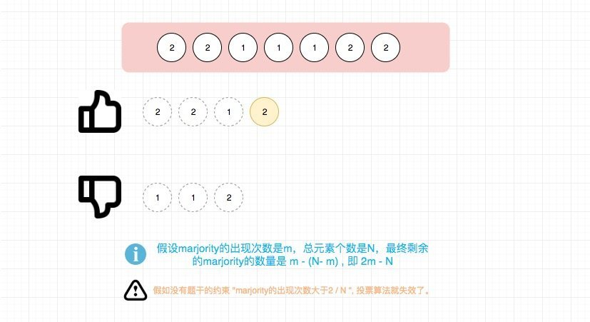

# 0169. 多数元素

## 题目地址(169. 多数元素)

<https://leetcode-cn.com/problems/majority-element/>

## 题目描述

```
<pre class="calibre18">```
给定一个大小为 n 的数组，找到其中的多数元素。多数元素是指在数组中出现次数大于 ⌊ n/2 ⌋ 的元素。

你可以假设数组是非空的，并且给定的数组总是存在多数元素。


示例 1:

输入: [3,2,3]
输出: 3
示例 2:

输入: [2,2,1,1,1,2,2]
输出: 2

```
```

## 前置知识

- 投票算法

## 公司

- 阿里
- 腾讯
- 百度
- 字节
- adobe
- zenefits

## 思路

符合直觉的做法是利用额外的空间去记录每个元素出现的次数，并用一个单独的变量记录当前出现次数最多的元素。

但是这种做法空间复杂度较高，有没有可能进行优化呢？ 答案就是用"投票算法"。

投票算法的原理是通过不断消除不同元素直到没有不同元素，剩下的元素就是我们要找的元素。



## 关键点解析

- 投票算法

## 代码

- 语言支持：JS，Python

Javascript Code:

```
<pre class="calibre18">```
<span class="hljs-keyword">var</span> majorityElement = <span class="hljs-function"><span class="hljs-keyword">function</span>(<span class="hljs-params">nums</span>) </span>{
    <span class="hljs-keyword">let</span> count = <span class="hljs-params">1</span>;
    <span class="hljs-keyword">let</span> majority = nums[<span class="hljs-params">0</span>];
    <span class="hljs-keyword">for</span>(<span class="hljs-keyword">let</span> i = <span class="hljs-params">1</span>; i < nums.length; i++) {
        <span class="hljs-keyword">if</span> (count === <span class="hljs-params">0</span>) {
            majority = nums[i];
        }
        <span class="hljs-keyword">if</span> (nums[i] === majority) {
            count ++;
        } <span class="hljs-keyword">else</span> {
            count --;
        }
    }
    <span class="hljs-keyword">return</span> majority;
};

```
```

Python Code:

```
<pre class="calibre18">```
<span class="hljs-class"><span class="hljs-keyword">class</span> <span class="hljs-title">Solution</span>:</span>
    <span class="hljs-function"><span class="hljs-keyword">def</span> <span class="hljs-title">majorityElement</span><span class="hljs-params">(self, nums: List[int])</span> -> int:</span>
        count, majority = <span class="hljs-params">1</span>, nums[<span class="hljs-params">0</span>]
        <span class="hljs-keyword">for</span> num <span class="hljs-keyword">in</span> nums[<span class="hljs-params">1</span>:]:
            <span class="hljs-keyword">if</span> count == <span class="hljs-params">0</span>:
                majority = num
            <span class="hljs-keyword">if</span> num == majority:
                count += <span class="hljs-params">1</span>
            <span class="hljs-keyword">else</span>:
                count -= <span class="hljs-params">1</span>
        <span class="hljs-keyword">return</span> majority

```
```

**复杂度分析**

- 时间复杂度：O(N)O(N)O(N)，其中N为数组长度
- 空间复杂度：O(1)O(1)O(1)

更多题解可以访问我的LeetCode题解仓库：<https://github.com/azl397985856/leetcode> 。 目前已经37K star啦。

关注公众号力扣加加，努力用清晰直白的语言还原解题思路，并且有大量图解，手把手教你识别套路，高效刷题。

