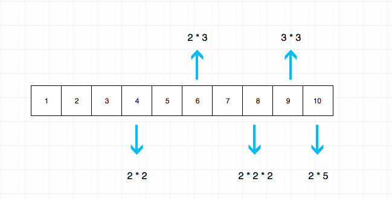
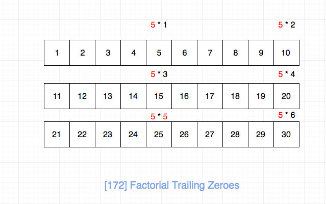
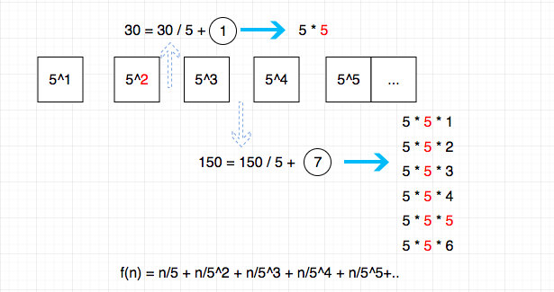

# 0172. 阶乘后的零

## 题目地址(172. 阶乘后的零)

<https://leetcode-cn.com/problems/factorial-trailing-zeroes/>

## 题目描述

```
<pre class="calibre18">```
给定一个整数 n，返回 n! 结果尾数中零的数量。

示例 1:

输入: 3
输出: 0
解释: 3! = 6, 尾数中没有零。
示例 2:

输入: 5
输出: 1
解释: 5! = 120, 尾数中有 1 个零.
说明: 你算法的时间复杂度应为 O(log n) 。

```
```

## 前置知识

- [递归](https://github.com/azl397985856/leetcode/blob/master/thinkings/basic-data-structure.md)

## 公司

- 阿里
- 腾讯
- 百度
- bloomberg

## 思路

我们需要求解这n个数字相乘的结果末尾有多少个0，由于题目要求log的复杂度，因此暴力求解是不行的。

通过观察，我们发现如果想要结果末尾是0，必须是分解质因数之后，2 和 5 相乘才行，同时因数分解之后发现5的个数远小于2， 因此我们只需要求解这n数字分解质因数之后一共有多少个5即可.



如图如果n为30，那么结果应该是图中红色5的个数，即7。



我们的结果并不是直接f(n) = n / 5, 比如n为30， 25中是有两个5的。 类似，n为150，会有7个这样的数字，通过观察我们发现规律`f(n) = n/5 + n/5^2 + n/5^3 + n/5^4 + n/5^5+..`



如果可以发现上面的规律，用递归还是循环实现这个算式就看你的了。

## 关键点解析

- 数论

## 代码

- 语言支持：JS，Python

Javascript Code:

```
<pre class="calibre18">```
<span class="hljs-title">/*
 * @lc app=leetcode id=172 lang=javascript
 *
 * [172] Factorial Trailing Zeroes
 */</span>
<span class="hljs-title">/**
 * @param {number} n
 * @return {number}
 */</span>
<span class="hljs-keyword">var</span> trailingZeroes = <span class="hljs-function"><span class="hljs-keyword">function</span>(<span class="hljs-params">n</span>) </span>{
  <span class="hljs-title">// tag: 数论</span>

  <span class="hljs-title">// if (n === 0) return n;</span>

  <span class="hljs-title">// 递归： f(n) = n / 5 + f(n / 5)</span>
  <span class="hljs-title">// return Math.floor(n / 5)  + trailingZeroes(Math.floor(n / 5));</span>
  <span class="hljs-keyword">let</span> count = <span class="hljs-params">0</span>;
  <span class="hljs-keyword">while</span> (n >= <span class="hljs-params">5</span>) {
    count += <span class="hljs-params">Math</span>.floor(n / <span class="hljs-params">5</span>);
    n = <span class="hljs-params">Math</span>.floor(n / <span class="hljs-params">5</span>);
  }
  <span class="hljs-keyword">return</span> count;
};

```
```

Python Code:

```
<pre class="calibre18">```
<span class="hljs-class"><span class="hljs-keyword">class</span> <span class="hljs-title">Solution</span>:</span>
    <span class="hljs-function"><span class="hljs-keyword">def</span> <span class="hljs-title">trailingZeroes</span><span class="hljs-params">(self, n: int)</span> -> int:</span>
        count = <span class="hljs-params">0</span>
        <span class="hljs-keyword">while</span> n >= <span class="hljs-params">5</span>:
            n = n // <span class="hljs-params">5</span>
            count += n
        <span class="hljs-keyword">return</span> count


<span class="hljs-title"># 递归</span>
<span class="hljs-class"><span class="hljs-keyword">class</span> <span class="hljs-title">Solution</span>:</span>
    <span class="hljs-function"><span class="hljs-keyword">def</span> <span class="hljs-title">trailingZeroes</span><span class="hljs-params">(self, n: int)</span> -> int:</span>
        <span class="hljs-keyword">if</span> n == <span class="hljs-params">0</span>: <span class="hljs-keyword">return</span> <span class="hljs-params">0</span>
        <span class="hljs-keyword">return</span> n // <span class="hljs-params">5</span> + self.trailingZeroes(n // <span class="hljs-params">5</span>)

```
```

**复杂度分析**

- 时间复杂度：O(logN)O(logN)O(logN)
- 空间复杂度：O(1)O(1)O(1)

更多题解可以访问我的LeetCode题解仓库：<https://github.com/azl397985856/leetcode> 。 目前已经37K star啦。

关注公众号力扣加加，努力用清晰直白的语言还原解题思路，并且有大量图解，手把手教你识别套路，高效刷题。

