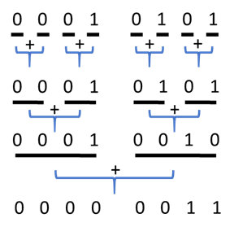

# 0191. 位1的个数

## 题目地址(191. 位1的个数)

<https://leetcode-cn.com/problems/number-of-1-bits/>

## 题目描述

```
<pre class="calibre18">```
编写一个函数，输入是一个无符号整数，返回其二进制表达式中数字位数为 ‘1’ 的个数（也被称为汉明重量）。


示例 1：

输入：00000000000000000000000000001011
输出：3
解释：输入的二进制串 00000000000000000000000000001011 中，共有三位为 '1'。
示例 2：

输入：00000000000000000000000010000000
输出：1
解释：输入的二进制串 00000000000000000000000010000000 中，共有一位为 '1'。
示例 3：

输入：11111111111111111111111111111101
输出：31
解释：输入的二进制串 11111111111111111111111111111101 中，共有 31 位为 '1'。


提示：

请注意，在某些语言（如 Java）中，没有无符号整数类型。在这种情况下，输入和输出都将被指定为有符号整数类型，并且不应影响您的实现，因为无论整数是有符号的还是无符号的，其内部的二进制表示形式都是相同的。
在 Java 中，编译器使用二进制补码记法来表示有符号整数。因此，在上面的 示例 3 中，输入表示有符号整数 -3。


进阶:
如果多次调用这个函数，你将如何优化你的算法？

```
```

## 前置知识

- [位运算](https://github.com/azl397985856/leetcode/blob/master/thinkings/bit.md)

## 公司

- 阿里
- 腾讯
- 百度
- 字节
- apple
- microsoft

## 思路

这个题目的大意是： 给定一个无符号的整数， 返回其用二进制表式的时候的1的个数。

这里用一个trick， 可以轻松求出。 就是`n & (n - 1)` 可以`消除` n 最后的一个1的原理。

> 为什么能消除最后一个1， 其实也比较简单，大家自己想一下

这样我们可以不断进行`n = n & (n - 1)`直到n === 0 ， 说明没有一个1了。 这个时候`我们消除了多少1变成一个1都没有了， 就说明n有多少个1了`。

## 关键点解析

1. `n & (n - 1)` 可以`消除` n 最后的一个1的原理 简化操作
2. bit 运算

## 代码

语言支持：JS, C++，Python

JavaScript Code:

```
<pre class="calibre18">```
<span class="hljs-title">/*
 * @lc app=leetcode id=191 lang=javascript
 *
 */</span>
<span class="hljs-title">/**
 * @param {number} n - a positive integer
 * @return {number}
 */</span>
<span class="hljs-keyword">var</span> hammingWeight = <span class="hljs-function"><span class="hljs-keyword">function</span>(<span class="hljs-params">n</span>) </span>{
  <span class="hljs-keyword">let</span> count = <span class="hljs-params">0</span>;
  <span class="hljs-keyword">while</span> (n !== <span class="hljs-params">0</span>) {
    n = n & (n - <span class="hljs-params">1</span>);
    count++;
  }

  <span class="hljs-keyword">return</span> count;
};

```
```

C++ code:

```
<pre class="calibre18">```
<span class="hljs-keyword">class</span> Solution {
<span class="hljs-keyword">public</span>:
    <span class="hljs-function"><span class="hljs-keyword">int</span> <span class="hljs-title">hammingWeight</span><span class="hljs-params">(uint32_t v)</span> </span>{
        <span class="hljs-keyword">auto</span> count = <span class="hljs-params">0</span>;
        <span class="hljs-keyword">while</span> (v != <span class="hljs-params">0</span>) {
            v &= (v - <span class="hljs-params">1</span>);
            ++count;
        }
        <span class="hljs-keyword">return</span> count;
    }
};

```
```

Python Code:

```
<pre class="calibre18">```
<span class="hljs-class"><span class="hljs-keyword">class</span> <span class="hljs-title">Solution</span><span class="hljs-params">(object)</span>:</span>
    <span class="hljs-function"><span class="hljs-keyword">def</span> <span class="hljs-title">hammingWeight</span><span class="hljs-params">(self, n)</span>:</span>
        <span class="hljs-string">"""
        :type n: int
        :rtype: int
        """</span>
        count = <span class="hljs-params">0</span>
        <span class="hljs-keyword">while</span> n:
            n &= n - <span class="hljs-params">1</span>
            count += <span class="hljs-params">1</span>
        <span class="hljs-keyword">return</span> count

```
```

**复杂度分析**

- 时间复杂度：O(logN)O(logN)O(logN)
- 空间复杂度：O(N)O(N)O(N)

## 扩展

可以使用位操作来达到目的。例如8位的整数21:



C++ Code：

```
<pre class="calibre18">```
<span class="hljs-keyword">const</span> <span class="hljs-keyword">uint32_t</span> ODD_BIT_MASK = <span class="hljs-params">0xAAAAAAAA</span>;
<span class="hljs-keyword">const</span> <span class="hljs-keyword">uint32_t</span> EVEN_BIT_MASK = <span class="hljs-params">0x55555555</span>;
<span class="hljs-keyword">const</span> <span class="hljs-keyword">uint32_t</span> ODD_2BIT_MASK = <span class="hljs-params">0xCCCCCCCC</span>;
<span class="hljs-keyword">const</span> <span class="hljs-keyword">uint32_t</span> EVEN_2BIT_MASK = <span class="hljs-params">0x33333333</span>;
<span class="hljs-keyword">const</span> <span class="hljs-keyword">uint32_t</span> ODD_4BIT_MASK = <span class="hljs-params">0xF0F0F0F0</span>;
<span class="hljs-keyword">const</span> <span class="hljs-keyword">uint32_t</span> EVEN_4BIT_MASK = <span class="hljs-params">0x0F0F0F0F</span>;
<span class="hljs-keyword">const</span> <span class="hljs-keyword">uint32_t</span> ODD_8BIT_MASK = <span class="hljs-params">0xFF00FF00</span>;
<span class="hljs-keyword">const</span> <span class="hljs-keyword">uint32_t</span> EVEN_8BIT_MASK = <span class="hljs-params">0x00FF00FF</span>;
<span class="hljs-keyword">const</span> <span class="hljs-keyword">uint32_t</span> ODD_16BIT_MASK = <span class="hljs-params">0xFFFF0000</span>;
<span class="hljs-keyword">const</span> <span class="hljs-keyword">uint32_t</span> EVEN_16BIT_MASK = <span class="hljs-params">0x0000FFFF</span>;

<span class="hljs-keyword">class</span> Solution {
<span class="hljs-keyword">public</span>:

    <span class="hljs-function"><span class="hljs-keyword">int</span> <span class="hljs-title">hammingWeight</span><span class="hljs-params">(uint32_t v)</span> </span>{
        v = (v & EVEN_BIT_MASK) + ((v & ODD_BIT_MASK) >> <span class="hljs-params">1</span>);
        v = (v & EVEN_2BIT_MASK) + ((v & ODD_2BIT_MASK) >> <span class="hljs-params">2</span>);
        v = (v & EVEN_4BIT_MASK) + ((v & ODD_4BIT_MASK) >> <span class="hljs-params">4</span>);
        v = (v & EVEN_8BIT_MASK) + ((v & ODD_8BIT_MASK) >> <span class="hljs-params">8</span>);
        <span class="hljs-keyword">return</span> (v & EVEN_16BIT_MASK) + ((v & ODD_16BIT_MASK) >> <span class="hljs-params">16</span>);
    }
};

```
```

更多题解可以访问我的LeetCode题解仓库：<https://github.com/azl397985856/leetcode> 。 目前已经37K star啦。

关注公众号力扣加加，努力用清晰直白的语言还原解题思路，并且有大量图解，手把手教你识别套路，高效刷题。

