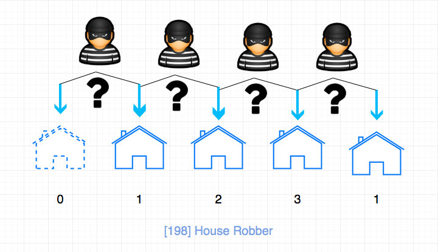

# 0198. 打家劫舍

## 题目地址(198. 打家劫舍)

<https://leetcode-cn.com/problems/house-robber/>

## 题目描述

```
<pre class="calibre18">```
你是一个专业的小偷，计划偷窃沿街的房屋。每间房内都藏有一定的现金，影响你偷窃的唯一制约因素就是相邻的房屋装有相互连通的防盗系统，如果两间相邻的房屋在同一晚上被小偷闯入，系统会自动报警。

给定一个代表每个房屋存放金额的非负整数数组，计算你 不触动警报装置的情况下 ，一夜之内能够偷窃到的最高金额。


示例 1：

输入：[1,2,3,1]
输出：4
解释：偷窃 1 号房屋 (金额 = 1) ，然后偷窃 3 号房屋 (金额 = 3)。
     偷窃到的最高金额 = 1 + 3 = 4 。
示例 2：

输入：[2,7,9,3,1]
输出：12
解释：偷窃 1 号房屋 (金额 = 2), 偷窃 3 号房屋 (金额 = 9)，接着偷窃 5 号房屋 (金额 = 1)。
     偷窃到的最高金额 = 2 + 9 + 1 = 12 。


提示：

0 <= nums.length <= 100
0 <= nums[i] <= 400

```
```

## 前置知识

- [动态规划](https://github.com/azl397985856/leetcode/blob/master/thinkings/dynamic-programming.md)

## 公司

- 阿里
- 腾讯
- 百度
- 字节
- airbnb
- linkedin

## 思路

这是一道非常典型且简单的动态规划问题，但是在这里我希望通过这个例子， 让大家对动态规划问题有一点认识。

为什么别人的动态规划可以那么写，为什么没有用 dp 数组就搞定了。 比如别人的爬楼梯问题怎么就用 fibnacci 搞定了？为什么？在这里我们就来看下。

思路还是和其他简单的动态规划问题一样，我们本质上在解决`对于第[i] 个房子，我们抢还是不抢。`的问题。

判断的标准就是总价值哪个更大， 那么对于抢的话`就是当前的房子可以抢的价值 + dp[i - 2]`

> i - 1 不能抢，否则会触发警铃

如果不抢的话，就是`dp[i - 1]`.

> 这里的 dp 其实就是`子问题`.

状态转移方程也不难写`dp[i] = Math.max(dp[i - 2] + nums[i - 2], dp[i - 1]);`（注：这里为了方便计算，令 `dp[0]`和 `dp[1]`都等于 0，所以 `dp[i]`对应的是 `nums[i - 2]`）

上述过程用图来表示的话，是这样的：



我们仔细观察的话，其实我们只需要保证前一个 dp\[i - 1\] 和 dp\[i - 2\] 两个变量就好了， 比如我们计算到 i = 6 的时候，即需要计算 dp\[6\]的时候， 我们需要 dp\[5\], dp\[4\]，但是我们 不需要 dp\[3\], dp\[2\] ...

因此代码可以简化为：

```
<pre class="calibre18">```
<span class="hljs-keyword">let</span> a = <span class="hljs-params">0</span>;
<span class="hljs-keyword">let</span> b = <span class="hljs-params">0</span>;

<span class="hljs-keyword">for</span> (<span class="hljs-keyword">let</span> i = <span class="hljs-params">0</span>; i < nums.length; i++) {
  <span class="hljs-keyword">const</span> temp = b;
  b = <span class="hljs-params">Math</span>.max(a + nums[i], b);
  a = temp;
}

<span class="hljs-keyword">return</span> b;

```
```

如上的代码，我们可以将空间复杂度进行优化，从 O(n)降低到 O(1), 类似的优化在 DP 问题中不在少数。

> 动态规划问题是递归问题查表，避免重复计算，从而节省时间。 如果我们对问题加以分析和抽象，有可能对空间上进一步优化

## 关键点解析

## 代码

- 语言支持：JS，C++，Python

JavaScript Code：

```
<pre class="calibre18">```
<span class="hljs-title">/**
 * @param {number[]} nums
 * @return {number}
 */</span>
<span class="hljs-keyword">var</span> rob = <span class="hljs-function"><span class="hljs-keyword">function</span> (<span class="hljs-params">nums</span>) </span>{
  <span class="hljs-title">// Tag: DP</span>
  <span class="hljs-keyword">const</span> dp = [];
  dp[<span class="hljs-params">0</span>] = <span class="hljs-params">0</span>;
  dp[<span class="hljs-params">1</span>] = <span class="hljs-params">0</span>;

  <span class="hljs-keyword">for</span> (<span class="hljs-keyword">let</span> i = <span class="hljs-params">2</span>; i < nums.length + <span class="hljs-params">2</span>; i++) {
    dp[i] = <span class="hljs-params">Math</span>.max(dp[i - <span class="hljs-params">2</span>] + nums[i - <span class="hljs-params">2</span>], dp[i - <span class="hljs-params">1</span>]);
  }

  <span class="hljs-keyword">return</span> dp[nums.length + <span class="hljs-params">1</span>];
};

```
```

C++ Code：

> 与 JavaScript 代码略有差异，但状态迁移方程是一样的。

```
<pre class="calibre18">```
<span class="hljs-keyword">class</span> Solution {
<span class="hljs-keyword">public</span>:
    <span class="hljs-function"><span class="hljs-keyword">int</span> <span class="hljs-title">rob</span><span class="hljs-params">(<span class="hljs-params">vector</span><<span class="hljs-keyword">int</span>>& nums)</span> </span>{
        <span class="hljs-keyword">if</span> (nums.empty()) <span class="hljs-keyword">return</span> <span class="hljs-params">0</span>;
        <span class="hljs-keyword">auto</span> sz = nums.size();
        <span class="hljs-keyword">if</span> (sz == <span class="hljs-params">1</span>) <span class="hljs-keyword">return</span> nums[<span class="hljs-params">0</span>];
        <span class="hljs-keyword">auto</span> prev = nums[<span class="hljs-params">0</span>];
        <span class="hljs-keyword">auto</span> cur = max(prev, nums[<span class="hljs-params">1</span>]);
        <span class="hljs-keyword">for</span> (<span class="hljs-keyword">auto</span> i = <span class="hljs-params">2</span>; i < sz; ++i) {
            <span class="hljs-keyword">auto</span> tmp = cur;
            cur = max(nums[i] + prev, cur);
            prev = tmp;
        }
        <span class="hljs-keyword">return</span> cur;
    }
};

```
```

Python Code:

```
<pre class="calibre18">```
<span class="hljs-class"><span class="hljs-keyword">class</span> <span class="hljs-title">Solution</span>:</span>
    <span class="hljs-function"><span class="hljs-keyword">def</span> <span class="hljs-title">rob</span><span class="hljs-params">(self, nums: List[int])</span> -> int:</span>
        <span class="hljs-keyword">if</span> <span class="hljs-keyword">not</span> nums:
            <span class="hljs-keyword">return</span> <span class="hljs-params">0</span>

        length = len(nums)
        <span class="hljs-keyword">if</span> length == <span class="hljs-params">1</span>:
            <span class="hljs-keyword">return</span> nums[<span class="hljs-params">0</span>]
        <span class="hljs-keyword">else</span>:
            prev = nums[<span class="hljs-params">0</span>]
            cur = max(prev, nums[<span class="hljs-params">1</span>])
            <span class="hljs-keyword">for</span> i <span class="hljs-keyword">in</span> range(<span class="hljs-params">2</span>, length):
                cur, prev = max(prev + nums[i], cur), cur
            <span class="hljs-keyword">return</span> cur

```
```

**复杂度分析**

- 时间复杂度：O(N)O(N)O(N)
- 空间复杂度：O(1)O(1)O(1)

## 相关题目

- [337.house-robber-iii](https://github.com/azl397985856/leetcode/blob/master/problems/337.house-robber-iii.md)

大家对此有何看法，欢迎给我留言，我有时间都会一一查看回答。更多算法套路可以访问我的 LeetCode 题解仓库：<https://github.com/azl397985856/leetcode> 。 目前已经 37K star 啦。 大家也可以关注我的公众号《力扣加加》带你啃下算法这块硬骨头。

