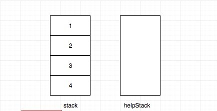
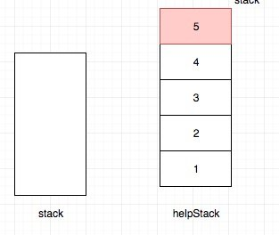
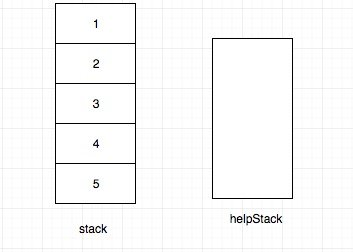
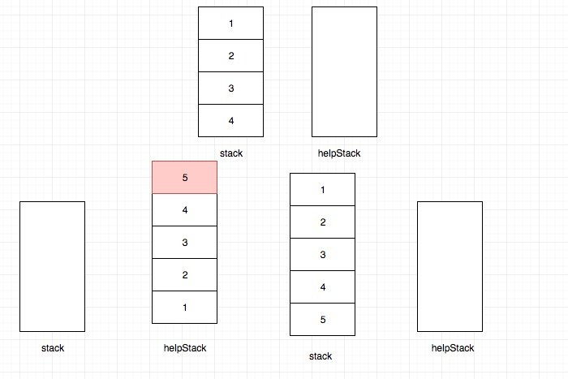

# 0232. 用栈实现队列

## 题目地址(232. 用栈实现队列)

<https://leetcode-cn.com/problems/implement-queue-using-stacks/>

## 题目描述

```
<pre class="calibre18">```
使用栈实现队列的下列操作：

push(x) -- 将一个元素放入队列的尾部。
pop() -- 从队列首部移除元素。
peek() -- 返回队列首部的元素。
empty() -- 返回队列是否为空。


示例:

MyQueue queue = new MyQueue();

queue.push(1);
queue.push(2);  
queue.peek();  // 返回 1
queue.pop();   // 返回 1
queue.empty(); // 返回 false


说明:

你只能使用标准的栈操作 -- 也就是只有 push to top, peek/pop from top, size, 和 is empty 操作是合法的。
你所使用的语言也许不支持栈。你可以使用 list 或者 deque（双端队列）来模拟一个栈，只要是标准的栈操作即可。
假设所有操作都是有效的 （例如，一个空的队列不会调用 pop 或者 peek 操作）。

```
```

## 前置知识

- [栈](https://github.com/azl397985856/leetcode/blob/master/thinkings/basic-data-structure.md)

## 公司

- 阿里
- 腾讯
- 百度
- 字节
- bloomberg
- microsoft

## 思路

这道题目是让我们用栈来模拟实现队列。 我们知道栈和队列都是一种受限的数据结构。 栈的特点是只能在一端进行所有操作，队列的特点是只能在一端入队，另一端出队。

在这里我们可以借助另外一个栈，也就是说用两个栈来实现队列的效果。这种做法的时间复杂度和空间复杂度都是O(n)。

由于栈只能操作一端，因此我们peek或者pop的时候也只去操作顶部元素，要达到目的 我们需要在push的时候将队头的元素放到栈顶即可。

因此我们只需要在push的时候，用一下辅助栈即可。 具体做法是先将栈清空并依次放到另一个辅助栈中，辅助栈中的元素再次放回栈中，最后将新的元素push进去即可。

比如我们现在栈中已经是1，2，3，4了。 我们现在要push一个5.

push之前是这样的：



然后我们将栈中的元素转移到辅助栈：



最后将新的元素添加到栈顶。



整个过程是这样的：



## 关键点解析

- 在push的时候利用辅助栈(双栈)

## 代码

- 语言支持：JS, Python, Java

Javascript Code:

```
<pre class="calibre18">```
<span class="hljs-title">/*
 * @lc app=leetcode id=232 lang=javascript
 *
 * [232] Implement Queue using Stacks
 */</span>
<span class="hljs-title">/**
 * Initialize your data structure here.
 */</span>
<span class="hljs-keyword">var</span> MyQueue = <span class="hljs-function"><span class="hljs-keyword">function</span>(<span class="hljs-params"></span>) </span>{
  <span class="hljs-title">// tag: queue stack array</span>
  <span class="hljs-keyword">this</span>.stack = [];
  <span class="hljs-keyword">this</span>.helperStack = [];
};

<span class="hljs-title">/**
 * Push element x to the back of queue.
 * @param {number} x
 * @return {void}
 */</span>
MyQueue.prototype.push = <span class="hljs-function"><span class="hljs-keyword">function</span>(<span class="hljs-params">x</span>) </span>{
  <span class="hljs-keyword">let</span> cur = <span class="hljs-params">null</span>;
  <span class="hljs-keyword">while</span> ((cur = <span class="hljs-keyword">this</span>.stack.pop())) {
    <span class="hljs-keyword">this</span>.helperStack.push(cur);
  }
  <span class="hljs-keyword">this</span>.helperStack.push(x);

  <span class="hljs-keyword">while</span> ((cur = <span class="hljs-keyword">this</span>.helperStack.pop())) {
    <span class="hljs-keyword">this</span>.stack.push(cur);
  }
};

<span class="hljs-title">/**
 * Removes the element from in front of queue and returns that element.
 * @return {number}
 */</span>
MyQueue.prototype.pop = <span class="hljs-function"><span class="hljs-keyword">function</span>(<span class="hljs-params"></span>) </span>{
  <span class="hljs-keyword">return</span> <span class="hljs-keyword">this</span>.stack.pop();
};

<span class="hljs-title">/**
 * Get the front element.
 * @return {number}
 */</span>
MyQueue.prototype.peek = <span class="hljs-function"><span class="hljs-keyword">function</span>(<span class="hljs-params"></span>) </span>{
  <span class="hljs-keyword">return</span> <span class="hljs-keyword">this</span>.stack[<span class="hljs-keyword">this</span>.stack.length - <span class="hljs-params">1</span>];
};

<span class="hljs-title">/**
 * Returns whether the queue is empty.
 * @return {boolean}
 */</span>
MyQueue.prototype.empty = <span class="hljs-function"><span class="hljs-keyword">function</span>(<span class="hljs-params"></span>) </span>{
  <span class="hljs-keyword">return</span> <span class="hljs-keyword">this</span>.stack.length === <span class="hljs-params">0</span>;
};

<span class="hljs-title">/**
 * Your MyQueue object will be instantiated and called as such:
 * var obj = new MyQueue()
 * obj.push(x)
 * var param_2 = obj.pop()
 * var param_3 = obj.peek()
 * var param_4 = obj.empty()
 */</span>

```
```

Python Code:

```
<pre class="calibre18">```
<span class="hljs-class"><span class="hljs-keyword">class</span> <span class="hljs-title">MyQueue</span>:</span>

    <span class="hljs-function"><span class="hljs-keyword">def</span> <span class="hljs-title">__init__</span><span class="hljs-params">(self)</span>:</span>
        <span class="hljs-string">"""
        Initialize your data structure here.
        """</span>
        self.stack = []
        self.help_stack = []

    <span class="hljs-function"><span class="hljs-keyword">def</span> <span class="hljs-title">push</span><span class="hljs-params">(self, x: int)</span> -> <span class="hljs-keyword">None</span>:</span>
        <span class="hljs-string">"""
        Push element x to the back of queue.
        """</span>
        <span class="hljs-keyword">while</span> self.stack:
            self.help_stack.append(self.stack.pop())
        self.help_stack.append(x)
        <span class="hljs-keyword">while</span> self.help_stack:
            self.stack.append(self.help_stack.pop())

    <span class="hljs-function"><span class="hljs-keyword">def</span> <span class="hljs-title">pop</span><span class="hljs-params">(self)</span> -> int:</span>
        <span class="hljs-string">"""
        Removes the element from in front of queue and returns that element.
        """</span>
        <span class="hljs-keyword">return</span> self.stack.pop()

    <span class="hljs-function"><span class="hljs-keyword">def</span> <span class="hljs-title">peek</span><span class="hljs-params">(self)</span> -> int:</span>
        <span class="hljs-string">"""
        Get the front element.
        """</span>
        <span class="hljs-keyword">return</span> self.stack[<span class="hljs-params">-1</span>]

    <span class="hljs-function"><span class="hljs-keyword">def</span> <span class="hljs-title">empty</span><span class="hljs-params">(self)</span> -> bool:</span>
        <span class="hljs-string">"""
        Returns whether the queue is empty.
        """</span>
        <span class="hljs-keyword">return</span> <span class="hljs-keyword">not</span> bool(self.stack)


<span class="hljs-title"># Your MyQueue object will be instantiated and called as such:</span>
<span class="hljs-title"># obj = MyQueue()</span>
<span class="hljs-title"># obj.push(x)</span>
<span class="hljs-title"># param_2 = obj.pop()</span>
<span class="hljs-title"># param_3 = obj.peek()</span>
<span class="hljs-title"># param_4 = obj.empty()</span>

```
```

Java Code

```
<pre class="calibre18">```
<span class="hljs-class"><span class="hljs-keyword">class</span> <span class="hljs-title">MyQueue</span> </span>{
    Stack<Integer> pushStack = <span class="hljs-keyword">new</span> Stack<> ();
    Stack<Integer> popStack = <span class="hljs-keyword">new</span> Stack<> ();

    <span class="hljs-title">/** Initialize your data structure here. */</span>
    <span class="hljs-function"><span class="hljs-keyword">public</span> <span class="hljs-title">MyQueue</span><span class="hljs-params">()</span> </span>{

    }

    <span class="hljs-title">/** Push element x to the back of queue. */</span>
    <span class="hljs-function"><span class="hljs-keyword">public</span> <span class="hljs-keyword">void</span> <span class="hljs-title">push</span><span class="hljs-params">(<span class="hljs-keyword">int</span> x)</span> </span>{
        <span class="hljs-keyword">while</span> (!popStack.isEmpty()) {
            pushStack.push(popStack.pop());
        }
        pushStack.push(x);
    }

    <span class="hljs-title">/** Removes the element from in front of queue and returns that element. */</span>
    <span class="hljs-function"><span class="hljs-keyword">public</span> <span class="hljs-keyword">int</span> <span class="hljs-title">pop</span><span class="hljs-params">()</span> </span>{
        <span class="hljs-keyword">while</span> (!pushStack.isEmpty()) {
            popStack.push(pushStack.pop());
        }
        <span class="hljs-keyword">return</span> popStack.pop();
    }

    <span class="hljs-title">/** Get the front element. */</span>
    <span class="hljs-function"><span class="hljs-keyword">public</span> <span class="hljs-keyword">int</span> <span class="hljs-title">peek</span><span class="hljs-params">()</span> </span>{
        <span class="hljs-keyword">while</span> (!pushStack.isEmpty()) {
            popStack.push(pushStack.pop());
        }
        <span class="hljs-keyword">return</span> popStack.peek();
    }

    <span class="hljs-title">/** Returns whether the queue is empty. */</span>
    <span class="hljs-function"><span class="hljs-keyword">public</span> <span class="hljs-keyword">boolean</span> <span class="hljs-title">empty</span><span class="hljs-params">()</span> </span>{
        <span class="hljs-keyword">return</span> pushStack.isEmpty() && popStack.isEmpty();
    }
}

<span class="hljs-title">/**
 * Your MyQueue object will be instantiated and called as such:
 * MyQueue obj = new MyQueue();
 * obj.push(x);
 * int param_2 = obj.pop();
 * int param_3 = obj.peek();
 * boolean param_4 = obj.empty();
 */</span>
`

```
```

**复杂度分析**

- 时间复杂度：O(1)O(1)O(1)
- 空间复杂度：O(1)O(1)O(1)

## 扩展

- 类似的题目有用队列实现栈，思路是完全一样的，大家有兴趣可以试一下。
- 栈混洗也是借助另外一个栈来完成的，从这点来看，两者有相似之处。

## 延伸阅读

实际上现实中也有使用两个栈来实现队列的情况，那么为什么我们要用两个stack来实现一个queue？

其实使用两个栈来替代一个队列的实现是为了在多进程中分开对同一个队列对读写操作。一个栈是用来读的，另一个是用来写的。当且仅当读栈满时或者写栈为空时，读写操作才会发生冲突。

当只有一个线程对栈进行读写操作的时候，总有一个栈是空的。在多线程应用中，如果我们只有一个队列，为了线程安全，我们在读或者写队列的时候都需要锁住整个队列。而在两个栈的实现中，只要写入栈不为空，那么`push`操作的锁就不会影响到`pop`。

- [reference](https://leetcode.com/problems/implement-queue-using-stacks/discuss/64284/Do-you-know-when-we-should-use-two-stacks-to-implement-a-queue)
- [further reading](https://stackoverflow.com/questions/2050120/why-use-two-stacks-to-make-a-queue/2050402#2050402)

更多题解可以访问我的LeetCode题解仓库：<https://github.com/azl397985856/leetcode> 。 目前已经37K star啦。

关注公众号力扣加加，努力用清晰直白的语言还原解题思路，并且有大量图解，手把手教你识别套路，高效刷题。

