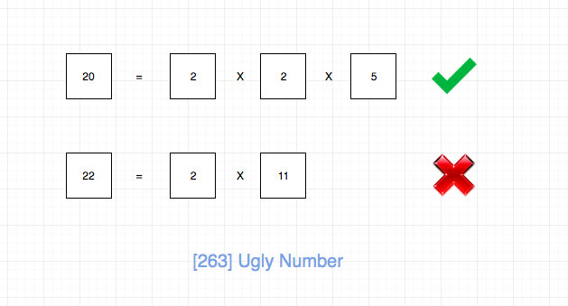

# 0263. 丑数

## 题目地址(263. 丑数)

<https://leetcode-cn.com/problems/ugly-number/>

## 题目描述

```
<pre class="calibre18">```
编写一个程序判断给定的数是否为丑数。

丑数就是只包含质因数 2, 3, 5 的正整数。

示例 1:

输入: 6
输出: true
解释: 6 = 2 × 3
示例 2:

输入: 8
输出: true
解释: 8 = 2 × 2 × 2
示例 3:

输入: 14
输出: false 
解释: 14 不是丑数，因为它包含了另外一个质因数 7。
说明：

1 是丑数。
输入不会超过 32 位有符号整数的范围: [−231,  231 − 1]。

```
```

## 前置知识

- 数学
- 因数分解

## 公司

- 阿里
- 腾讯
- 百度
- 字节

## 思路

题目要求给定一个数字，判断是否为“丑陋数”(ugly number), 丑陋数是指只包含质因子2, 3, 5的正整数。



根据定义，我们将给定数字除以2、3、5(顺序无所谓)，直到无法整除。 如果得到1，说明是所有因子都是2或3或5，如果不是1，则不是丑陋数。

这就好像我们判断一个数字是否为n(n为大于1的正整数)的幂次方一样，我们只需要 不断除以n，直到无法整除，如果得到1，那么就是n的幂次方。 这道题的不同在于 它不再是某一个数字的幂次方，而是三个数字（2，3，5），不过解题思路还是一样的。

转化为代码可以是：

```
<pre class="calibre18">```

  <span class="hljs-keyword">while</span>(num % <span class="hljs-params">2</span> === <span class="hljs-params">0</span>)   num = num / <span class="hljs-params">2</span>;
  <span class="hljs-keyword">while</span>(num % <span class="hljs-params">3</span> === <span class="hljs-params">0</span>)   num = num / <span class="hljs-params">3</span>;
  <span class="hljs-keyword">while</span>(num % <span class="hljs-params">5</span> === <span class="hljs-params">0</span>)   num = num / <span class="hljs-params">5</span>;

  <span class="hljs-keyword">return</span> num === <span class="hljs-params">1</span>;

```
```

> 我下方给出的代码是用了递归实现，只是给大家看下不同的写法而已。

## 关键点

- 数论
- 因数分解

## 代码

- 语言支持：JS, C++, Java, Python

Javascript Code:

```
<pre class="calibre18">```
<span class="hljs-title">/*
 * @lc app=leetcode id=263 lang=javascript
 *
 * [263] Ugly Number
 */</span>
<span class="hljs-title">/**
 * @param {number} num
 * @return {boolean}
 */</span>
<span class="hljs-keyword">var</span> isUgly = <span class="hljs-function"><span class="hljs-keyword">function</span>(<span class="hljs-params">num</span>) </span>{
  <span class="hljs-title">// TAG: 数论</span>
  <span class="hljs-keyword">if</span> (num <= <span class="hljs-params">0</span>) <span class="hljs-keyword">return</span> <span class="hljs-params">false</span>;
  <span class="hljs-keyword">if</span> (num === <span class="hljs-params">1</span>) <span class="hljs-keyword">return</span> <span class="hljs-params">true</span>;

  <span class="hljs-keyword">const</span> list = [<span class="hljs-params">2</span>, <span class="hljs-params">3</span>, <span class="hljs-params">5</span>];

  <span class="hljs-keyword">if</span> (list.includes(num)) <span class="hljs-keyword">return</span> <span class="hljs-params">true</span>;

  <span class="hljs-keyword">for</span> (<span class="hljs-keyword">let</span> i <span class="hljs-keyword">of</span> list) {
    <span class="hljs-keyword">if</span> (num % i === <span class="hljs-params">0</span>) <span class="hljs-keyword">return</span> isUgly(<span class="hljs-params">Math</span>.floor(num / i));
  }
  <span class="hljs-keyword">return</span> <span class="hljs-params">false</span>;
};

```
```

**复杂度分析**

- 时间复杂度：O(logN)O(logN)O(logN)
- 空间复杂度：O(logN)O(logN)O(logN)

C++ Code:

```
<pre class="calibre18">```
<span class="hljs-keyword">class</span> Solution {
<span class="hljs-keyword">public</span>:
    <span class="hljs-function"><span class="hljs-keyword">bool</span> <span class="hljs-title">isUgly</span><span class="hljs-params">(<span class="hljs-keyword">int</span> num)</span> </span>{
        <span class="hljs-keyword">int</span> ugly[] = {<span class="hljs-params">2</span>,<span class="hljs-params">3</span>,<span class="hljs-params">5</span>};
        <span class="hljs-keyword">for</span>(<span class="hljs-keyword">int</span> u : ugly)
        {
            <span class="hljs-keyword">while</span>(num%u==<span class="hljs-params">0</span> && num%u < num)
            {
                num/=u;
            }
        }
        <span class="hljs-keyword">return</span> num == <span class="hljs-params">1</span>;
    }
};

```
```

Java Code:

```
<pre class="calibre18">```
<span class="hljs-class"><span class="hljs-keyword">class</span> <span class="hljs-title">Solution</span> </span>{
    <span class="hljs-function"><span class="hljs-keyword">public</span> <span class="hljs-keyword">boolean</span> <span class="hljs-title">isUgly</span><span class="hljs-params">(<span class="hljs-keyword">int</span> num)</span> </span>{
        <span class="hljs-keyword">int</span> [] ugly = {<span class="hljs-params">2</span>,<span class="hljs-params">3</span>,<span class="hljs-params">5</span>};
        <span class="hljs-keyword">for</span>(<span class="hljs-keyword">int</span> u : ugly)
        {
            <span class="hljs-keyword">while</span>(num%u==<span class="hljs-params">0</span> && num%u < num)
            {
                num/=u;
            }
        }
        <span class="hljs-keyword">return</span> num == <span class="hljs-params">1</span>;
    }
}

```
```

Python Code:

```
<pre class="calibre18">```
<span class="hljs-title"># 非递归写法</span>
<span class="hljs-class"><span class="hljs-keyword">class</span> <span class="hljs-title">Solution</span>:</span>
    <span class="hljs-function"><span class="hljs-keyword">def</span> <span class="hljs-title">isUgly</span><span class="hljs-params">(self, num: int)</span> -> bool:</span>
        <span class="hljs-keyword">if</span> num <= <span class="hljs-params">0</span>:
            <span class="hljs-keyword">return</span> <span class="hljs-keyword">False</span>
        <span class="hljs-keyword">for</span> i <span class="hljs-keyword">in</span> (<span class="hljs-params">2</span>, <span class="hljs-params">3</span>, <span class="hljs-params">5</span>):
            <span class="hljs-keyword">while</span> num % i == <span class="hljs-params">0</span>:
                num /= i
        <span class="hljs-keyword">return</span> num == <span class="hljs-params">1</span>

```
```

**复杂度分析**

- 时间复杂度：O(logN)O(logN)O(logN)
- 空间复杂度：O(1)O(1)O(1)

更多题解可以访问我的LeetCode题解仓库：<https://github.com/azl397985856/leetcode> 。 目前已经37K star啦。

关注公众号力扣加加，努力用清晰直白的语言还原解题思路，并且有大量图解，手把手教你识别套路，高效刷题。

