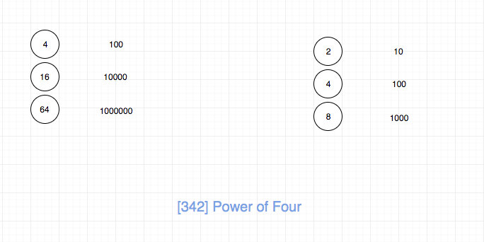
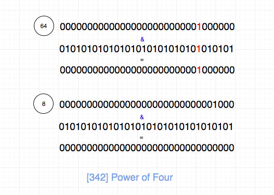
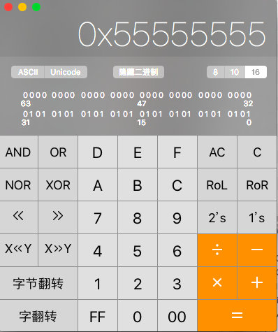

# 0342. 4的幂

## 题目地址(342. 4的幂)

<https://leetcode-cn.com/problems/power-of-four/>

## 题目描述

```
<pre class="calibre18">```
给定一个整数 (32 位有符号整数)，请编写一个函数来判断它是否是 4 的幂次方。

示例 1:

输入: 16
输出: true
示例 2:

输入: 5
输出: false
进阶：
你能不使用循环或者递归来完成本题吗？

```
```

## 前置知识

- 数论

## 公司

- 百度
- twosigma

## 思路

符合直觉的做法是不停除以 4 直到不能整除，然后判断是否为 1 即可。 代码如下：

```
<pre class="calibre18">```
<span class="hljs-keyword">while</span> (num && num % <span class="hljs-params">4</span> == <span class="hljs-params">0</span>) {
  num /= <span class="hljs-params">4</span>;
}
<span class="hljs-keyword">return</span> num == <span class="hljs-params">1</span>;

```
```

但是这道题目有一个 follow up: “你是否可以不使用循环/递归完成”。因此我们需要换种思路。

我们先来看下，4 的幂次方用 2 进制表示是什么样的.



发现规律： 4 的幂次方的二进制表示 1 的位置都是在奇数位（且不在最低位），其他位置都为 0

我们还可以发现： 2 的幂次方的特点是最低位之外，其他位置有且仅有一个 1（1 可以在任意位置）

我们进一步分析，如果一个数字是四的幂次方，那么只需要满足：

1. 是 2 的幂次方， 就能保证最低位之外，其他位置有且仅有一个 1
2. 这个 1 不在偶数位置，一定在奇数位置

对于第一点，如果保证一个数字是 2 的幂次方呢？ 显然不能不停除以 2，看结果是否等于 1，这样就循环了。 我们可以使用一个 trick， 如果一个数字 n 是 2 的幂次方，那么 n & (n - 1) 一定等于 0， 这个可以作为思考题，大家思考一下。

对于第二点，我们可以取一个特殊数字，这个特殊数字，奇数位置都是 1，偶数位置都是 0，然后和这个特殊数字 `求与`， 如果等于本身，那么毫无疑问，这个 1 不再偶数位置，一定在奇数位置，因为如果在偶数位置，`求与`的结果就是 0 了 题目要求 n 是 32 位有符号整形，那么我们的特殊数字就应该是`01010101010101010101010101010101`(不用数了，一共 32 位)。



如上图，64和这个特殊数字求与，得到的是本身。 8 是 2的次方，但是不是4的次方，我们求与结果就是0了。

为了体现自己的逼格，我们可以使用计算器，来找一个逼格比较高的数字，这里我选了十六进制，结果是`0x55555555`。



代码见下方代码区。

说实话，这种做法不容易想到，其实还有一种方法。 如果一个数字是 4 的幂次方，那么只需要满足：

1. 是二的倍数
2. 减去 1 是三的倍数

代码如下：

```
<pre class="calibre18">```
<span class="hljs-keyword">return</span> num > <span class="hljs-params">0</span> && (num & (num - <span class="hljs-params">1</span>)) === <span class="hljs-params">0</span> && (num - <span class="hljs-params">1</span>) % <span class="hljs-params">3</span> === <span class="hljs-params">0</span>;

```
```

## 关键点

- 数论
- 2的幂次方特点（数学性质以及二进制表示）
- 4的幂次方特点（数学性质以及二进制表示）

## 代码

语言支持：JS, Python

JavaScript Code：

```
<pre class="calibre18">```
<span class="hljs-title">/*
 * @lc app=leetcode id=342 lang=javascript
 *
 * [342] Power of Four
 */</span>
<span class="hljs-title">/**
 * @param {number} num
 * @return {boolean}
 */</span>
<span class="hljs-keyword">var</span> isPowerOfFour = <span class="hljs-function"><span class="hljs-keyword">function</span>(<span class="hljs-params">num</span>) </span>{
  <span class="hljs-title">// tag: 数论</span>

  <span class="hljs-keyword">if</span> (num === <span class="hljs-params">1</span>) <span class="hljs-keyword">return</span> <span class="hljs-params">true</span>;
  <span class="hljs-keyword">if</span> (num < <span class="hljs-params">4</span>) <span class="hljs-keyword">return</span> <span class="hljs-params">false</span>;

  <span class="hljs-keyword">if</span> ((num & (num - <span class="hljs-params">1</span>)) !== <span class="hljs-params">0</span>) <span class="hljs-keyword">return</span> <span class="hljs-params">false</span>;

  <span class="hljs-keyword">return</span> (num & <span class="hljs-params">0x55555555</span>) === num;
};

```
```

Python Code:

```
<pre class="calibre18">```
<span class="hljs-class"><span class="hljs-keyword">class</span> <span class="hljs-title">Solution</span>:</span>
    <span class="hljs-function"><span class="hljs-keyword">def</span> <span class="hljs-title">isPowerOfFour</span><span class="hljs-params">(self, num: int)</span> -> bool:</span>
        <span class="hljs-keyword">if</span> num == <span class="hljs-params">1</span>:
            <span class="hljs-keyword">return</span> <span class="hljs-keyword">True</span>
        <span class="hljs-keyword">elif</span> num < <span class="hljs-params">4</span>:
            <span class="hljs-keyword">return</span> <span class="hljs-keyword">False</span>
        <span class="hljs-keyword">else</span>:
            <span class="hljs-keyword">if</span> <span class="hljs-keyword">not</span> num & (num<span class="hljs-params">-1</span>) == <span class="hljs-params">0</span>:
                <span class="hljs-keyword">return</span> <span class="hljs-keyword">False</span>
            <span class="hljs-keyword">else</span>:
                <span class="hljs-keyword">return</span> num & <span class="hljs-params">0x55555555</span> == num

    <span class="hljs-title"># 另一种解法：将数字转化为二进制表示的字符串，利用字符串的相关操作进行判断</span>
    <span class="hljs-function"><span class="hljs-keyword">def</span> <span class="hljs-title">isPowerOfFour</span><span class="hljs-params">(self, num: int)</span> -> bool:</span>
        binary_num = bin(num)[<span class="hljs-params">2</span>:]
        <span class="hljs-keyword">return</span> binary_num.strip(<span class="hljs-string">'0'</span>) == <span class="hljs-string">'1'</span> <span class="hljs-keyword">and</span> len(binary_num) % <span class="hljs-params">2</span> == <span class="hljs-params">1</span>

```
```

**复杂度分析**

- 时间复杂度：O(1)O(1)O(1)
- 空间复杂度：O(1)O(1)O(1)

更多题解可以访问我的LeetCode题解仓库：<https://github.com/azl397985856/leetcode> 。 目前已经37K star啦。

关注公众号力扣加加，努力用清晰直白的语言还原解题思路，并且有大量图解，手把手教你识别套路，高效刷题。

