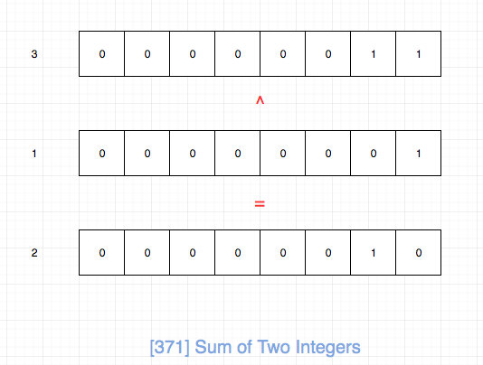
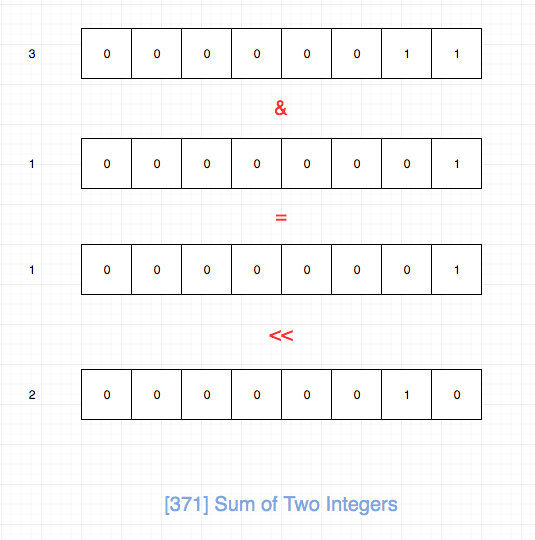

# 0371. 两整数之和

## 题目地址(371. 两整数之和)

<https://leetcode-cn.com/problems/sum-of-two-integers/>

## 题目描述

```
<pre class="calibre18">```
不使用运算符 + 和 - ，计算两整数 a 、b 之和。

示例 1:

输入: a = 1, b = 2
输出: 3
示例 2:

输入: a = -2, b = 3
输出: 1

```
```

## 前置知识

- [位运算](https://github.com/azl397985856/leetcode/blob/master/thinkings/bit.md)

## 公司

- 阿里
- 腾讯
- 百度
- 字节

## 思路

不能使用加减法来求加法。 我们只能朝着位元算的角度来思考了。

由于`异或`是`相同则位0，不同则位1`，因此我们可以把异或看成是一种不进位的加减法。



由于`与`是`全部位1则位1，否则位0`，因此我们可以求与之后左移一位来表示进位。



然后我们对上述两个元算结果递归求解即可。 递归的结束条件就是其中一个为0，我们直接返回另一个。

## 关键点解析

- 位运算
- 异或是一种不进位的加减法
- 求与之后左移一位来可以表示进位

## 代码

代码支持：JS，C++，Java，Python
Javascript Code:

```
<pre class="calibre18">```
<span class="hljs-title">/*
 * @lc app=leetcode id=371 lang=javascript
 *
 * [371] Sum of Two Integers
 */</span>
<span class="hljs-title">/**
 * @param {number} a
 * @param {number} b
 * @return {number}
 */</span>
<span class="hljs-keyword">var</span> getSum = <span class="hljs-function"><span class="hljs-keyword">function</span>(<span class="hljs-params">a, b</span>) </span>{
    <span class="hljs-keyword">if</span> (a === <span class="hljs-params">0</span>) <span class="hljs-keyword">return</span> b;

    <span class="hljs-keyword">if</span> (b === <span class="hljs-params">0</span>) <span class="hljs-keyword">return</span> a;

    <span class="hljs-keyword">return</span> getSum(a ^ b, (a & b) << <span class="hljs-params">1</span>);
};

```
```

C++ Code:

```
<pre class="calibre18">```
<span class="hljs-keyword">class</span> Solution {
<span class="hljs-keyword">public</span>:
    <span class="hljs-function"><span class="hljs-keyword">int</span> <span class="hljs-title">getSum</span><span class="hljs-params">(<span class="hljs-keyword">int</span> a, <span class="hljs-keyword">int</span> b)</span> </span>{
        <span class="hljs-keyword">if</span>(a==<span class="hljs-params">0</span>) <span class="hljs-keyword">return</span> b;
        <span class="hljs-keyword">if</span>(b==<span class="hljs-params">0</span>) <span class="hljs-keyword">return</span> a;

        <span class="hljs-keyword">while</span>(b!=<span class="hljs-params">0</span>)
        {
            <span class="hljs-title">// 防止 AddressSanitizer 对有符号左移的溢出保护处理</span>
            <span class="hljs-keyword">auto</span> carry = ((<span class="hljs-keyword">unsigned</span> <span class="hljs-keyword">int</span> ) (a & b))<<<span class="hljs-params">1</span>;
            <span class="hljs-title">// 计算无进位的结果</span>
            a = a^b;
            <span class="hljs-title">//将存在进位的位置置1</span>
            b =carry;
        }
        <span class="hljs-keyword">return</span> a;
    }
};

```
```

Java Code:

```
<pre class="calibre18">```
<span class="hljs-class"><span class="hljs-keyword">class</span> <span class="hljs-title">Solution</span> </span>{
    <span class="hljs-function"><span class="hljs-keyword">public</span> <span class="hljs-keyword">int</span> <span class="hljs-title">getSum</span><span class="hljs-params">(<span class="hljs-keyword">int</span> a, <span class="hljs-keyword">int</span> b)</span> </span>{
        <span class="hljs-keyword">if</span>(a==<span class="hljs-params">0</span>) <span class="hljs-keyword">return</span> b;
        <span class="hljs-keyword">if</span>(b==<span class="hljs-params">0</span>) <span class="hljs-keyword">return</span> a;

        <span class="hljs-keyword">while</span>(b!=<span class="hljs-params">0</span>)
        {
            <span class="hljs-keyword">int</span> carry = a&b;
            <span class="hljs-title">// 计算无进位的结果</span>
            a = a^b;
            <span class="hljs-title">//将存在进位的位置置1</span>
            b =carry<<<span class="hljs-params">1</span>;
        }
        <span class="hljs-keyword">return</span> a;
    }
}

```
```

Python Code:

```
<pre class="calibre18">```
<span class="hljs-title"># python整数类型为Unifying Long Integers, 即无限长整数类型.</span>
<span class="hljs-title"># 模拟 32bit 有符号整型加法</span>
<span class="hljs-class"><span class="hljs-keyword">class</span> <span class="hljs-title">Solution</span>:</span>
    <span class="hljs-function"><span class="hljs-keyword">def</span> <span class="hljs-title">getSum</span><span class="hljs-params">(self, a: int, b: int)</span> -> int:</span>
        a &= <span class="hljs-params">0xFFFFFFFF</span>
        b &= <span class="hljs-params">0xFFFFFFFF</span>
        <span class="hljs-keyword">while</span> b:
            carry = a & b
            a ^= b
            b = ((carry) << <span class="hljs-params">1</span>) & <span class="hljs-params">0xFFFFFFFF</span>
            <span class="hljs-title"># print((a, b))</span>
        <span class="hljs-keyword">return</span> a <span class="hljs-keyword">if</span> a < <span class="hljs-params">0x80000000</span> <span class="hljs-keyword">else</span> ~(a^<span class="hljs-params">0xFFFFFFFF</span>)

```
```

**复杂度分析**

- 时间复杂度：O(1)O(1)O(1)
- 空间复杂度：O(1)O(1)O(1)

> 由于题目数据规模不会变化，因此其实复杂度分析是没有意义的。

更多题解可以访问我的LeetCode题解仓库：<https://github.com/azl397985856/leetcode> 。 目前已经37K star啦。

关注公众号力扣加加，努力用清晰直白的语言还原解题思路，并且有大量图解，手把手教你识别套路，高效刷题。

