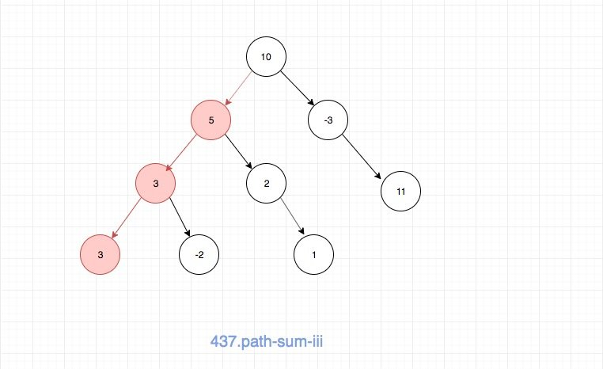
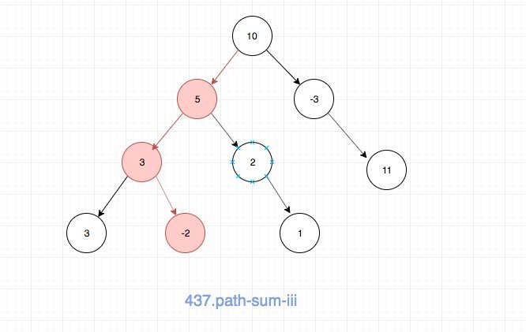

# 0437. 路径总和 III

## 题目地址(437. 路径总和 III)

<https://leetcode-cn.com/problems/path-sum-iii/>

## 题目描述

```
<pre class="calibre18">```
给定一个二叉树，它的每个结点都存放着一个整数值。

找出路径和等于给定数值的路径总数。

路径不需要从根节点开始，也不需要在叶子节点结束，但是路径方向必须是向下的（只能从父节点到子节点）。

二叉树不超过1000个节点，且节点数值范围是 [-1000000,1000000] 的整数。

示例：

root = [10,5,-3,3,2,null,11,3,-2,null,1], sum = 8

      10
     /  \
    5   -3
   / \    \
  3   2   11
 / \   \
3  -2   1

返回 3。和等于 8 的路径有:

1.  5 -> 3
2.  5 -> 2 -> 1
3.  -3 -> 11

```
```

## 前置知识

- hashmap

## 公司

- 阿里
- 腾讯
- 百度
- 字节

## 思路

这道题目是要我们求解出任何一个节点出发到子孙节点的路径中和为指定值。 注意这里，不一定是从根节点出发，也不一定在叶子节点结束。

一种简单的思路就是直接递归解决，空间复杂度O(n) 时间复杂度介于O(nlogn) 和 O(n^2)， 具体代码：

```
<pre class="calibre18">```
<span class="hljs-title">/**
 * Definition for a binary tree node.
 * function TreeNode(val) {
 *     this.val = val;
 *     this.left = this.right = null;
 * }
 */</span>
<span class="hljs-title">// the number of the paths starting from self</span>
<span class="hljs-function"><span class="hljs-keyword">function</span> <span class="hljs-title">helper</span>(<span class="hljs-params">root, sum</span>) </span>{
  <span class="hljs-keyword">if</span> (root === <span class="hljs-params">null</span>) <span class="hljs-keyword">return</span> <span class="hljs-params">0</span>;
  <span class="hljs-keyword">const</span> l = helper(root.left, sum - root.val);
  <span class="hljs-keyword">const</span> r = helper(root.right, sum - root.val);

  <span class="hljs-keyword">return</span> l + r + (root.val === sum ? <span class="hljs-params">1</span> : <span class="hljs-params">0</span>);
}
<span class="hljs-title">/**
 * @param {TreeNode} root
 * @param {number} sum
 * @return {number}
 */</span>
<span class="hljs-keyword">var</span> pathSum = <span class="hljs-function"><span class="hljs-keyword">function</span>(<span class="hljs-params">root, sum</span>) </span>{
<span class="hljs-title">// 空间复杂度O(n) 时间复杂度介于O(nlogn) 和 O(n^2)</span>
  <span class="hljs-title">// tag: dfs tree</span>
  <span class="hljs-keyword">if</span> (root === <span class="hljs-params">null</span>) <span class="hljs-keyword">return</span> <span class="hljs-params">0</span>;
  <span class="hljs-title">// the number of the paths starting from self</span>
  <span class="hljs-keyword">const</span> self = helper(root, sum);
  <span class="hljs-title">// we don't know the answer, so we just pass it down</span>
  <span class="hljs-keyword">const</span> l = pathSum(root.left, sum);
  <span class="hljs-title">// we don't know the answer, so we just pass it down</span>
  <span class="hljs-keyword">const</span> r = pathSum(root.right, sum);

  <span class="hljs-keyword">return</span> self + l + r;
};

```
```

但是还有一种空间复杂度更加优秀的算法，利用hashmap来避免重复计算，时间复杂度和空间复杂度都是O(n)。 这种思路是`subarray-sum-equals-k`的升级版本，如果那道题目你可以O(n)解决，这道题目难度就不会很大， 只是将数组换成了二叉树。关于具体的思路可以看[这道题目](560.subarray-sum-equals-k.html)

这里有一个不一样的地方，这里我说明一下，就是为什么要有`hashmap[acc] = hashmap[acc] - 1;`， 原因很简单，就是我们DFS的时候，从底部往上回溯的时候，map的值应该也回溯。如果你对回溯法比较熟悉的话， 应该很容易理解，如果不熟悉可以参考[这道题目](46.permutations.html)， 这道题目就是通过`tempList.pop()`来完成的。

另外我画了一个图，相信看完你就明白了。

当我们执行到底部的时候：



接着往上回溯：



很容易看出，我们的hashmap不应该有第一张图的那个记录了，因此需要减去。

具体实现见下方代码区。

## 关键点解析

- 通过hashmap，以时间换空间
- 对于这种连续的元素求和问题，有一个共同的思路，可以参考[这道题目](560.subarray-sum-equals-k.html)

## 代码

- 语言支持：JS

```
<pre class="calibre18">```


<span class="hljs-title">/*
 * @lc app=leetcode id=437 lang=javascript
 *
 * [437] Path Sum III
 */</span>
<span class="hljs-title">/**
 * Definition for a binary tree node.
 * function TreeNode(val) {
 *     this.val = val;
 *     this.left = this.right = null;
 * }
 */</span>
<span class="hljs-function"><span class="hljs-keyword">function</span> <span class="hljs-title">helper</span>(<span class="hljs-params">root, acc, target, hashmap</span>) </span>{
  <span class="hljs-title">// see also : https://leetcode.com/problems/subarray-sum-equals-k/</span>

  <span class="hljs-keyword">if</span> (root === <span class="hljs-params">null</span>) <span class="hljs-keyword">return</span> <span class="hljs-params">0</span>;
  <span class="hljs-keyword">let</span> count = <span class="hljs-params">0</span>;
  acc += root.val;
  <span class="hljs-keyword">if</span> (acc === target) count++;
  <span class="hljs-keyword">if</span> (hashmap[acc - target] !== <span class="hljs-keyword">void</span> <span class="hljs-params">0</span>) {
    count += hashmap[acc - target];
  }
  <span class="hljs-keyword">if</span> (hashmap[acc] === <span class="hljs-keyword">void</span> <span class="hljs-params">0</span>) {
    hashmap[acc] = <span class="hljs-params">1</span>;
  } <span class="hljs-keyword">else</span> {
    hashmap[acc] += <span class="hljs-params">1</span>;
  }
  <span class="hljs-keyword">const</span> res =
    count +
    helper(root.left, acc, target, hashmap) +
    helper(root.right, acc, target, hashmap);

    <span class="hljs-title">// 这里要注意别忘记了</span>
    hashmap[acc] = hashmap[acc] - <span class="hljs-params">1</span>;

    <span class="hljs-keyword">return</span> res;
}

<span class="hljs-keyword">var</span> pathSum = <span class="hljs-function"><span class="hljs-keyword">function</span>(<span class="hljs-params">root, sum</span>) </span>{
  <span class="hljs-keyword">const</span> hashmap = {};
  <span class="hljs-keyword">return</span> helper(root, <span class="hljs-params">0</span>, sum, hashmap);
};

```
```

**复杂度分析**

- 时间复杂度：O(N)O(N)O(N)
- 空间复杂度：O(N)O(N)O(N)

更多题解可以访问我的LeetCode题解仓库：<https://github.com/azl397985856/leetcode> 。 目前已经37K star啦。

关注公众号力扣加加，努力用清晰直白的语言还原解题思路，并且有大量图解，手把手教你识别套路，高效刷题。

