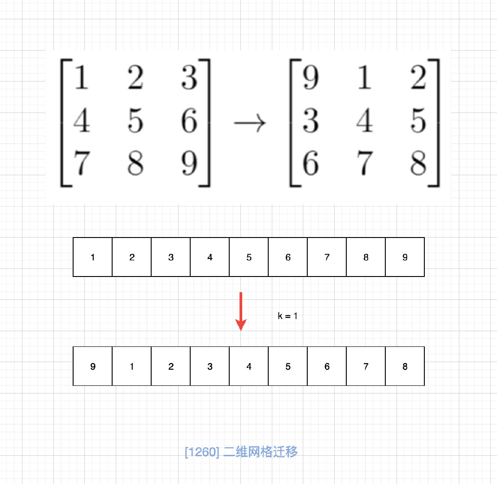

# 1260. 二维网格迁移

## 题目地址（1260. 二维网格迁移）

<https://leetcode-cn.com/problems/shift-2d-grid/description/>

## 题目描述

```
<pre class="calibre18">```

给你一个 n 行 m 列的二维网格 grid 和一个整数 k。你需要将 grid 迁移 k 次。

每次「迁移」操作将会引发下述活动：

位于 grid[i][j] 的元素将会移动到 grid[i][j + 1]。
位于 grid[i][m - 1] 的元素将会移动到 grid[i + 1][0]。
位于 grid[n - 1][m - 1] 的元素将会移动到 grid[0][0]。
请你返回 k 次迁移操作后最终得到的 二维网格。


示例 1：


输入：grid = [[1,2,3],[4,5,6],[7,8,9]], k = 1
输出：[[9,1,2],[3,4,5],[6,7,8]]
示例 2：


输入：grid = [[3,8,1,9],[19,7,2,5],[4,6,11,10],[12,0,21,13]], k = 4
输出：[[12,0,21,13],[3,8,1,9],[19,7,2,5],[4,6,11,10]]
示例 3：

输入：grid = [[1,2,3],[4,5,6],[7,8,9]], k = 9
输出：[[1,2,3],[4,5,6],[7,8,9]]


提示：

1 <= grid.length <= 50
1 <= grid[i].length <= 50
-1000 <= grid[i][j] <= 1000
0 <= k <= 100

```
```

## 前置知识

- [数组](https://github.com/azl397985856/leetcode/blob/master/thinkings/basic-data-structure.md)
- 数学

## 暴力法

## 公司

- 字节

### 思路

我们直接翻译题目，没有任何 hack 的做法。

### 代码

```
<pre class="calibre18">```
<span class="hljs-keyword">from</span> copy <span class="hljs-keyword">import</span> deepcopy

<span class="hljs-class"><span class="hljs-keyword">class</span> <span class="hljs-title">Solution</span>:</span>
    <span class="hljs-function"><span class="hljs-keyword">def</span> <span class="hljs-title">shiftGrid</span><span class="hljs-params">(self, grid: List[List[int]], k: int)</span> -> List[List[int]]:</span>
        n = len(grid)
        m = len(grid[<span class="hljs-params">0</span>])
        <span class="hljs-keyword">for</span> _ <span class="hljs-keyword">in</span> range(k):
            old = deepcopy(grid)
            <span class="hljs-keyword">for</span> i <span class="hljs-keyword">in</span> range(n):
                <span class="hljs-keyword">for</span> j <span class="hljs-keyword">in</span> range(m):
                    <span class="hljs-keyword">if</span> j == m - <span class="hljs-params">1</span>:
                            grid[(i + <span class="hljs-params">1</span>) % n][<span class="hljs-params">0</span>] = old[i][j]
                    <span class="hljs-keyword">elif</span> i == n - <span class="hljs-params">1</span> <span class="hljs-keyword">and</span> j == m - <span class="hljs-params">1</span>:
                        grid[<span class="hljs-params">0</span>][<span class="hljs-params">0</span>] = old[i][j]
                    <span class="hljs-keyword">else</span>:
                        grid[i][j + <span class="hljs-params">1</span>] = old[i][j]
        <span class="hljs-keyword">return</span> grid

```
```

由于是 easy，上述做法勉强可以过，我们考虑优化。

## 数学分析

### 思路

我们仔细观察矩阵会发现，其实这样的矩阵迁移是有规律的。 如图： 

因此这个问题就转化为我们一直的一维矩阵转移问题，LeetCode 也有原题[189. 旋转数组](https://leetcode-cn.com/problems/rotate-array/)，同时我也写了一篇文章[文科生都能看懂的循环移位算法](https://lucifer.ren/blog/2019/12/11/rotate-list/)专门讨论这个，最终我们使用的是三次旋转法，相关数学证明也有写，很详细，这里不再赘述。

LeetCode 真的是喜欢换汤不换药呀 😂

### 代码

Python 代码：

```
<pre class="calibre18">```
<span class="hljs-title">#</span>
<span class="hljs-title"># @lc app=leetcode.cn id=1260 lang=python3</span>
<span class="hljs-title">#</span>
<span class="hljs-title"># [1260] 二维网格迁移</span>
<span class="hljs-title">#</span>

<span class="hljs-title"># @lc code=start</span>


<span class="hljs-class"><span class="hljs-keyword">class</span> <span class="hljs-title">Solution</span>:</span>
    <span class="hljs-function"><span class="hljs-keyword">def</span> <span class="hljs-title">shiftGrid</span><span class="hljs-params">(self, grid: List[List[int]], k: int)</span> -> List[List[int]]:</span>
        n = len(grid)
        m = len(grid[<span class="hljs-params">0</span>])
        <span class="hljs-title"># 二维到一维</span>
        arr = [grid[i][j] <span class="hljs-keyword">for</span> i <span class="hljs-keyword">in</span> range(n) <span class="hljs-keyword">for</span> j <span class="hljs-keyword">in</span> range(m)]
        <span class="hljs-title"># 取模，缩小k的范围，避免无意义的运算</span>
        k %= m * n
        res = []
        <span class="hljs-title"># 首尾交换法</span>

        <span class="hljs-function"><span class="hljs-keyword">def</span> <span class="hljs-title">reverse</span><span class="hljs-params">(l, r)</span>:</span>
            <span class="hljs-keyword">while</span> l < r:
                t = arr[l]
                arr[l] = arr[r]
                arr[r] = t
                l += <span class="hljs-params">1</span>
                r -= <span class="hljs-params">1</span>
        <span class="hljs-title"># 三次旋转</span>
        reverse(<span class="hljs-params">0</span>, m * n - k - <span class="hljs-params">1</span>)
        reverse(m * n - k, m * n - <span class="hljs-params">1</span>)
        reverse(<span class="hljs-params">0</span>, m * n - <span class="hljs-params">1</span>)
        <span class="hljs-title"># 一维到二维</span>
        row = []
        <span class="hljs-keyword">for</span> i <span class="hljs-keyword">in</span> range(m * n):
            <span class="hljs-keyword">if</span> i > <span class="hljs-params">0</span> <span class="hljs-keyword">and</span> i % m == <span class="hljs-params">0</span>:
                res.append(row)
                row = []
            row.append(arr[i])
        res.append(row)

        <span class="hljs-keyword">return</span> res

<span class="hljs-title"># @lc code=end</span>

```
```

**复杂度分析**

- 时间复杂度：O(N)O(N)O(N)
- 空间复杂度：O(1)O(1)O(1)

## 相关题目

- [189. 旋转数组](https://leetcode-cn.com/problems/rotate-array/)

## 参考

- [文科生都能看懂的循环移位算法](https://lucifer.ren/blog/2019/12/11/rotate-list/)

更多题解可以访问我的LeetCode题解仓库：<https://github.com/azl397985856/leetcode> 。 目前已经37K star啦。

关注公众号力扣加加，努力用清晰直白的语言还原解题思路，并且有大量图解，手把手教你识别套路，高效刷题。

