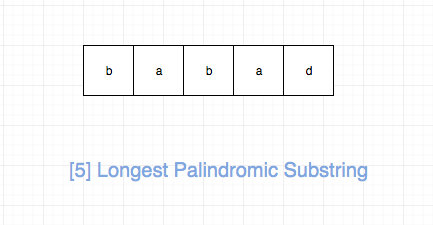
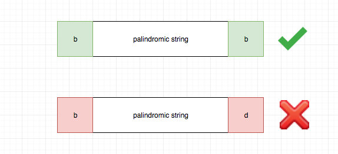
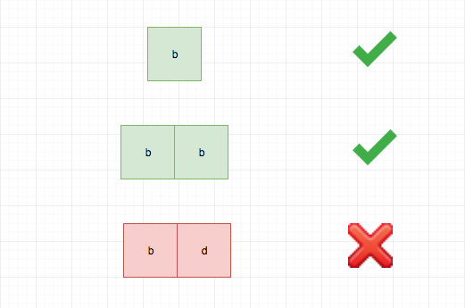

# 0005. 最长回文子串

## 题目地址（5. 最长回文子串）

<https://leetcode-cn.com/problems/longest-palindromic-substring/>

## 题目描述

给定一个字符串 s，找到 s 中最长的回文子串。你可以假设 s 的最大长度为 1000。

示例 1：

输入: "babad" 输出: "bab" 注意: "aba" 也是一个有效答案。 示例 2：

输入: "cbbd" 输出: "bb"

## 前置知识

- 回文

## 公司

- 阿里
- 百度
- 腾讯

## 思路

这是一道最长回文的题目，要我们求出给定字符串的最大回文子串。



解决这类问题的核心思想就是两个字“延伸”，具体来说

- 如果在一个不是回文字符串的字符串两端添加任何字符，或者在回文串左右分别加不同的字符，得到的一定不是回文串
- 如果一个字符串不是回文串，或者在回文串左右分别加不同的字符，得到的一定不是回文串

事实上，上面的分析已经建立了大问题和小问题之间的关联， 基于此，我们可以建立动态规划模型。

我们可以用 dp\[i\]\[j\] 表示 s 中从 i 到 j（包括 i 和 j）是否可以形成回文， 状态转移方程只是将上面的描述转化为代码即可：

```
<pre class="calibre18">```
<span class="hljs-keyword">if</span> (s[i] === s[j] && dp[i + <span class="hljs-params">1</span>][j - <span class="hljs-params">1</span>]) {
  dp[i][j] = <span class="hljs-params">true</span>;
}

```
```



base case 就是一个字符（轴对称点是本身），或者两个字符（轴对称点是介于两者之间的虚拟点）。



## 关键点

- ”延伸“（extend）

## 代码

代码支持：Python，JavaScript：

Python Code：

```
<pre class="calibre18">```
<span class="hljs-class"><span class="hljs-keyword">class</span> <span class="hljs-title">Solution</span>:</span>
    <span class="hljs-function"><span class="hljs-keyword">def</span> <span class="hljs-title">longestPalindrome</span><span class="hljs-params">(self, s: str)</span> -> str:</span>
        n = len(s)
        <span class="hljs-keyword">if</span> n == <span class="hljs-params">0</span>:
            <span class="hljs-keyword">return</span> <span class="hljs-string">""</span>
        res = s[<span class="hljs-params">0</span>]
        <span class="hljs-function"><span class="hljs-keyword">def</span> <span class="hljs-title">extend</span><span class="hljs-params">(i, j, s)</span>:</span>
            <span class="hljs-keyword">while</span>(i >= <span class="hljs-params">0</span> <span class="hljs-keyword">and</span> j < len(s) <span class="hljs-keyword">and</span> s[i] == s[j]):
                i -= <span class="hljs-params">1</span>
                j += <span class="hljs-params">1</span>
            <span class="hljs-keyword">return</span> s[i + <span class="hljs-params">1</span>:j]

        <span class="hljs-keyword">for</span> i <span class="hljs-keyword">in</span> range(n - <span class="hljs-params">1</span>):
            e1 = extend(i, i, s)
            e2 = extend(i, i + <span class="hljs-params">1</span>, s)
            <span class="hljs-keyword">if</span> max(len(e1), len(e2)) > len(res):
                res = e1 <span class="hljs-keyword">if</span> len(e1) > len(e2) <span class="hljs-keyword">else</span> e2
        <span class="hljs-keyword">return</span> res

```
```

JavaScript Code：

```
<pre class="calibre18">```
<span class="hljs-title">/*
 * @lc app=leetcode id=5 lang=javascript
 *
 * [5] Longest Palindromic Substring
 */</span>
<span class="hljs-title">/**
 * @param {string} s
 * @return {string}
 */</span>
<span class="hljs-keyword">var</span> longestPalindrome = <span class="hljs-function"><span class="hljs-keyword">function</span> (<span class="hljs-params">s</span>) </span>{
  <span class="hljs-title">// babad</span>
  <span class="hljs-title">// tag : dp</span>
  <span class="hljs-keyword">if</span> (!s || s.length === <span class="hljs-params">0</span>) <span class="hljs-keyword">return</span> <span class="hljs-string">""</span>;
  <span class="hljs-keyword">let</span> res = s[<span class="hljs-params">0</span>];

  <span class="hljs-keyword">const</span> dp = [];

  <span class="hljs-title">// 倒着遍历简化操作， 这么做的原因是dp[i][..]依赖于dp[i + 1][..]</span>
  <span class="hljs-keyword">for</span> (<span class="hljs-keyword">let</span> i = s.length - <span class="hljs-params">1</span>; i >= <span class="hljs-params">0</span>; i--) {
    dp[i] = [];
    <span class="hljs-keyword">for</span> (<span class="hljs-keyword">let</span> j = i; j < s.length; j++) {
      <span class="hljs-keyword">if</span> (j - i === <span class="hljs-params">0</span>) dp[i][j] = <span class="hljs-params">true</span>;
      <span class="hljs-title">// specail case 1</span>
      <span class="hljs-keyword">else</span> <span class="hljs-keyword">if</span> (j - i === <span class="hljs-params">1</span> && s[i] === s[j]) dp[i][j] = <span class="hljs-params">true</span>;
      <span class="hljs-title">// specail case 2</span>
      <span class="hljs-keyword">else</span> <span class="hljs-keyword">if</span> (s[i] === s[j] && dp[i + <span class="hljs-params">1</span>][j - <span class="hljs-params">1</span>]) {
        <span class="hljs-title">// state transition</span>
        dp[i][j] = <span class="hljs-params">true</span>;
      }

      <span class="hljs-keyword">if</span> (dp[i][j] && j - i + <span class="hljs-params">1</span> > res.length) {
        <span class="hljs-title">// update res</span>
        res = s.slice(i, j + <span class="hljs-params">1</span>);
      }
    }
  }

  <span class="hljs-keyword">return</span> res;
};

```
```

***复杂度分析***

- 时间复杂度：O(N2)O(N^2)O(N2)
- 空间复杂度：O(N2)O(N^2)O(N2)

## 相关题目

- [516.longest-palindromic-subsequence](516.longest-palindromic-subsequence.html)

大家对此有何看法，欢迎给我留言，我有时间都会一一查看回答。更多算法套路可以访问我的 LeetCode 题解仓库：<https://github.com/azl397985856/leetcode> 。 目前已经 37K star 啦。 大家也可以关注我的公众号《力扣加加》带你啃下算法这块硬骨头。 

