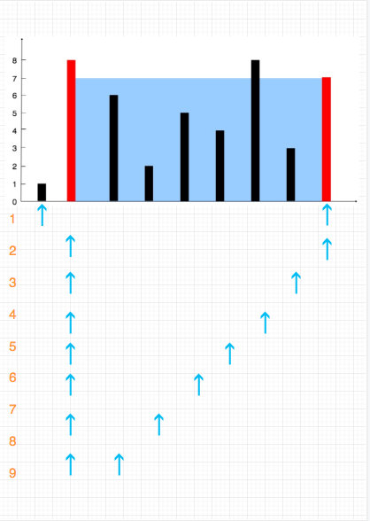

# 0011. 盛最多水的容器

## 题目地址(11. 盛最多水的容器)

<https://leetcode-cn.com/problems/container-with-most-water/description/>

## 题目描述

```
<pre class="calibre18">```
给你 n 个非负整数 a1，a2，...，an，每个数代表坐标中的一个点  (i, ai) 。在坐标内画 n 条垂直线，垂直线 i  的两个端点分别为  (i, ai) 和 (i, 0)。找出其中的两条线，使得它们与  x  轴共同构成的容器可以容纳最多的水。

说明：你不能倾斜容器，且  n  的值至少为 2。


图中垂直线代表输入数组 [1,8,6,2,5,4,8,3,7]。在此情况下，容器能够容纳水（表示为蓝色部分）的最大值为  49。


示例：
`
输入：[1,8,6,2,5,4,8,3,7]
输出：49

```
```

## 前置知识

- 双指针

## 公司

- 字节
- 腾讯
- 百度
- 阿里

## 思路

题目中说`找出其中的两条线，使得它们与 x 轴共同构成的容器可以容纳最多的水。` ，因此符合直觉的解法就是固定两个端点，计算可以承载的水量， 然后不断更新最大值，最后返回最大值即可。这种算法，需要两层循环，时间复杂度是 O(n2)O(n^2)O(n2)。

代码（JS）:

```
<pre class="calibre18">```
<span class="hljs-keyword">let</span> max = <span class="hljs-params">0</span>;
<span class="hljs-keyword">for</span> (<span class="hljs-keyword">let</span> i = <span class="hljs-params">0</span>; i < height.length; i++) {
  <span class="hljs-keyword">for</span> (<span class="hljs-keyword">let</span> j = i + <span class="hljs-params">1</span>; j < height.length; j++) {
    <span class="hljs-keyword">const</span> currentArea = <span class="hljs-params">Math</span>.abs(i - j) * <span class="hljs-params">Math</span>.min(height[i], height[j]);
    <span class="hljs-keyword">if</span> (currentArea > max) {
      max = currentArea;
    }
  }
}
<span class="hljs-keyword">return</span> max;

```
```

虽然解法效率不高，但是可以通过（JS 可以通过，Python 不可以，其他语言没有尝试）。那么有没有更优的解法呢？

我们来换个角度来思考这个问题，上述的解法是通过两两组合，这无疑是完备的。我们换个角度思考，是否可以先计算长度为 n 的面积，然后计算长度为 n-1 的面积，... 计算长度为 1 的面积。 这样去不断更新最大值呢？很显然这种解法也是完备的，但是似乎时间复杂度还是 O(n2)O(n ^ 2)O(n2), 不要着急。

考虑一下，如果我们计算 n-1 长度的面积的时候,是可以直接排除一半的结果的。

如图：



比如我们计算 n 面积的时候，假如左侧的线段高度比右侧的高度低，那么我们通过左移右指针来将长度缩短为 n-1 的做法是没有意义的， 因为`新的形成的面积变成了(n-1) * heightOfLeft 这个面积一定比刚才的长度为 n 的面积 （n * heightOfLeft） 小`。

也就是说**最大面积一定是当前的面积或者通过移动短的端点得到。**

## 关键点解析

- 双指针优化时间复杂度

## 代码

- 语言支持：JS，C++,Python

JavaScript Code:

```
<pre class="calibre18">```
<span class="hljs-title">/**
 * @param {number[]} height
 * @return {number}
 */</span>
<span class="hljs-keyword">var</span> maxArea = <span class="hljs-function"><span class="hljs-keyword">function</span> (<span class="hljs-params">height</span>) </span>{
  <span class="hljs-keyword">if</span> (!height || height.length <= <span class="hljs-params">1</span>) <span class="hljs-keyword">return</span> <span class="hljs-params">0</span>;

  <span class="hljs-keyword">let</span> leftPos = <span class="hljs-params">0</span>;
  <span class="hljs-keyword">let</span> rightPos = height.length - <span class="hljs-params">1</span>;
  <span class="hljs-keyword">let</span> max = <span class="hljs-params">0</span>;
  <span class="hljs-keyword">while</span> (leftPos < rightPos) {
    <span class="hljs-keyword">const</span> currentArea =
      <span class="hljs-params">Math</span>.abs(leftPos - rightPos) *
      <span class="hljs-params">Math</span>.min(height[leftPos], height[rightPos]);
    <span class="hljs-keyword">if</span> (currentArea > max) {
      max = currentArea;
    }
    <span class="hljs-title">// 更新小的</span>
    <span class="hljs-keyword">if</span> (height[leftPos] < height[rightPos]) {
      leftPos++;
    } <span class="hljs-keyword">else</span> {
      <span class="hljs-title">// 如果相等就随便了</span>
      rightPos--;
    }
  }

  <span class="hljs-keyword">return</span> max;
};

```
```

C++ Code:

```
<pre class="calibre18">```
<span class="hljs-keyword">class</span> Solution {
<span class="hljs-keyword">public</span>:
    <span class="hljs-function"><span class="hljs-keyword">int</span> <span class="hljs-title">maxArea</span><span class="hljs-params">(<span class="hljs-params">vector</span><<span class="hljs-keyword">int</span>>& height)</span> </span>{
        <span class="hljs-keyword">auto</span> ret = <span class="hljs-params">0u</span>l, leftPos = <span class="hljs-params">0u</span>l, rightPos = height.size() - <span class="hljs-params">1</span>;
        <span class="hljs-keyword">while</span>( leftPos < rightPos)
        {
            ret = <span class="hljs-params">std</span>::max(ret, <span class="hljs-params">std</span>::min(height[leftPos], height[rightPos]) * (rightPos - leftPos));
            <span class="hljs-keyword">if</span> (height[leftPos] < height[rightPos]) ++leftPos;
            <span class="hljs-keyword">else</span> --rightPos;
        }
        <span class="hljs-keyword">return</span> ret;
    }
};

```
```

Python Code:

```
<pre class="calibre18">```
<span class="hljs-class"><span class="hljs-keyword">class</span> <span class="hljs-title">Solution</span>:</span>
    <span class="hljs-function"><span class="hljs-keyword">def</span> <span class="hljs-title">maxArea</span><span class="hljs-params">(self, heights)</span>:</span>
        l, r =  <span class="hljs-params">0</span>, len(heights) - <span class="hljs-params">1</span>
        ans = <span class="hljs-params">0</span>
        <span class="hljs-keyword">while</span> l < r:
            ans = max(ans, (r - l) * min(heights[l], heights[r]))
            <span class="hljs-keyword">if</span> heights[r] > heights[l]:
                l += <span class="hljs-params">1</span>
            <span class="hljs-keyword">else</span>:
                r -= <span class="hljs-params">1</span>
        <span class="hljs-keyword">return</span> ans

```
```

***复杂度分析***

- 时间复杂度：由于左右指针移动的次数加起来正好是 n， 因此时间复杂度为 O(N)O(N)O(N)。
- 空间复杂度：O(1)O(1)O(1)。

更多题解可以访问我的 LeetCode 题解仓库：<https://github.com/azl397985856/leetcode> 。 目前已经 37K star 啦。

关注公众号力扣加加，努力用清晰直白的语言还原解题思路，并且有大量图解，手把手教你识别套路，高效刷题。

