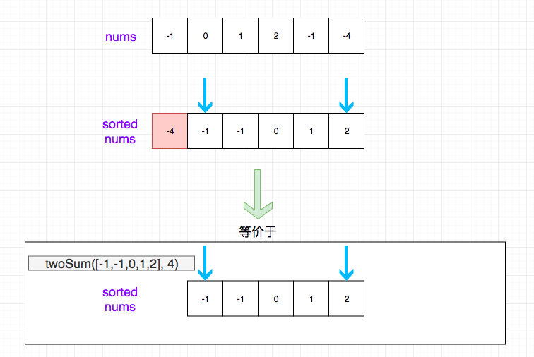

# 0015. 三数之和

## 题目地址(15. 三数之和)

<https://leetcode-cn.com/problems/3sum/>

## 题目描述

```
<pre class="calibre18">```
给你一个包含 n 个整数的数组 nums，判断 nums 中是否存在三个元素 a，b，c ，使得 a + b + c = 0 ？请你找出所有满足条件且不重复的三元组。

注意：答案中不可以包含重复的三元组。


示例：

给定数组 nums = [-1, 0, 1, 2, -1, -4]，

满足要求的三元组集合为：
[
  [-1, 0, 1],
  [-1, -1, 2]
]

```
```

## 前置知识

- 排序
- 双指针
- 分治

## 公司

- 阿里
- 字节

## 思路

我们采用`分治`的思想. 想要找出三个数相加等于 0，我们可以数组依次遍历， 每一项 a\[i\]我们都认为它是最终能够用组成 0 中的一个数字，那么我们的目标就是找到 剩下的元素（除 a\[i\]）`两个`相加等于-a\[i\].

通过上面的思路，我们的问题转化为了`给定一个数组，找出其中两个相加等于给定值`， 这个问题是比较简单的， 我们只需要对数组进行排序，然后双指针解决即可。 加上我们需要外层遍历依次数组，因此总的时间复杂度应该是 O(N^2)。

思路如图所示：



> 在这里之所以要排序解决是因为， 我们算法的瓶颈在这里不在于排序，而在于 O(N^2)，如果我们瓶颈是排序，就可以考虑别的方式了
> 
> 如果找某一个特定元素，一个指针就够了。如果是找两个元素满足一定关系（比如求和等于特定值），需要双指针， 当然前提是数组有序。

## 关键点解析

- 排序之后，用双指针
- 分治

## 代码

```
<pre class="calibre18">```
<span class="hljs-title">/**
 * @param {number[]} nums
 * @return {number[][]}
 */</span>
<span class="hljs-keyword">var</span> threeSum = <span class="hljs-function"><span class="hljs-keyword">function</span> (<span class="hljs-params">nums</span>) </span>{
  <span class="hljs-keyword">if</span> (nums.length < <span class="hljs-params">3</span>) <span class="hljs-keyword">return</span> [];
  <span class="hljs-keyword">const</span> list = [];
  nums.sort((a, b) => a - b);
  <span class="hljs-keyword">for</span> (<span class="hljs-keyword">let</span> i = <span class="hljs-params">0</span>; i < nums.length; i++) {
    <span class="hljs-title">//nums is sorted,so it's impossible to have a sum = 0</span>
    <span class="hljs-keyword">if</span> (nums[i] > <span class="hljs-params">0</span>) <span class="hljs-keyword">break</span>;
    <span class="hljs-title">// skip duplicated result without set</span>
    <span class="hljs-keyword">if</span> (i > <span class="hljs-params">0</span> && nums[i] === nums[i - <span class="hljs-params">1</span>]) <span class="hljs-keyword">continue</span>;
    <span class="hljs-keyword">let</span> left = i + <span class="hljs-params">1</span>;
    <span class="hljs-keyword">let</span> right = nums.length - <span class="hljs-params">1</span>;

    <span class="hljs-title">// for each index i</span>
    <span class="hljs-title">// we want to find the triplet [i, left, right] which sum to 0</span>
    <span class="hljs-keyword">while</span> (left < right) {
      <span class="hljs-title">// since left < right, and left > i, no need to compare i === left and i === right.</span>
      <span class="hljs-keyword">if</span> (nums[left] + nums[right] + nums[i] === <span class="hljs-params">0</span>) {
        list.push([nums[left], nums[right], nums[i]]);
        <span class="hljs-title">// skip duplicated result without set</span>
        <span class="hljs-keyword">while</span> (nums[left] === nums[left + <span class="hljs-params">1</span>]) {
          left++;
        }
        left++;
        <span class="hljs-title">// skip duplicated result without set</span>
        <span class="hljs-keyword">while</span> (nums[right] === nums[right - <span class="hljs-params">1</span>]) {
          right--;
        }
        right--;
        <span class="hljs-keyword">continue</span>;
      } <span class="hljs-keyword">else</span> <span class="hljs-keyword">if</span> (nums[left] + nums[right] + nums[i] > <span class="hljs-params">0</span>) {
        right--;
      } <span class="hljs-keyword">else</span> {
        left++;
      }
    }
  }
  <span class="hljs-keyword">return</span> list;
};

```
```

**复杂度分析**

- 时间复杂度：O(N2)O(N^2)O(N2)
- 空间复杂度：取决于排序算法的空间消耗

大家对此有何看法，欢迎给我留言，我有时间都会一一查看回答。更多算法套路可以访问我的 LeetCode 题解仓库：<https://github.com/azl397985856/leetcode> 。 目前已经 37K star 啦。 大家也可以关注我的公众号《力扣加加》带你啃下算法这块硬骨头。 