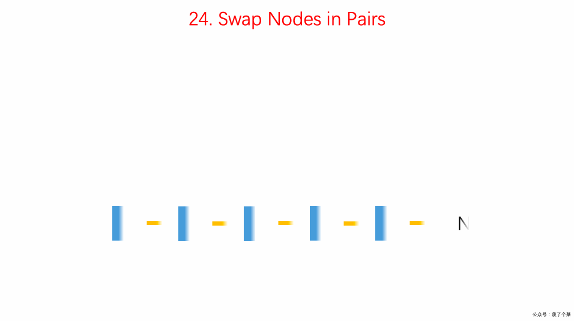

# 0024. 两两交换链表中的节点

## 题目地址(24. 两两交换链表中的节点)

<https://leetcode-cn.com/problems/swap-nodes-in-pairs/>

## 题目描述

给定一个链表，两两交换其中相邻的节点，并返回交换后的链表。

你不能只是单纯的改变节点内部的值，而是需要实际的进行节点交换。


```
<pre class="calibre18">```

示例 1：


输入：head = [1,2,3,4]
输出：[2,1,4,3]
示例 2：

输入：head = []
输出：[]
示例 3：

输入：head = [1]
输出：[1]


提示：

链表中节点的数目在范围 [0, 100] 内
0 <= Node.val <= 100

```
```

## 前置知识

- 链表

## 公司

- 阿里
- 腾讯
- 百度
- 字节

## 思路

设置一个 dummy 节点简化操作，dummy next 指向 head。

1. 初始化 first 为第一个节点
2. 初始化 second 为第二个节点
3. 初始化 current 为 dummy
4. first.next = second.next
5. second.next = first
6. current.next = second
7. current 移动两格
8. 重复



（图片来自： <https://github.com/MisterBooo/LeetCodeAnimation>)

## 关键点解析

1. 链表这种数据结构的特点和使用
2. dummyHead 简化操作

## 代码

- 语言支持：JS，Python3

```
<pre class="calibre18">```
<span class="hljs-title">/**
 * Definition for singly-linked list.
 * function ListNode(val) {
 *     this.val = val;
 *     this.next = null;
 * }
 */</span>
<span class="hljs-title">/**
 * @param {ListNode} head
 * @return {ListNode}
 */</span>
<span class="hljs-keyword">var</span> swapPairs = <span class="hljs-function"><span class="hljs-keyword">function</span>(<span class="hljs-params">head</span>) </span>{
  <span class="hljs-keyword">const</span> dummy = <span class="hljs-keyword">new</span> ListNode(<span class="hljs-params">0</span>);
  dummy.next = head;
  <span class="hljs-keyword">let</span> current = dummy;
  <span class="hljs-keyword">while</span> (current.next != <span class="hljs-params">null</span> && current.next.next != <span class="hljs-params">null</span>) {
    <span class="hljs-title">// 初始化双指针</span>
    <span class="hljs-keyword">const</span> first = current.next;
    <span class="hljs-keyword">const</span> second = current.next.next;

    <span class="hljs-title">// 更新双指针和 current 指针</span>
    first.next = second.next;
    second.next = first;
    current.next = second;

    <span class="hljs-title">// 更新指针</span>
    current = current.next.next;
  }
  <span class="hljs-keyword">return</span> dummy.next;
};

```
```

Python3 Code:

```
<pre class="calibre18">```
<span class="hljs-class"><span class="hljs-keyword">class</span> <span class="hljs-title">Solution</span>:</span>
    <span class="hljs-function"><span class="hljs-keyword">def</span> <span class="hljs-title">swapPairs</span><span class="hljs-params">(self, head: ListNode)</span> -> ListNode:</span>
        <span class="hljs-string">"""
        用递归实现链表相邻互换：
        第一个节点的 next 是第三、第四个节点交换的结果，第二个节点的 next 是第一个节点；
        第三个节点的 next 是第五、第六个节点交换的结果，第四个节点的 next 是第三个节点；
        以此类推
        :param ListNode head
        :return ListNode
        """</span>
        <span class="hljs-title"># 如果为 None 或 next 为 None，则直接返回</span>
        <span class="hljs-keyword">if</span> <span class="hljs-keyword">not</span> head <span class="hljs-keyword">or</span> <span class="hljs-keyword">not</span> head.next:
            <span class="hljs-keyword">return</span> head

        _next = head.next
        head.next = self.swapPairs(_next.next)
        _next.next = head
        <span class="hljs-keyword">return</span> _next

```
```

**复杂度分析**

- 时间复杂度：O(N)O(N)O(N)
- 空间复杂度：O(1)O(1)O(1)

大家对此有何看法，欢迎给我留言，我有时间都会一一查看回答。更多算法套路可以访问我的 LeetCode 题解仓库：<https://github.com/azl397985856/leetcode> 。 目前已经 37K star 啦。 大家也可以关注我的公众号《力扣加加》带你啃下算法这块硬骨头。 