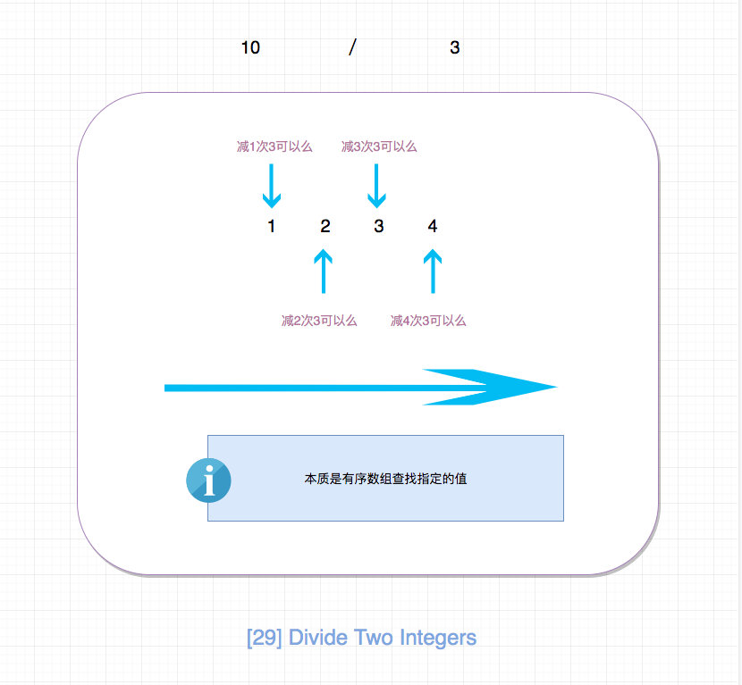

# 0029. 两数相除

## 题目地址(29. 两数相除)

<https://leetcode-cn.com/problems/divide-two-integers/>

## 题目描述

```
<pre class="calibre18">```
给定两个整数，被除数 dividend 和除数 divisor。将两数相除，要求不使用乘法、除法和 mod 运算符。

返回被除数 dividend 除以除数 divisor 得到的商。

整数除法的结果应当截去（truncate）其小数部分，例如：truncate(8.345) = 8 以及 truncate(-2.7335) = -2


示例 1:

输入: dividend = 10, divisor = 3
输出: 3
解释: 10/3 = truncate(3.33333..) = truncate(3) = 3
示例 2:

输入: dividend = 7, divisor = -3
输出: -2
解释: 7/-3 = truncate(-2.33333..) = -2


提示：

被除数和除数均为 32 位有符号整数。
除数不为 0。
假设我们的环境只能存储 32 位有符号整数，其数值范围是 [−231,  231 − 1]。本题中，如果除法结果溢出，则返回 231 − 1。

```
```

## 前置知识

- 二分法

## 公司

- 阿里
- 腾讯
- 百度
- 字节

## 思路

符合直觉的做法是，减数一次一次减去被减数，不断更新差，直到差小于0，我们减了多少次，结果就是多少。

核心代码：

```
<pre class="calibre18">```
  <span class="hljs-keyword">let</span> acc = divisor;
  <span class="hljs-keyword">let</span> count = <span class="hljs-params">0</span>;

  <span class="hljs-keyword">while</span> (dividend - acc >= <span class="hljs-params">0</span>) {
    acc += divisor;
    count++;
  }

  <span class="hljs-keyword">return</span> count;

```
```

这种做法简单直观，但是性能却比较差. 下面来介绍一种性能更好的方法。



通过上面这样的分析，我们直到可以使用二分法来解决，性能有很大的提升。

## 关键点解析

- [二分查找](binary-search.html)
- 正负数的判断中，这样判断更简单。

```
<pre class="calibre18">```
<span class="hljs-keyword">const</span> isNegative = dividend > <span class="hljs-params">0</span> !== divisor > <span class="hljs-params">0</span>;

```
```

或者利用异或：

```
<pre class="calibre18">```
<span class="hljs-keyword">const</span> isNegative = dividend ^ divisor < <span class="hljs-params">0</span>;

```
```

## 代码

- 语言支持：JS，Python3

```
<pre class="calibre18">```


<span class="hljs-title">/*
 * @lc app=leetcode id=29 lang=javascript
 *
 * [29] Divide Two Integers
 */</span>
<span class="hljs-title">/**
 * @param {number} dividend
 * @param {number} divisor
 * @return {number}
 */</span>
<span class="hljs-keyword">var</span> divide = <span class="hljs-function"><span class="hljs-keyword">function</span>(<span class="hljs-params">dividend, divisor</span>) </span>{
  <span class="hljs-keyword">if</span> (divisor === <span class="hljs-params">1</span>) <span class="hljs-keyword">return</span> dividend;

  <span class="hljs-title">// 这种方法很巧妙，即符号相同则为正，不同则为负</span>
  <span class="hljs-keyword">const</span> isNegative = dividend > <span class="hljs-params">0</span> !== divisor > <span class="hljs-params">0</span>;

  <span class="hljs-keyword">const</span> MAX_INTERGER = <span class="hljs-params">Math</span>.pow(<span class="hljs-params">2</span>, <span class="hljs-params">31</span>);

  <span class="hljs-keyword">const</span> res = helper(<span class="hljs-params">Math</span>.abs(dividend), <span class="hljs-params">Math</span>.abs(divisor));

  <span class="hljs-title">// overflow</span>
  <span class="hljs-keyword">if</span> (res > MAX_INTERGER - <span class="hljs-params">1</span> || res < <span class="hljs-params">-1</span> * MAX_INTERGER) {
    <span class="hljs-keyword">return</span> MAX_INTERGER - <span class="hljs-params">1</span>;
  }

  <span class="hljs-keyword">return</span> isNegative ? <span class="hljs-params">-1</span> * res : res;
};

<span class="hljs-function"><span class="hljs-keyword">function</span> <span class="hljs-title">helper</span>(<span class="hljs-params">dividend, divisor</span>) </span>{
  <span class="hljs-title">// 二分法</span>
  <span class="hljs-keyword">if</span> (dividend <= <span class="hljs-params">0</span>) <span class="hljs-keyword">return</span> <span class="hljs-params">0</span>;
  <span class="hljs-keyword">if</span> (dividend < divisor) <span class="hljs-keyword">return</span> <span class="hljs-params">0</span>;
  <span class="hljs-keyword">if</span> (divisor === <span class="hljs-params">1</span>) <span class="hljs-keyword">return</span> dividend;

  <span class="hljs-keyword">let</span> acc = <span class="hljs-params">2</span> * divisor;
  <span class="hljs-keyword">let</span> count = <span class="hljs-params">1</span>;

  <span class="hljs-keyword">while</span> (dividend - acc > <span class="hljs-params">0</span>) {
    acc += acc;
    count += count;
  }
  <span class="hljs-title">// 直接使用位移运算，比如acc >> 1会有问题</span>
  <span class="hljs-keyword">const</span> last = dividend - <span class="hljs-params">Math</span>.floor(acc / <span class="hljs-params">2</span>);

  <span class="hljs-keyword">return</span> count + helper(last, divisor);
}

```
```

Python3 Code:

```
<pre class="calibre18">```
<span class="hljs-class"><span class="hljs-keyword">class</span> <span class="hljs-title">Solution</span>:</span>
    <span class="hljs-function"><span class="hljs-keyword">def</span> <span class="hljs-title">divide</span><span class="hljs-params">(self, dividend: int, divisor: int)</span> -> int:</span>
        <span class="hljs-string">"""
        二分法
        :param int divisor
        :param int dividend
        :return int
        """</span>
        <span class="hljs-title"># 错误处理</span>
        <span class="hljs-keyword">if</span> divisor == <span class="hljs-params">0</span>:
            <span class="hljs-keyword">raise</span> ZeroDivisionError
        <span class="hljs-keyword">if</span> abs(divisor) == <span class="hljs-params">1</span>:
            result = dividend <span class="hljs-keyword">if</span> <span class="hljs-params">1</span> == divisor <span class="hljs-keyword">else</span> -dividend
            <span class="hljs-keyword">return</span> min(<span class="hljs-params">2</span>**<span class="hljs-params">31</span><span class="hljs-params">-1</span>, max(<span class="hljs-params">-2</span>**<span class="hljs-params">31</span>, result))

        <span class="hljs-title"># 确定结果的符号</span>
        sign = ((dividend >= <span class="hljs-params">0</span>) == (divisor >= <span class="hljs-params">0</span>))

        result = <span class="hljs-params">0</span>
        <span class="hljs-title"># abs也可以直接写在while条件中，不过可能会多计算几次</span>
        _divisor = abs(divisor)
        _dividend = abs(dividend)

        <span class="hljs-keyword">while</span> _divisor <= _dividend:
            r, _dividend = self._multi_divide(_divisor, _dividend)
            result += r

        result = result <span class="hljs-keyword">if</span> sign <span class="hljs-keyword">else</span> -result

        <span class="hljs-title"># 注意返回值不能超过32位有符号数的表示范围</span>
        <span class="hljs-keyword">return</span> min(<span class="hljs-params">2</span>**<span class="hljs-params">31</span><span class="hljs-params">-1</span>, max(<span class="hljs-params">-2</span>**<span class="hljs-params">31</span>, result))

    <span class="hljs-function"><span class="hljs-keyword">def</span> <span class="hljs-title">_multi_divide</span><span class="hljs-params">(self, divisor, dividend)</span>:</span>
        <span class="hljs-string">"""
        翻倍除法，如果可以被除，则下一步除数翻倍，直至除数大于被除数，
        返回商加总的结果与被除数的剩余值；
        这里就不做异常处理了；
        :param int divisor
        :param int dividend
        :return tuple result, left_dividend
        """</span>
        result = <span class="hljs-params">0</span>
        times_count = <span class="hljs-params">1</span>
        <span class="hljs-keyword">while</span> divisor <= dividend:
            dividend -= divisor
            result += times_count
            times_count += times_count
            divisor += divisor
        <span class="hljs-keyword">return</span> result, dividend

```
```

**复杂度分析**

- 时间复杂度：O(logN)O(logN)O(logN)
- 空间复杂度：O(1)O(1)O(1)

## 相关题目

- [875.koko-eating-bananas](875.koko-eating-bananas.html)

大家对此有何看法，欢迎给我留言，我有时间都会一一查看回答。更多算法套路可以访问我的 LeetCode 题解仓库：<https://github.com/azl397985856/leetcode> 。 目前已经 37K star 啦。 大家也可以关注我的公众号《力扣加加》带你啃下算法这块硬骨头。 