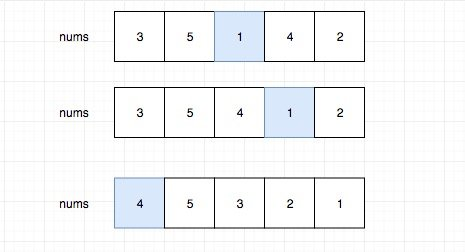
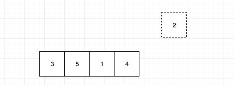
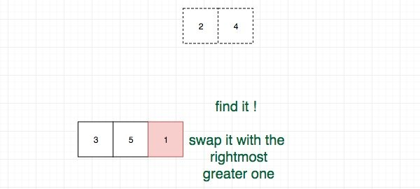
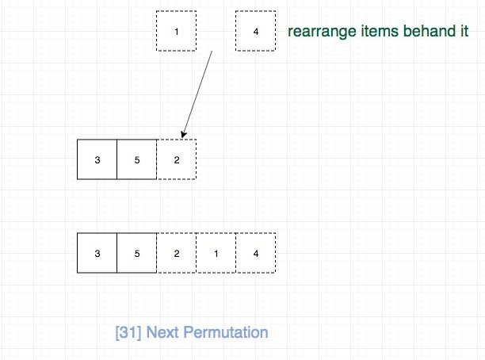

# 0031. 下一个排列

## 题目地址(31. 下一个排列)

<https://leetcode-cn.com/problems/next-permutation/>

## 题目描述

```
<pre class="calibre18">```
实现获取下一个排列的函数，算法需要将给定数字序列重新排列成字典序中下一个更大的排列。

如果不存在下一个更大的排列，则将数字重新排列成最小的排列（即升序排列）。

必须原地修改，只允许使用额外常数空间。

以下是一些例子，输入位于左侧列，其相应输出位于右侧列。
1,2,3 → 1,3,2
3,2,1 → 1,2,3
1,1,5 → 1,5,1

```
```

## 前置知识

- 回溯法

## 公司

- 阿里
- 腾讯
- 百度
- 字节

## 思路

符合直觉的方法是我们按顺序求出所有的排列，如果当前排列等于 nums，那么我直接取下一个 但是这种做法不符合 constant space 要求（题目要求直接修改原数组）,时间复杂度也太高，为 O(n!),肯定不是合适的解。

这种题目比较抽象，写几个例子通常会帮助理解问题的规律。我找了几个例子，其中蓝色背景表示的是当前数字找下一个更大排列的时候`需要改变的元素`.



我们不难发现，蓝色的数字都是从后往前第一个不递增的元素，并且我们的下一个更大的排列 只需要改变蓝色的以及之后部分即可，前面的不需要变。

那么怎么改变蓝色的以及后面部分呢？为了使增量最小， 由于前面我们观察发现，其实剩下的元素从左到右是递减的，而我们想要变成递增的，我们只需要不断交换首尾元素即可。

另外我们也可以以回溯的角度来思考这个问题，让我们先回溯一次：



这个时候可以选择的元素只有2，我们无法组成更大的排列，我们继续回溯，直到如图：



我们发现我们可以交换4或者2实现变大的效果，但是要保证变大的幅度最小（下一个更大）， 我们需要选择最小的，由于之前我们发现后面是从左到右递减的，显然就是交换最右面大于1的。

之后就是不断交换使之幅度最小：



## 关键点解析

- 写几个例子通常会帮助理解问题的规律
- 在有序数组中首尾指针不断交换位置即可实现reverse
- 找到从右边起`第一个大于nums[i]的`，并将其和nums\[i\]进行交换
  
  ## 代码
- 语言支持: Javascript，Python3

```
<pre class="calibre18">```
<span class="hljs-title">/*
 * @lc app=leetcode id=31 lang=javascript
 *
 * [31] Next Permutation
 */</span>

<span class="hljs-function"><span class="hljs-keyword">function</span> <span class="hljs-title">reverseRange</span>(<span class="hljs-params">A, i, j</span>) </span>{
  <span class="hljs-keyword">while</span> (i < j) {
    <span class="hljs-keyword">const</span> temp = A[i];
    A[i] = A[j];
    A[j] = temp;
    i++;
    j--;
  }
}
<span class="hljs-title">/**
 * @param {number[]} nums
 * @return {void} Do not return anything, modify nums in-place instead.
 */</span>
<span class="hljs-keyword">var</span> nextPermutation = <span class="hljs-function"><span class="hljs-keyword">function</span>(<span class="hljs-params">nums</span>) </span>{
  <span class="hljs-title">// 时间复杂度O(n) 空间复杂度O(1)</span>
  <span class="hljs-keyword">if</span> (nums == <span class="hljs-params">null</span> || nums.length <= <span class="hljs-params">1</span>) <span class="hljs-keyword">return</span>;

  <span class="hljs-keyword">let</span> i = nums.length - <span class="hljs-params">2</span>;
  <span class="hljs-title">// 从后往前找到第一个降序的,相当于找到了我们的回溯点</span>
  <span class="hljs-keyword">while</span> (i > <span class="hljs-params">-1</span> && nums[i + <span class="hljs-params">1</span>] <= nums[i]) i--;

  <span class="hljs-title">// 如果找了就swap</span>
  <span class="hljs-keyword">if</span> (i > <span class="hljs-params">-1</span>) {
    <span class="hljs-keyword">let</span> j = nums.length - <span class="hljs-params">1</span>;
    <span class="hljs-title">// 找到从右边起第一个大于nums[i]的，并将其和nums[i]进行交换</span>
    <span class="hljs-title">// 因为如果交换的数字比nums[i]还要小肯定不符合题意</span>
    <span class="hljs-keyword">while</span> (nums[j] <= nums[i]) j--;
    <span class="hljs-keyword">const</span> temp = nums[i];
    nums[i] = nums[j];
    nums[j] = temp;
  }

  <span class="hljs-title">// 最后我们只需要将剩下的元素从左到右，依次填入当前最小的元素就可以保证是大于当前排列的最小值了</span>
  <span class="hljs-title">// [i + 1, A.length -1]的元素进行反转</span>

  reverseRange(nums, i + <span class="hljs-params">1</span>, nums.length - <span class="hljs-params">1</span>);
};

```
```

Python3 Code:

```
<pre class="calibre18">```
<span class="hljs-class"><span class="hljs-keyword">class</span> <span class="hljs-title">Solution</span>:</span>
    <span class="hljs-function"><span class="hljs-keyword">def</span> <span class="hljs-title">nextPermutation</span><span class="hljs-params">(self, nums)</span>:</span>
        <span class="hljs-string">"""
        Do not return anything, modify nums in-place instead.
        :param list nums
        """</span>
        <span class="hljs-title"># 第一步，从后往前，找到下降点</span>
        down_index = <span class="hljs-keyword">None</span>
        <span class="hljs-keyword">for</span> i <span class="hljs-keyword">in</span> range(len(nums)<span class="hljs-params">-2</span>, <span class="hljs-params">-1</span>, <span class="hljs-params">-1</span>):
            <span class="hljs-keyword">if</span> nums[i] < nums[i+<span class="hljs-params">1</span>]:
                down_index = i
                <span class="hljs-keyword">break</span>
        <span class="hljs-title"># 如果没有下降点，重新排列</span>
        <span class="hljs-keyword">if</span> down_index <span class="hljs-keyword">is</span> <span class="hljs-keyword">None</span>:
            nums.reverse()
        <span class="hljs-title"># 如果有下降点</span>
        <span class="hljs-keyword">else</span>:
            <span class="hljs-title"># 第二步，从后往前，找到比下降点大的数，对换位置</span>
            <span class="hljs-keyword">for</span> i <span class="hljs-keyword">in</span> range(len(nums)<span class="hljs-params">-1</span>, i, <span class="hljs-params">-1</span>):
                <span class="hljs-keyword">if</span> nums[down_index] < nums[i]:
                    nums[down_index], nums[i] = nums[i], nums[down_index]
                    <span class="hljs-keyword">break</span>
            <span class="hljs-title"># 第三部，重新排列下降点之后的数</span>
            i, j = down_index+<span class="hljs-params">1</span>, len(nums)<span class="hljs-params">-1</span>
            <span class="hljs-keyword">while</span> i < j:
                nums[i], nums[j] = nums[j], nums[i]
                i += <span class="hljs-params">1</span>
                j -= <span class="hljs-params">1</span>

```
```

Python3 Code:

```
<pre class="calibre18">```
<span class="hljs-class"><span class="hljs-keyword">class</span> <span class="hljs-title">Solution</span>:</span>
    <span class="hljs-function"><span class="hljs-keyword">def</span> <span class="hljs-title">nextPermutation</span><span class="hljs-params">(self, nums)</span>:</span>
        <span class="hljs-string">"""
        Do not return anything, modify nums in-place instead.
        :param list nums
        """</span>
        <span class="hljs-title"># 第一步，从后往前，找到下降点</span>
        down_index = <span class="hljs-keyword">None</span>
        <span class="hljs-keyword">for</span> i <span class="hljs-keyword">in</span> range(len(nums)<span class="hljs-params">-2</span>, <span class="hljs-params">-1</span>, <span class="hljs-params">-1</span>):
            <span class="hljs-keyword">if</span> nums[i] < nums[i+<span class="hljs-params">1</span>]:
                down_index = i
                <span class="hljs-keyword">break</span>
        <span class="hljs-title"># 如果没有下降点，重新排列</span>
        <span class="hljs-keyword">if</span> down_index <span class="hljs-keyword">is</span> <span class="hljs-keyword">None</span>:
            nums.reverse()
        <span class="hljs-title"># 如果有下降点</span>
        <span class="hljs-keyword">else</span>:
            <span class="hljs-title"># 第二步，从后往前，找到比下降点大的数，对换位置</span>
            <span class="hljs-keyword">for</span> i <span class="hljs-keyword">in</span> range(len(nums)<span class="hljs-params">-1</span>, i, <span class="hljs-params">-1</span>):
                <span class="hljs-keyword">if</span> nums[down_index] < nums[i]:
                    nums[down_index], nums[i] = nums[i], nums[down_index]
                    <span class="hljs-keyword">break</span>
            <span class="hljs-title"># 第三步，重新排列下降点之后的数</span>
            i, j = down_index+<span class="hljs-params">1</span>, len(nums)<span class="hljs-params">-1</span>
            <span class="hljs-keyword">while</span> i < j:
                nums[i], nums[j] = nums[j], nums[i]
                i += <span class="hljs-params">1</span>
                j -= <span class="hljs-params">1</span>

```
```

## 相关题目

- [46.next-permutation](46.next-permutation.md)
- [47.permutations-ii](47.permutations-ii.html)
- [60.permutation-sequence](60.permutation-sequence.html)(TODO)