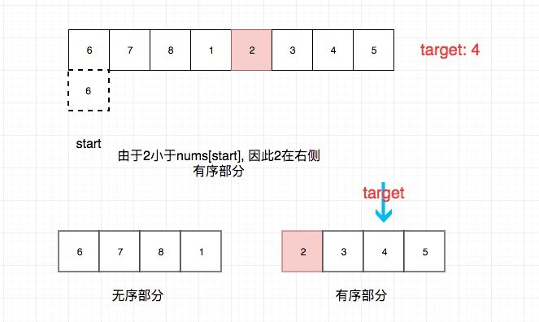
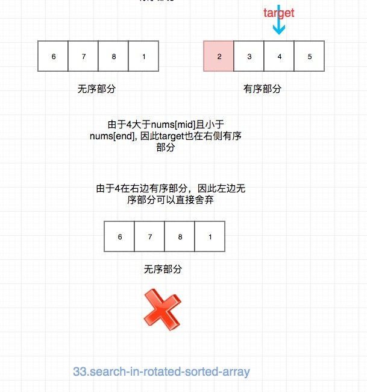

# 0033. 搜索旋转排序数组

## 题目地址(33. 搜索旋转排序数组)

<https://leetcode-cn.com/problems/search-in-rotated-sorted-array/>

## 题目描述

```
<pre class="calibre18">```
给你一个升序排列的整数数组 nums ，和一个整数 target 。

假设按照升序排序的数组在预先未知的某个点上进行了旋转。（例如，数组 [0,1,2,4,5,6,7] 可能变为 [4,5,6,7,0,1,2] ）。

请你在数组中搜索 target ，如果数组中存在这个目标值，则返回它的索引，否则返回 -1 。


示例 1：

输入：nums = [4,5,6,7,0,1,2], target = 0
输出：4
示例 2：

输入：nums = [4,5,6,7,0,1,2], target = 3
输出：-1
示例 3：

输入：nums = [1], target = 0
输出：-1


提示：

1 <= nums.length <= 5000
-10^4 <= nums[i] <= 10^4
nums 中的每个值都 独一无二
nums 肯定会在某个点上旋转
-10^4 <= target <= 10^4

```
```

## 前置知识

- 数组
- 二分法

## 公司

- 阿里
- 腾讯
- 百度
- 字节

## 思路

这是一个我在网上看到的前端头条技术终面的一个算法题。

题目要求时间复杂度为logn，因此基本就是二分法了。 这道题目不是直接的有序数组，不然就是easy了。

首先要知道，我们随便选择一个点，将数组分为前后两部分，其中一部分一定是有序的。

具体步骤：

- 我们可以先找出mid，然后根据mid来判断，mid是在有序的部分还是无序的部分

假如mid小于start，则mid一定在右边有序部分。 假如mid大于等于start， 则mid一定在左边有序部分。

> 注意等号的考虑

- 然后我们继续判断target在哪一部分， 我们就可以舍弃另一部分了

我们只需要比较target和有序部分的边界关系就行了。 比如mid在右侧有序部分，即\[mid, end\] 那么我们只需要判断 target >= mid && target <= end 就能知道target在右侧有序部分，我们就 可以舍弃左边部分了(start = mid + 1)， 反之亦然。

我们以(\[6,7,8,1,2,3,4,5\], 4)为例讲解一下：





## 关键点解析

- [二分法](binary-search.html)
- 找出有序区间，然后根据target是否在有序区间舍弃一半元素
  
  ## 代码
- 语言支持: Javascript，Python3

```
<pre class="calibre18">```
<span class="hljs-title">/*
 * @lc app=leetcode id=33 lang=javascript
 *
 * [33] Search in Rotated Sorted Array
 */</span>
<span class="hljs-title">/**
 * @param {number[]} nums
 * @param {number} target
 * @return {number}
 */</span>
<span class="hljs-keyword">var</span> search = <span class="hljs-function"><span class="hljs-keyword">function</span>(<span class="hljs-params">nums, target</span>) </span>{
  <span class="hljs-title">// 时间复杂度：O(logn)</span>
  <span class="hljs-title">// 空间复杂度：O(1)</span>
  <span class="hljs-title">// [6,7,8,1,2,3,4,5]</span>
  <span class="hljs-keyword">let</span> start = <span class="hljs-params">0</span>;
  <span class="hljs-keyword">let</span> end = nums.length - <span class="hljs-params">1</span>;

  <span class="hljs-keyword">while</span> (start <= end) {
    <span class="hljs-keyword">const</span> mid = start + ((end - start) >> <span class="hljs-params">1</span>);
    <span class="hljs-keyword">if</span> (nums[mid] === target) <span class="hljs-keyword">return</span> mid;

    <span class="hljs-title">// [start, mid]有序</span>

    <span class="hljs-title">// ️⚠️注意这里的等号</span>
    <span class="hljs-keyword">if</span> (nums[mid] >= nums[start]) {
      <span class="hljs-title">//target 在 [start, mid] 之间</span>

      <span class="hljs-title">// 其实target不可能等于nums[mid]， 但是为了对称，我还是加上了等号</span>
      <span class="hljs-keyword">if</span> (target >= nums[start] && target <= nums[mid]) {
        end = mid - <span class="hljs-params">1</span>;
      } <span class="hljs-keyword">else</span> {
        <span class="hljs-title">//target 不在 [start, mid] 之间</span>
        start = mid + <span class="hljs-params">1</span>;
      }
    } <span class="hljs-keyword">else</span> {
      <span class="hljs-title">// [mid, end]有序</span>

      <span class="hljs-title">// target 在 [mid, end] 之间</span>
      <span class="hljs-keyword">if</span> (target >= nums[mid] && target <= nums[end]) {
        start = mid + <span class="hljs-params">1</span>;
      } <span class="hljs-keyword">else</span> {
        <span class="hljs-title">// target 不在 [mid, end] 之间</span>
        end = mid - <span class="hljs-params">1</span>;
      }
    }
  }

  <span class="hljs-keyword">return</span> <span class="hljs-params">-1</span>;
};

```
```

Python3 Code:

```
<pre class="calibre18">```
<span class="hljs-class"><span class="hljs-keyword">class</span> <span class="hljs-title">Solution</span>:</span>
    <span class="hljs-function"><span class="hljs-keyword">def</span> <span class="hljs-title">search</span><span class="hljs-params">(self, nums: List[int], target: int)</span> -> int:</span>
        <span class="hljs-string">"""用二分法，先判断左右两边哪一边是有序的，再判断是否在有序的列表之内"""</span>
        <span class="hljs-keyword">if</span> len(nums) <= <span class="hljs-params">0</span>:
            <span class="hljs-keyword">return</span> <span class="hljs-params">-1</span>

        left = <span class="hljs-params">0</span>
        right = len(nums) - <span class="hljs-params">1</span>
        <span class="hljs-keyword">while</span> left < right:
            mid = (right - left) // <span class="hljs-params">2</span> + left
            <span class="hljs-keyword">if</span> nums[mid] == target:
                <span class="hljs-keyword">return</span> mid

            <span class="hljs-title"># 如果中间的值大于最左边的值，说明左边有序</span>
            <span class="hljs-keyword">if</span> nums[mid] > nums[left]:
                <span class="hljs-keyword">if</span> nums[left] <= target <= nums[mid]:
                    right = mid
                <span class="hljs-keyword">else</span>:
                    <span class="hljs-title"># 这里 +1，因为上面是 <= 符号</span>
                    left = mid + <span class="hljs-params">1</span>
            <span class="hljs-title"># 否则右边有序</span>
            <span class="hljs-keyword">else</span>:
                <span class="hljs-title"># 注意：这里必须是 mid+1，因为根据我们的比较方式，mid属于左边的序列</span>
                <span class="hljs-keyword">if</span> nums[mid+<span class="hljs-params">1</span>] <= target <= nums[right]:
                    left = mid + <span class="hljs-params">1</span>
                <span class="hljs-keyword">else</span>:
                    right = mid

        <span class="hljs-keyword">return</span> left <span class="hljs-keyword">if</span> nums[left] == target <span class="hljs-keyword">else</span> <span class="hljs-params">-1</span>

```
```

**复杂度分析**

- 时间复杂度：O(logN)O(logN)O(logN)
- 空间复杂度：O(1)O(1)O(1)

大家对此有何看法，欢迎给我留言，我有时间都会一一查看回答。更多算法套路可以访问我的 LeetCode 题解仓库：<https://github.com/azl397985856/leetcode> 。 目前已经 37K star 啦。 大家也可以关注我的公众号《力扣加加》带你啃下算法这块硬骨头。 