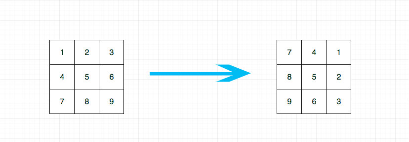
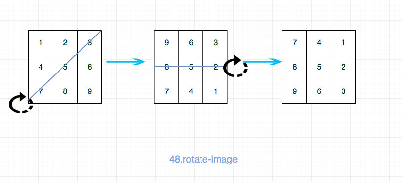

# 0048. 旋转图像

## 题目地址(48. 旋转图像)

<https://leetcode-cn.com/problems/rotate-image/>

## 题目描述

```
<pre class="calibre18">```
给定一个 n × n 的二维矩阵表示一个图像。

将图像顺时针旋转 90 度。

说明：

你必须在原地旋转图像，这意味着你需要直接修改输入的二维矩阵。请不要使用另一个矩阵来旋转图像。

示例 1:

给定 matrix = 
[
  [1,2,3],
  [4,5,6],
  [7,8,9]
],

原地旋转输入矩阵，使其变为:
[
  [7,4,1],
  [8,5,2],
  [9,6,3]
]
示例 2:

给定 matrix =
[
  [ 5, 1, 9,11],
  [ 2, 4, 8,10],
  [13, 3, 6, 7],
  [15,14,12,16]
], 

原地旋转输入矩阵，使其变为:
[
  [15,13, 2, 5],
  [14, 3, 4, 1],
  [12, 6, 8, 9],
  [16, 7,10,11]
]

```
```

## 前置知识

- 原地算法
- 矩阵

## 公司

- 阿里
- 腾讯
- 百度
- 字节

## 思路

这道题目让我们 in-place，也就说空间复杂度要求 O(1)，如果没有这个限制的话，很简单。

通过观察发现，我们只需要将第 i 行变成第 n - i - 1 列， 因此我们只需要保存一个原有矩阵，然后按照这个规律一个个更新即可。



代码：

```
<pre class="calibre18">```
<span class="hljs-keyword">var</span> rotate = <span class="hljs-function"><span class="hljs-keyword">function</span> (<span class="hljs-params">matrix</span>) </span>{
  <span class="hljs-title">// 时间复杂度O(n^2) 空间复杂度O(n)</span>
  <span class="hljs-keyword">const</span> oMatrix = <span class="hljs-params">JSON</span>.parse(<span class="hljs-params">JSON</span>.stringify(matrix)); <span class="hljs-title">// clone</span>
  <span class="hljs-keyword">const</span> n = oMatrix.length;
  <span class="hljs-keyword">for</span> (<span class="hljs-keyword">let</span> i = <span class="hljs-params">0</span>; i < n; i++) {
    <span class="hljs-keyword">for</span> (<span class="hljs-keyword">let</span> j = <span class="hljs-params">0</span>; j < n; j++) {
      matrix[j][n - i - <span class="hljs-params">1</span>] = oMatrix[i][j];
    }
  }
};

```
```

如果要求空间复杂度是 O(1)的话，我们可以用一个 temp 记录即可，这个时候就不能逐个遍历了。 比如遍历到 1 的时候，我们把 1 存到 temp，然后更新 1 的值为 7。 1 被换到了 3 的位置，我们再将 3 存到 temp，依次类推。 但是这种解法写起来比较麻烦，这里我就不写了。

事实上有一个更加巧妙的做法，我们可以巧妙地利用对称轴旋转达到我们的目的，如图，我们先进行一次以对角线为轴的翻转，然后 再进行一次以水平轴心线为轴的翻转即可。



这种做法的时间复杂度是 O(n^2) ，空间复杂度是 O(1)

## 关键点解析

- 矩阵旋转操作

## 代码

- 语言支持: Javascript，Python3

```
<pre class="calibre18">```
<span class="hljs-title">/*
 * @lc app=leetcode id=48 lang=javascript
 *
 * [48] Rotate Image
 */</span>
<span class="hljs-title">/**
 * @param {number[][]} matrix
 * @return {void} Do not return anything, modify matrix in-place instead.
 */</span>
<span class="hljs-keyword">var</span> rotate = <span class="hljs-function"><span class="hljs-keyword">function</span> (<span class="hljs-params">matrix</span>) </span>{
  <span class="hljs-title">// 时间复杂度O(n^2) 空间复杂度O(1)</span>

  <span class="hljs-title">// 做法： 先沿着对角线翻转，然后沿着水平线翻转</span>
  <span class="hljs-keyword">const</span> n = matrix.length;
  <span class="hljs-function"><span class="hljs-keyword">function</span> <span class="hljs-title">swap</span>(<span class="hljs-params">arr, [i, j], [m, n]</span>) </span>{
    <span class="hljs-keyword">const</span> temp = arr[i][j];
    arr[i][j] = arr[m][n];
    arr[m][n] = temp;
  }
  <span class="hljs-keyword">for</span> (<span class="hljs-keyword">let</span> i = <span class="hljs-params">0</span>; i < n - <span class="hljs-params">1</span>; i++) {
    <span class="hljs-keyword">for</span> (<span class="hljs-keyword">let</span> j = <span class="hljs-params">0</span>; j < n - i; j++) {
      swap(matrix, [i, j], [n - j - <span class="hljs-params">1</span>, n - i - <span class="hljs-params">1</span>]);
    }
  }

  <span class="hljs-keyword">for</span> (<span class="hljs-keyword">let</span> i = <span class="hljs-params">0</span>; i < n / <span class="hljs-params">2</span>; i++) {
    <span class="hljs-keyword">for</span> (<span class="hljs-keyword">let</span> j = <span class="hljs-params">0</span>; j < n; j++) {
      swap(matrix, [i, j], [n - i - <span class="hljs-params">1</span>, j]);
    }
  }
};

```
```

Python3 Code:

```
<pre class="calibre18">```
<span class="hljs-class"><span class="hljs-keyword">class</span> <span class="hljs-title">Solution</span>:</span>
    <span class="hljs-function"><span class="hljs-keyword">def</span> <span class="hljs-title">rotate</span><span class="hljs-params">(self, matrix: List[List[int]])</span> -> <span class="hljs-keyword">None</span>:</span>
        <span class="hljs-string">"""
        Do not return anything, modify matrix in-place instead.
        先做矩阵转置（即沿着对角线翻转），然后每个列表翻转；
        """</span>
        n = len(matrix)
        <span class="hljs-keyword">for</span> i <span class="hljs-keyword">in</span> range(n):
            <span class="hljs-keyword">for</span> j <span class="hljs-keyword">in</span> range(i, n):
                matrix[i][j], matrix[j][i] = matrix[j][i], matrix[i][j]
        <span class="hljs-keyword">for</span> m <span class="hljs-keyword">in</span> matrix:
            m.reverse()

    <span class="hljs-function"><span class="hljs-keyword">def</span> <span class="hljs-title">rotate2</span><span class="hljs-params">(self, matrix: List[List[int]])</span> -> <span class="hljs-keyword">None</span>:</span>
        <span class="hljs-string">"""
        Do not return anything, modify matrix in-place instead.
        通过内置函数zip，可以简单实现矩阵转置，下面的代码等于先整体翻转，后转置；
        不过这种写法的空间复杂度其实是O(n);
        """</span>
        matrix[:] = map(list, zip(*matrix[::<span class="hljs-params">-1</span>]))

```
```

**复杂度分析**

- 时间复杂度：O(M∗N)O(M \* N)O(M∗N)
- 空间复杂度：O(1)O(1)O(1)

大家对此有何看法，欢迎给我留言，我有时间都会一一查看回答。更多算法套路可以访问我的 LeetCode 题解仓库：<https://github.com/azl397985856/leetcode> 。 目前已经 37K star 啦。 大家也可以关注我的公众号《力扣加加》带你啃下算法这块硬骨头。 