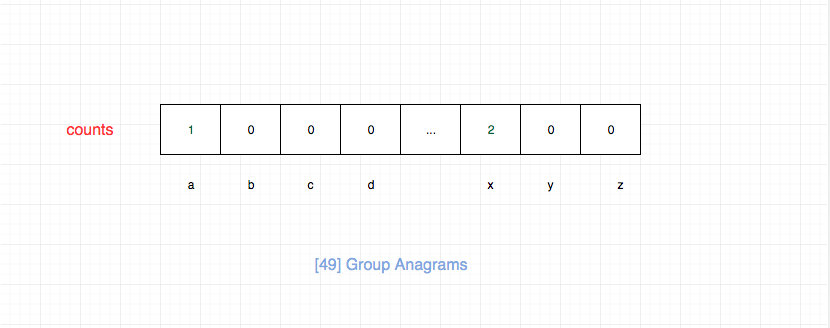

# 0049. 字母异位词分组

## 题目地址(49. 字母异位词分组)

<https://leetcode-cn.com/problems/group-anagrams/>

## 题目描述

```
<pre class="calibre18">```
给定一个字符串数组，将字母异位词组合在一起。字母异位词指字母相同，但排列不同的字符串。

示例:

输入: ["eat", "tea", "tan", "ate", "nat", "bat"]
输出:
[
  ["ate","eat","tea"],
  ["nat","tan"],
  ["bat"]
]
说明：

所有输入均为小写字母。
不考虑答案输出的顺序。

```
```

## 前置知识

- 哈希表
- 排序

## 公司

- 阿里
- 腾讯
- 百度
- 字节

## 思路

一个简单的解法就是遍历数组，然后对每一项都进行排序，然后将其添加到 hashTable 中，最后输出 hashTable 中保存的值即可。

这种做法空间复杂度 O(n)， 假设排序算法用的快排，那么时间复杂度为 O(n \* klogk), n 为数组长度，k 为字符串的平均长度

代码：

```
<pre class="calibre18">```
<span class="hljs-keyword">var</span> groupAnagrams = <span class="hljs-function"><span class="hljs-keyword">function</span> (<span class="hljs-params">strs</span>) </span>{
  <span class="hljs-keyword">const</span> hashTable = {};

  <span class="hljs-function"><span class="hljs-keyword">function</span> <span class="hljs-title">sort</span>(<span class="hljs-params">str</span>) </span>{
    <span class="hljs-keyword">return</span> str.split(<span class="hljs-string">""</span>).sort().join(<span class="hljs-string">""</span>);
  }

  <span class="hljs-title">// 这个方法需要排序，因此不是很优，但是很直观，容易想到</span>
  <span class="hljs-keyword">for</span> (<span class="hljs-keyword">let</span> i = <span class="hljs-params">0</span>; i < strs.length; i++) {
    <span class="hljs-keyword">const</span> str = strs[i];
    <span class="hljs-keyword">const</span> key = sort(str);
    <span class="hljs-keyword">if</span> (!hashTable[key]) {
      hashTable[key] = [str];
    } <span class="hljs-keyword">else</span> {
      hashTable[key].push(str);
    }
  }

  <span class="hljs-keyword">return</span> <span class="hljs-params">Object</span>.values(hashTable);
};

```
```

下面我们介绍另外一种方法，我们建立一个 26 长度的 counts 数组（如果区分大小写，我们可以建立 52 个，如果支持其他字符依次类推）。 然后我们给每一个字符一个固定的数组下标，然后我们只需要更新每个字符出现的次数。 最后形成的 counts 数组如果一致，则说明他们可以通过 交换顺序得到。这种算法空间复杂度 O(n), 时间复杂度 O(n \* k), n 为数组长度，k 为字符串的平均长度.



## 关键点解析

- 桶排序

## 代码

- 语言支持: Javascript，Python3

```
<pre class="calibre18">```
<span class="hljs-title">/*
 * @lc app=leetcode id=49 lang=javascript
 *
 * [49] Group Anagrams
 */</span>
<span class="hljs-title">/**
 * @param {string[]} strs
 * @return {string[][]}
 */</span>
<span class="hljs-keyword">var</span> groupAnagrams = <span class="hljs-function"><span class="hljs-keyword">function</span> (<span class="hljs-params">strs</span>) </span>{
  <span class="hljs-title">// 类似桶排序</span>

  <span class="hljs-keyword">let</span> counts = [];
  <span class="hljs-keyword">const</span> hashTable = {};
  <span class="hljs-keyword">for</span> (<span class="hljs-keyword">let</span> i = <span class="hljs-params">0</span>; i < strs.length; i++) {
    <span class="hljs-keyword">const</span> str = strs[i];
    counts = <span class="hljs-params">Array</span>(<span class="hljs-params">26</span>).fill(<span class="hljs-params">0</span>);
    <span class="hljs-keyword">for</span> (<span class="hljs-keyword">let</span> j = <span class="hljs-params">0</span>; j < str.length; j++) {
      counts[str[j].charCodeAt(<span class="hljs-params">0</span>) - <span class="hljs-string">"a"</span>.charCodeAt(<span class="hljs-params">0</span>)]++;
    }
    <span class="hljs-keyword">const</span> key = counts.join(<span class="hljs-string">""</span>);
    <span class="hljs-keyword">if</span> (!hashTable[key]) {
      hashTable[key] = [str];
    } <span class="hljs-keyword">else</span> {
      hashTable[key].push(str);
    }
  }

  <span class="hljs-keyword">return</span> <span class="hljs-params">Object</span>.values(hashTable);
};

```
```

Python3 Code:

```
<pre class="calibre18">```
<span class="hljs-class"><span class="hljs-keyword">class</span> <span class="hljs-title">Solution</span>:</span>
    <span class="hljs-function"><span class="hljs-keyword">def</span> <span class="hljs-title">groupAnagrams</span><span class="hljs-params">(self, strs: List[str])</span> -> List[List[str]]:</span>
        <span class="hljs-string">"""
        思路同上，在Python中，这里涉及到3个知识点：
        1. 使用内置的 defaultdict 字典设置默认值；
        2. 内置的 ord 函数，计算ASCII值（等于chr）或Unicode值(等于unichr)；
        3. 列表不可哈希，不能作为字典的键，因此这里转为元组；
        """</span>
        str_dict = collections.defaultdict(list)
        <span class="hljs-keyword">for</span> s <span class="hljs-keyword">in</span> strs:
          s_key = [<span class="hljs-params">0</span>] * <span class="hljs-params">26</span>
          <span class="hljs-keyword">for</span> c <span class="hljs-keyword">in</span> s:
            s_key[ord(c)-ord(<span class="hljs-string">'a'</span>)] += <span class="hljs-params">1</span>
          str_dict[tuple(s_key)].append(s)
        <span class="hljs-keyword">return</span> str_dict.values()

```
```

**复杂度分析**

其中 N 为 strs 的长度， M 为 strs 中字符串的平均长度。

- 时间复杂度：O(N∗M)O(N \* M)O(N∗M)
- 空间复杂度：O(N∗M)O(N \* M)O(N∗M)

大家对此有何看法，欢迎给我留言，我有时间都会一一查看回答。更多算法套路可以访问我的 LeetCode 题解仓库：<https://github.com/azl397985856/leetcode> 。 目前已经 37K star 啦。 大家也可以关注我的公众号《力扣加加》带你啃下算法这块硬骨头。 