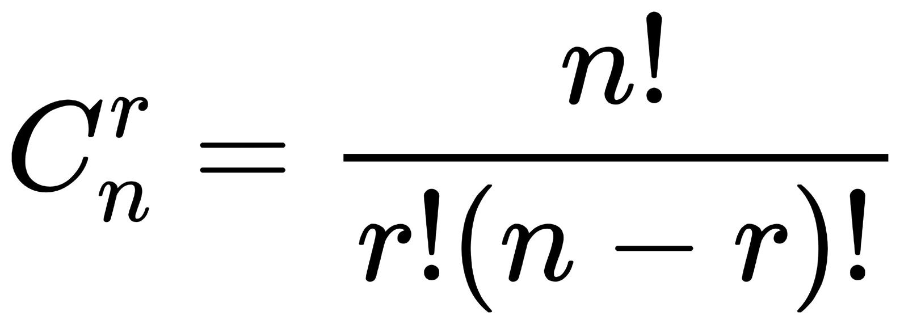

# 0062. 不同路径

## 题目地址(62. 不同路径)

<https://leetcode-cn.com/problems/unique-paths/>

## 题目描述

```
<pre class="calibre18">```

一个机器人位于一个 m x n 网格的左上角 （起始点在下图中标记为“Start” ）。

机器人每次只能向下或者向右移动一步。机器人试图达到网格的右下角（在下图中标记为“Finish”）。

问总共有多少条不同的路径？

```
```


```
<pre class="calibre18">```
例如，上图是一个7 x 3 的网格。有多少可能的路径？


示例 1:

输入: m = 3, n = 2
输出: 3
解释:
从左上角开始，总共有 3 条路径可以到达右下角。
1. 向右 -> 向右 -> 向下
2. 向右 -> 向下 -> 向右
3. 向下 -> 向右 -> 向右
示例 2:

输入: m = 7, n = 3
输出: 28


提示：

1 <= m, n <= 100
题目数据保证答案小于等于 2 * 10 ^ 9

```
```

## 前置知识

- 动态规划
- 排列组合

## 公司

- 阿里
- 腾讯
- 百度
- 字节

## 思路

首先这道题可以用排列组合的解法来解，需要一点高中的知识。



而这道题我们用动态规划来解。

这是一道典型的适合使用动态规划解决的题目，它和爬楼梯等都属于动态规划中最简单的题目，因此也经常会被用于面试之中。

读完题目你就能想到动态规划的话，建立模型并解决恐怕不是难事。其实我们很容易看出，由于机器人只能右移动和下移动， 因此第\[i, j\]个格子的总数应该等于\[i - 1, j\] + \[i, j -1\]， 因为第\[i,j\]个格子一定是从左边或者上面移动过来的。


代码大概是：

Python Code:

```
<pre class="calibre18">```
<span class="hljs-class"><span class="hljs-keyword">class</span> <span class="hljs-title">Solution</span>:</span>
    <span class="hljs-function"><span class="hljs-keyword">def</span> <span class="hljs-title">uniquePaths</span><span class="hljs-params">(self, m: int, n: int)</span> -> int:</span>
        d = [[<span class="hljs-params">1</span>] * n <span class="hljs-keyword">for</span> _ <span class="hljs-keyword">in</span> range(m)]

        <span class="hljs-keyword">for</span> col <span class="hljs-keyword">in</span> range(<span class="hljs-params">1</span>, m):
            <span class="hljs-keyword">for</span> row <span class="hljs-keyword">in</span> range(<span class="hljs-params">1</span>, n):
                d[col][row] = d[col - <span class="hljs-params">1</span>][row] + d[col][row - <span class="hljs-params">1</span>]

        <span class="hljs-keyword">return</span> d[m - <span class="hljs-params">1</span>][n - <span class="hljs-params">1</span>]

```
```

**复杂度分析**

- 时间复杂度：O(M∗N)O(M \* N)O(M∗N)
- 空间复杂度：O(M∗N)O(M \* N)O(M∗N)

由于 dp\[i\]\[j\] 只依赖于左边的元素和上面的元素，因此空间复杂度可以进一步优化， 优化到 O(n).


具体代码请查看代码区。

当然你也可以使用记忆化递归的方式来进行，由于递归深度的原因，性能比上面的方法差不少：

> 直接暴力递归的话可能会超时。

Python3 Code:

```
<pre class="calibre18">```
<span class="hljs-class"><span class="hljs-keyword">class</span> <span class="hljs-title">Solution</span>:</span>

<span class="hljs-params">    @lru_cache</span>
    <span class="hljs-function"><span class="hljs-keyword">def</span> <span class="hljs-title">uniquePaths</span><span class="hljs-params">(self, m: int, n: int)</span> -> int:</span>
        <span class="hljs-keyword">if</span> m == <span class="hljs-params">1</span> <span class="hljs-keyword">or</span> n == <span class="hljs-params">1</span>:
            <span class="hljs-keyword">return</span> <span class="hljs-params">1</span>
        cnt = self.uniquePaths(m - <span class="hljs-params">1</span>, n) + self.uniquePaths(m, n - <span class="hljs-params">1</span>)
        <span class="hljs-keyword">return</span> cnt

```
```

## 关键点

- 排列组合原理
- 记忆化递归
- 基本动态规划问题
- 空间复杂度可以进一步优化到 O(n), 这会是一个考点

## 代码

代码支持 JavaScript，Python3

JavaScript Code:

```
<pre class="calibre18">```
<span class="hljs-title">/*
 * @lc app=leetcode id=62 lang=javascript
 *
 * [62] Unique Paths
 *
 * https://leetcode.com/problems/unique-paths/description/
 */</span>
<span class="hljs-title">/**
 * @param {number} m
 * @param {number} n
 * @return {number}
 */</span>
<span class="hljs-keyword">var</span> uniquePaths = <span class="hljs-function"><span class="hljs-keyword">function</span> (<span class="hljs-params">m, n</span>) </span>{
  <span class="hljs-keyword">const</span> dp = <span class="hljs-params">Array</span>(n).fill(<span class="hljs-params">1</span>);

  <span class="hljs-keyword">for</span> (<span class="hljs-keyword">let</span> i = <span class="hljs-params">1</span>; i < m; i++) {
    <span class="hljs-keyword">for</span> (<span class="hljs-keyword">let</span> j = <span class="hljs-params">1</span>; j < n; j++) {
      dp[j] = dp[j] + dp[j - <span class="hljs-params">1</span>];
    }
  }

  <span class="hljs-keyword">return</span> dp[n - <span class="hljs-params">1</span>];
};

```
```

Python3 Code:

```
<pre class="calibre18">```
<span class="hljs-class"><span class="hljs-keyword">class</span> <span class="hljs-title">Solution</span>:</span>

    <span class="hljs-function"><span class="hljs-keyword">def</span> <span class="hljs-title">uniquePaths</span><span class="hljs-params">(self, m: int, n: int)</span> -> int:</span>
        dp = [<span class="hljs-params">1</span>] * n
        <span class="hljs-keyword">for</span> _ <span class="hljs-keyword">in</span> range(<span class="hljs-params">1</span>, m):
            <span class="hljs-keyword">for</span> j <span class="hljs-keyword">in</span> range(<span class="hljs-params">1</span>, n):
                dp[j] += dp[j - <span class="hljs-params">1</span>]
        <span class="hljs-keyword">return</span> dp[n - <span class="hljs-params">1</span>]

```
```

**复杂度分析**

- 时间复杂度：O(M∗N)O(M \* N)O(M∗N)
- 空间复杂度：O(N)O(N)O(N)

## 扩展

你可以做到比O(M∗N)O(M \* N)O(M∗N)更快，比O(N)O(N)O(N)更省内存的算法么？这里有一份[资料](https://leetcode.com/articles/unique-paths/)可供参考。

> 提示： 考虑数学

## 相关题目

- [70. 爬楼梯](https://leetcode-cn.com/problems/climbing-stairs/)
- [63. 不同路径 II](63.unique-paths-ii.md)